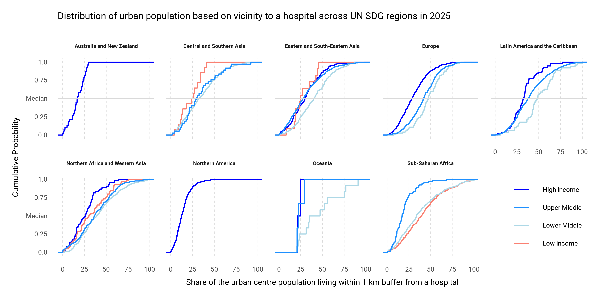

## **TidyTuesday data for [2026-09-29](https://github.com/rfordatascience/tidytuesday/blob/main/data/2026/2026-09-29/readme.md)**

``` r
library(tidyverse)
```

``` r
df_health <- read.csv("https://raw.githubusercontent.com/rfordatascience/tidytuesday/main/data/2026/2026-09-29/health.csv") ```
```

``` r
df_health |>
  filter(is.finite(HL_SHP_HOS_2025), !is.na(GC_DEV_WIG_2025)) |>
  ggplot(aes(x=HL_SHP_HOS_2025, color=GC_DEV_WIG_2025)) +
  stat_ecdf(geom = "step", linewidth = 0.5) +
  geom_hline(yintercept = 0.5, color = "grey85", linewidth = 0.25) +
  facet_wrap(~ GC_DEV_USR_2025, nrow=2) +
  labs(
    title = "Distribution of urban population based on vicinity to a hospital across UN SDG regions in 2025",
    x = "Share of the urban centre population living within 1 km buffer from a hospital",
    y = "Cumulative Probability") +
  theme_minimal(base_size = 24) +
  theme(
    legend.position = c(0.925, 0.2),
    legend.title = element_blank(),
    strip.text = element_text(size = 16, face = "bold"),
    panel.grid.minor = element_blank(),
    panel.grid.major.y = element_blank(),
    panel.grid.major.x = element_line(linewidth = 0.25, color = "grey85", linetype = "dashed"),
    text = element_text(family = "roboto")
    ) +
  scale_y_continuous(
    labels = c("0.0", "0.25", "Median", "0.75", "1.0")
  ) +
  scale_color_manual(values = c("High income"="blue", "Upper Middle"="dodgerblue", "Lower Middle"="lightblue", "Low income"="Salmon"),
                     limits = c("High income", "Upper Middle", "Lower Middle", "Low income"))
#ggsave("cdfs.png", dpi = 300, width = 8, height = 4, units = "in")
```



