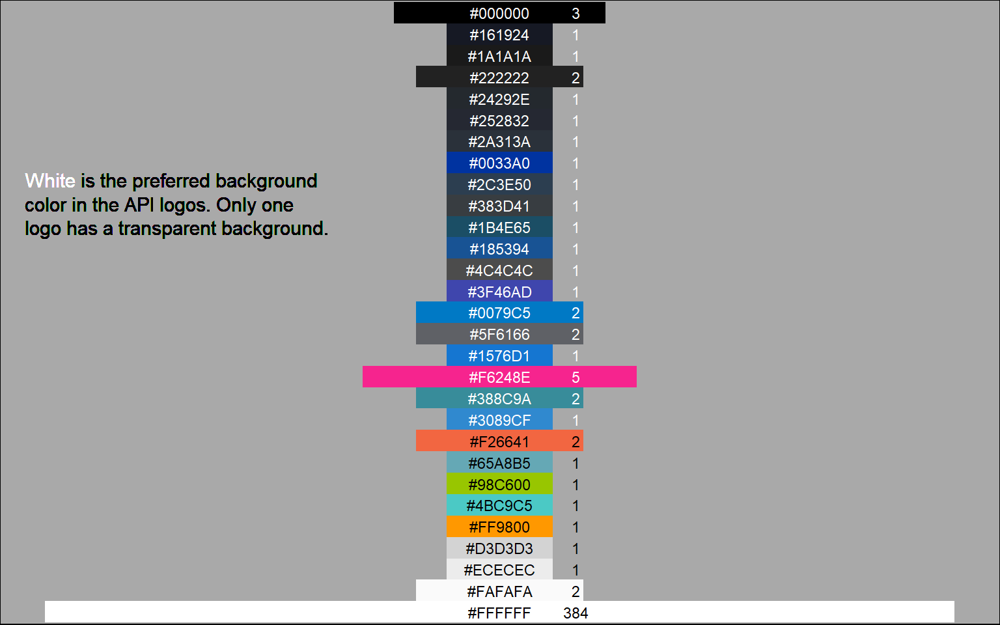

## **TidyTuesday data for [2025-06-17](https://github.com/rfordatascience/tidytuesday/blob/main/data/2025/2025-06-17/readme.md)**

``` r
library(tidyverse)
library(ggtext)
```

``` r
api_categories <- readr::read_csv('https://raw.githubusercontent.com/rfordatascience/tidytuesday/main/data/2025/2025-06-17/api_categories.csv')
api_info <- readr::read_csv('https://raw.githubusercontent.com/rfordatascience/tidytuesday/main/data/2025/2025-06-17/api_info.csv')
api_logos <- readr::read_csv('https://raw.githubusercontent.com/rfordatascience/tidytuesday/main/data/2025/2025-06-17/api_logos.csv')
api_origins <- readr::read_csv('https://raw.githubusercontent.com/rfordatascience/tidytuesday/main/data/2025/2025-06-17/api_origins.csv')
apisguru_apis <- readr::read_csv('https://raw.githubusercontent.com/rfordatascience/tidytuesday/main/data/2025/2025-06-17/apisguru_apis.csv')
```

``` r
glimpse(api_logos)
```

    Rows: 2,529
    Columns: 4
    $ name             <chr> "1forge.com", "1password.com:events", "1password.loca…
    $ background_color <chr> "#24292e", NA, NA, "#F26641", NA, NA, NA, NA, NA, NA,…
    $ url              <chr> "https://api.apis.guru/v2/cache/logo/https_1forge.com…
    $ alt_text         <chr> NA, NA, NA, NA, NA, NA, NA, NA, NA, NA, NA, NA, NA, N…

``` r
normalize_to_hex <- function(color_str) {
  if (is.na(color_str)) return(NA_character_)
  
  color_str <- trimws(tolower(color_str))  # Normalize spacing and case
  
  if (grepl("^rgb\\(", color_str)) {
    nums <- as.numeric(unlist(regmatches(color_str, gregexpr("\\d+", color_str))))
    if (length(nums) < 3) return(NA_character_)
    return(rgb(nums[1], nums[2], nums[3], maxColorValue = 255))
  }
  
  # If it's already hex return it as-is
  if (grepl("^#[0-9a-f]{6}$", color_str)) {
    return(toupper(color_str))  
  }
  
  # Handle named colors or invalid inputs
  tryCatch({
    return(rgb(col2rgb(color_str)[, 1], maxColorValue = 255))
  }, error = function(e) {
    return(NA_character_)
  })
}

api_logos <- api_logos %>% 
  mutate(hex_color = map_chr(background_color, normalize_to_hex))
```

Function for arranging colors by brightness.

``` r
hex_brightness <- function(hex) {
  rgb <- col2rgb(hex)
  # Use relative luminance formula
  0.299 * rgb[1, ] + 0.587 * rgb[2, ] + 0.114 * rgb[3, ]
}
```

``` r
api_logos_mod <- api_logos %>%
  filter(!is.na(hex_color)) %>%
  select(name, hex_color) %>%
  group_by(hex_color) %>%
  summarize(n = n()) %>% 
  arrange(hex_color) %>% 
  filter(!grepl("transparent", hex_color, ignore.case=T)) %>% 
  mutate(brightness = hex_brightness(hex_color),
         text_color = ifelse(brightness > 128, "black", "white")) %>%
  arrange(desc(brightness))
```

## Plotting

``` r
title <- "<span style='color:white;'>White</span> is the preferred background <br>color in the API logos. Only one <br>logo has a transparent background."

api_logos_mod %>% 
ggplot(aes(y = factor(seq_len(nrow(api_logos_mod))),x=1, fill = hex_color)) +
  geom_tile(aes(width=log(n+1))) +
  geom_text(aes(label = hex_color, color = text_color), size = 3, family="Consolas") +
  geom_text(aes(label = n, color = text_color), size = 3, nudge_x = 0.5, family="Consolas") +
  scale_fill_identity() +
  scale_color_identity() +
  theme_void() +
#  labs(title = "Background color for the API logos") +
  geom_richtext(x = -2.15, y = 20, label = title, size = 4, family="Serif", hjust=0, fill=NA, label.color=NA) +
  theme(axis.text.y = element_blank(),
        axis.ticks.y = element_blank(),
        panel.grid = element_blank(),
        panel.background = element_rect(fill = "darkgrey"))
```



``` r
#ggsave("API_logos.png", dpi=300)
```
