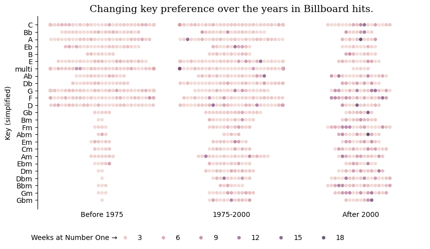
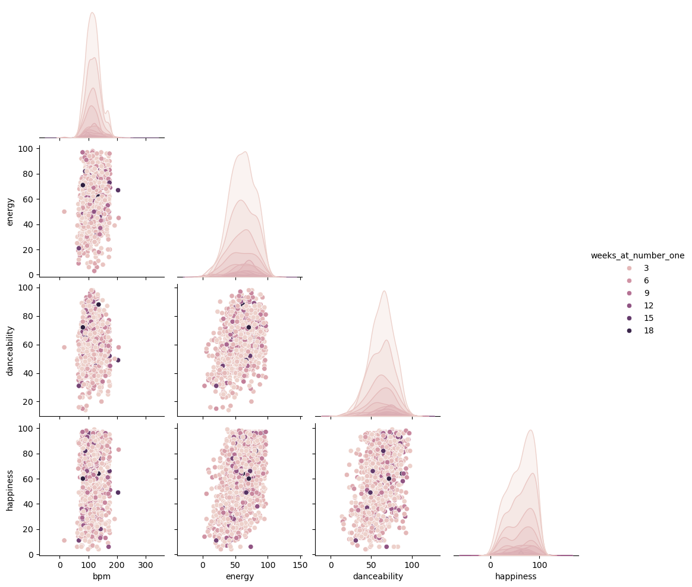

<script src="https://cdnjs.cloudflare.com/ajax/libs/require.js/2.3.6/require.min.js" integrity="sha512-c3Nl8+7g4LMSTdrm621y7kf9v3SDPnhxLNhcjFJbKECVnmZHTdo+IRO05sNLTH/D3vA6u1X32ehoLC7WFVdheg==" crossorigin="anonymous"></script>
<script src="https://cdnjs.cloudflare.com/ajax/libs/jquery/3.5.1/jquery.min.js" integrity="sha512-bLT0Qm9VnAYZDflyKcBaQ2gg0hSYNQrJ8RilYldYQ1FxQYoCLtUjuuRuZo+fjqhx/qtq/1itJ0C2ejDxltZVFg==" crossorigin="anonymous" data-relocate-top="true"></script>
<script type="application/javascript">define('jquery', [],function() {return window.jQuery;})</script>


## TidyTuesday dataset of [2025-08-26](https://github.com/rfordatascience/tidytuesday/blob/main/data/2025/2025-08-26)

``` python
import pandas as pd
import matplotlib.pyplot as plt
import seaborn as sns
```

``` python
billboard = pd.read_csv('https://raw.githubusercontent.com/rfordatascience/tidytuesday/main/data/2025/2025-08-26/billboard.csv')
topics = pd.read_csv('https://raw.githubusercontent.com/rfordatascience/tidytuesday/main/data/2025/2025-08-26/topics.csv')
```

``` python
billboard
```

<div>
<style scoped>
    .dataframe tbody tr th:only-of-type {
        vertical-align: middle;
    }

    .dataframe tbody tr th {
        vertical-align: top;
    }

    .dataframe thead th {
        text-align: right;
    }
</style>

|  | song | artist | date | weeks_at_number_one | non_consecutive | rating_1 | rating_2 | rating_3 | overall_rating | divisiveness | \... | featured_in_a_then_contemporary_play | written_for_a_film | featured_in_a_then_contemporary_film | written_for_a_t_v_show | featured_in_a_then_contemporary_t_v_show | associated_with_dance | topped_the_charts_by_multiple_artist | double_a_side | eurovision_entry | u_s_artwork |
|----|----|----|----|----|----|----|----|----|----|----|----|----|----|----|----|----|----|----|----|----|----|
| 0 | Poor Little Fool | Ricky Nelson | 1958-08-04T00:00:00Z | 2 | 0 | 4 | 5 | 3 | 4.000000 | 1.333333 | \... | NaN | 0 | NaN | 0 | NaN | 0 | 0 | NaN | 0 | Cannot Locate |
| 1 | Nel Blu Dipinto Di Blu | Domenico Modugno | 1958-08-18T00:00:00Z | 5 | 1 | 7 | 7 | 5 | 6.333333 | 1.333333 | \... | NaN | 0 | NaN | 0 | NaN | 0 | 0 | NaN | 1 | Cannot Locate |
| 2 | Little Star | The Elegants | 1958-08-25T00:00:00Z | 1 | 0 | 5 | 6 | 6 | 5.666667 | 0.666667 | \... | NaN | 0 | NaN | 0 | NaN | 0 | 0 | NaN | 0 | Cannot Locate |
| 3 | It\'s All in the Game | Tommy Edwards | 1958-09-29T00:00:00Z | 6 | 0 | 3 | 3 | 7 | 4.333333 | 2.666667 | \... | NaN | 0 | NaN | 0 | NaN | 0 | 0 | NaN | 0 | Cannot Locate |
| 4 | It\'s Only Make Believe | Conway Twitty | 1958-11-10T00:00:00Z | 2 | 1 | 7 | 8 | 9 | 8.000000 | 1.333333 | \... | NaN | 0 | NaN | 0 | NaN | 0 | 0 | NaN | 0 | Cannot Locate |
| \... | \... | \... | \... | \... | \... | \... | \... | \... | \... | \... | \... | \... | \... | \... | \... | \... | \... | \... | \... | \... | \... |
| 1172 | Please Please Please | Sabrina Carpenter | 2024-06-29T00:00:00Z | 1 | 0 | 8 | 7 | 8 | 7.666667 | 0.666667 | \... | NaN | 0 | NaN | 0 | NaN | 0 | 0 | NaN | 0 | Artist Photograph |
| 1173 | A Bar Song (Tipsy) | Shaboozey | 2024-07-13T00:00:00Z | 19 | 1 | 6 | 4 | 9 | 6.333333 | 3.333333 | \... | NaN | 0 | NaN | 0 | NaN | 0 | 0 | NaN | 0 | Artist Photograph;Photograph Related to Song T\... |
| 1174 | Love Somebody | Morgan Wallen | 2024-11-02T00:00:00Z | 1 | 0 | 3 | 5 | 5 | 4.333333 | 1.333333 | \... | NaN | 0 | NaN | 0 | NaN | 0 | 0 | NaN | 0 | Photograph Not Related to Song |
| 1175 | squabble up | Kendrick Lamar | 2024-12-07T00:00:00Z | 1 | 0 | 9 | 10 | 9 | 9.333333 | 0.666667 | \... | NaN | 0 | NaN | 0 | NaN | 0 | 0 | NaN | 0 | NaN |
| 1176 | Die with a Smile | Bruno Mars & Lady Gaga | 2025-01-11T00:00:00Z | 2 | 0 | 8 | 7 | 4 | 6.333333 | 2.666667 | \... | NaN | 0 | NaN | 0 | NaN | 0 | 0 | NaN | 0 | Artist Photograph;Text |

<p>1177 rows × 105 columns</p>
</div>

``` python
billboard.columns.values
```

    array(['song', 'artist', 'date', 'weeks_at_number_one', 'non_consecutive',
           'rating_1', 'rating_2', 'rating_3', 'overall_rating',
           'divisiveness', 'label', 'parent_label', 'cdr_genre', 'cdr_style',
           'discogs_genre', 'discogs_style', 'artist_structure',
           'featured_artists', 'multiple_lead_vocalists',
           'group_named_after_non_lead_singer', 'talent_contestant',
           'posthumous', 'artist_place_of_origin', 'front_person_age',
           'artist_male', 'artist_white', 'artist_black', 'songwriters',
           'songwriters_w_o_interpolation_sample_credits', 'songwriter_male',
           'songwriter_white', 'artist_is_a_songwriter',
           'artist_is_only_songwriter', 'producers', 'producer_male',
           'producer_white', 'artist_is_a_producer',
           'artist_is_only_producer', 'songwriter_is_a_producer',
           'time_signature', 'keys', 'simplified_key', 'bpm', 'energy',
           'danceability', 'happiness', 'loudness_d_b', 'acousticness',
           'vocally_based', 'bass_based', 'guitar_based',
           'piano_keyboard_based', 'orchestral_strings', 'horns_winds',
           'accordion', 'banjo', 'bongos', 'clarinet', 'cowbell',
           'falsetto_vocal', 'flute_piccolo', 'handclaps_snaps', 'harmonica',
           'human_whistling', 'kazoo', 'mandolin', 'pedal_lap_steel',
           'ocarina', 'saxophone', 'sitar', 'trumpet', 'ukulele', 'violin',
           'sound_effects', 'song_structure', 'rap_verse_in_a_non_rap_song',
           'length_sec', 'instrumental', 'instrumental_length_sec',
           'intro_length_sec', 'vocal_introduction',
           'free_time_vocal_introduction', 'fade_out', 'live', 'cover',
           'sample', 'interpolation', 'inspired_by_a_different_song',
           'lyrics', 'lyrical_topic', 'lyrical_narrative', 'spoken_word',
           'explicit', 'foreign_language', 'written_for_a_play',
           'featured_in_a_then_contemporary_play', 'written_for_a_film',
           'featured_in_a_then_contemporary_film', 'written_for_a_t_v_show',
           'featured_in_a_then_contemporary_t_v_show',
           'associated_with_dance', 'topped_the_charts_by_multiple_artist',
           'double_a_side', 'eurovision_entry', 'u_s_artwork'], dtype=object)

``` python
billboard['date'] = pd.to_datetime(billboard['date'])
# add a new  col date2 having three categories Before 75, 75-2000, After 2000
billboard['date2'] = pd.cut(billboard['date'].dt.year, bins=[0, 1975, 2000, 2025], labels=['Before 1975', '1975-2000', 'After 2000'])
billboard['date2'].value_counts()
```

    date2
    1975-2000      484
    Before 1975    383
    After 2000     310
    Name: count, dtype: int64

``` python
billboard['simplified_key_mod'] = billboard['simplified_key'].replace('Multiple Keys', 'multi')
sk_values = billboard['simplified_key_mod'].value_counts()
sk_values
```

    simplified_key_mod
    C        120
    multi     96
    G         83
    F         76
    D         70
    E         69
    A         67
    Db        57
    Ab        49
    Bb        48
    Eb        42
    Am        40
    Fm        34
    Cm        32
    Gm        31
    Dbm       29
    Dm        29
    Gb        29
    B         29
    Bbm       28
    Em        27
    Ebm       26
    Bm        25
    Gbm       21
    Abm       20
    Name: count, dtype: int64

``` python
fig,ax = plt.subplots(figsize=(10,5))

sns.swarmplot(data=billboard, x='date2', y='simplified_key_mod', hue='weeks_at_number_one', \
ax=ax, alpha=0.75)
ax.legend(loc='lower center', ncol=6, bbox_to_anchor=(0.5, -0.2), \
frameon=False, title="")
ax.text(-0.55,29.4, "Weeks at Number One →")
sns.despine(bottom=True)
ax.tick_params(axis='x', which='both', length=0)

plt.xlabel('')
plt.ylabel('Key (simplified)')
plt.title("Changing key preference over the years in Billboard hits.", fontfamily='serif', \
         fontsize=14)
plt.savefig('billboard_hits.png', dpi=300, bbox_inches='tight')
plt.show()
```




``` python
sns.pairplot(billboard[['bpm', 'energy','danceability', 'happiness','weeks_at_number_one']], hue='weeks_at_number_one',\
corner=True)
plt.show()
```



## Update

A revised visualization for this data was submitted to Plotnine contest 2025 ([Repo](https://github.com/manishdatt/PN2025)).

<figure>

<figcaption aria-hidden="true">Plot</figcaption>
</figure>
