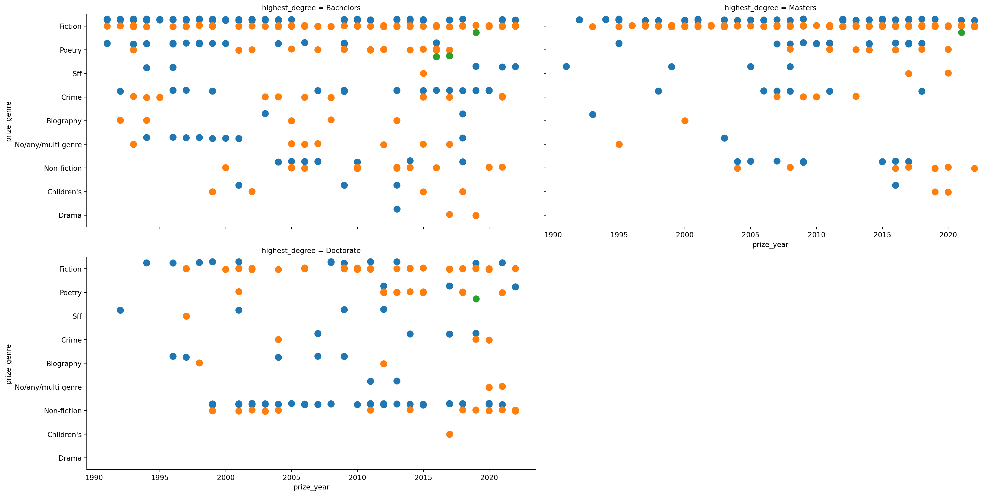
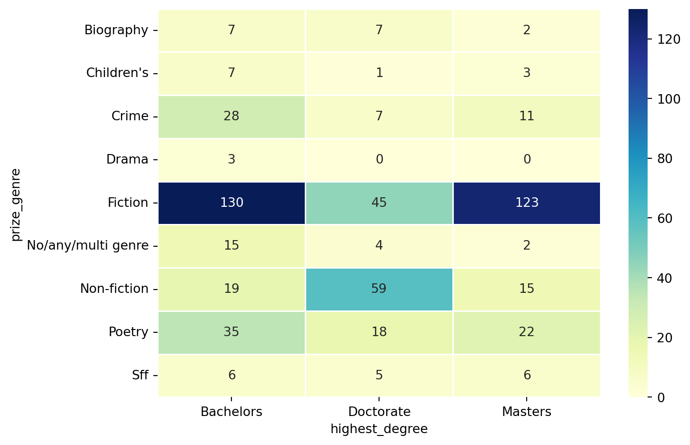
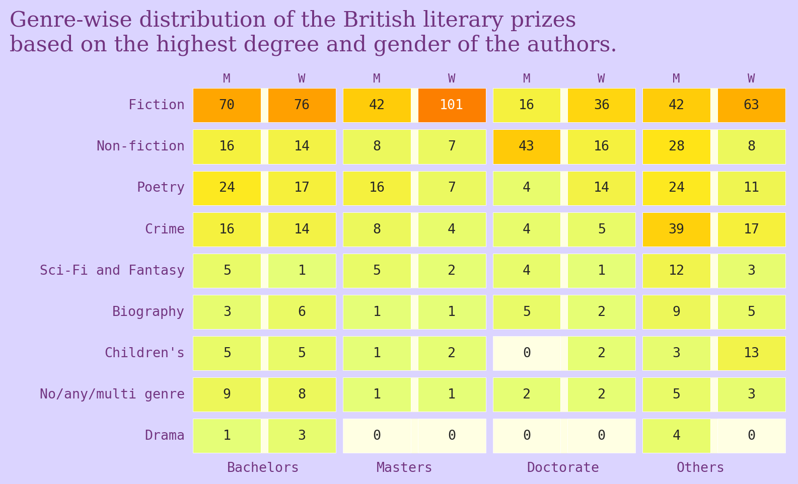

<script src="https://cdnjs.cloudflare.com/ajax/libs/require.js/2.3.6/require.min.js" integrity="sha512-c3Nl8+7g4LMSTdrm621y7kf9v3SDPnhxLNhcjFJbKECVnmZHTdo+IRO05sNLTH/D3vA6u1X32ehoLC7WFVdheg==" crossorigin="anonymous"></script>
<script src="https://cdnjs.cloudflare.com/ajax/libs/jquery/3.5.1/jquery.min.js" integrity="sha512-bLT0Qm9VnAYZDflyKcBaQ2gg0hSYNQrJ8RilYldYQ1FxQYoCLtUjuuRuZo+fjqhx/qtq/1itJ0C2ejDxltZVFg==" crossorigin="anonymous" data-relocate-top="true"></script>
<script type="application/javascript">define('jquery', [],function() {return window.jQuery;})</script>


## TidyTuesday dataset of [2025-10-28](https://github.com/rfordatascience/tidytuesday/blob/main/data/2025/2025-10-28)

``` python
import pandas as pd
import matplotlib.pyplot as plt
import seaborn as sns
```

``` python
prizes = pd.read_csv('https://raw.githubusercontent.com/rfordatascience/tidytuesday/main/data/2025/2025-10-28/prizes.csv')
```

``` python
prizes
```

<div>
<style scoped>
    .dataframe tbody tr th:only-of-type {
        vertical-align: middle;
    }

    .dataframe tbody tr th {
        vertical-align: top;
    }

    .dataframe thead th {
        text-align: right;
    }
</style>

|  | prize_id | prize_alias | prize_name | prize_institution | prize_year | prize_genre | person_id | person_role | last_name | first_name | \... | uk_residence | ethnicity_macro | ethnicity | highest_degree | degree_institution | degree_field_category | degree_field | viaf | book_id | book_title |
|----|----|----|----|----|----|----|----|----|----|----|----|----|----|----|----|----|----|----|----|----|----|
| 0 | 8 | Booker Prize | Booker Prize | Booker Foundation | 1991 | fiction | 294 | shortlisted | Amis | Martin | \... | True | White British | English | Bachelors | University of Oxford | Language and Literature | English Literature | 36913662 | 5 | Time\'s Arrow |
| 1 | 1 | James Tait Black Prize for Fiction | James Tait Black Prize for Fiction | The University of Edinburgh | 1991 | fiction | 33 | winner | Boyd | William | \... | True | White British | British | unknown | University of Oxford | Language and Literature | English Literature | 111500719 | 36 | Brazzaville Beach |
| 2 | 3 | Costa First Novel Award | Whitbread First Novel | Whitbread | 1991 | fiction | 167 | winner | Burn | Gordon | \... | True | White British | English | none | none | none | none | 51988764 | 42 | Alma Cogan |
| 3 | 8 | Booker Prize | Booker Prize | Booker Foundation | 1991 | fiction | 286 | shortlisted | Doyle | Roddy | \... | False | Irish | Irish | Bachelors | University College Dublin | Multiple | English and Geography | 17301306 | 77 | The Van |
| 4 | 4 | Costa Novel Award | Whitbread Novel | Whitbread | 1991 | fiction | 168 | winner | Gardam | Jane | \... | True | White British | English | Bachelors | University of London | Language and Literature | English Literature | 70213168 | 114 | The Queen of the Tambourine |
| \... | \... | \... | \... | \... | \... | \... | \... | \... | \... | \... | \... | \... | \... | \... | \... | \... | \... | \... | \... | \... | \... |
| 947 | 10 | Women\'s Prize for Fiction | Women\'s Prize for Fiction | Women\'s Prize Trust | 2022 | fiction | 192 | shortlisted | Shafak | Elif | \... | True | Non-UK White | Turkish British | Doctorate | Middle East Technical University | Politics and Economics | Political Science | 64320935 | 367 | The Island of Missing Trees |
| 948 | 11 | Gold Dagger | Gold Dagger | The Crime Writers\' Association | 2022 | crime | 410 | shortlisted | Shaw | William | \... | True | White British | English | unknown | unknown | unknown | unknown | NaN | 521 | The Trawlerman |
| 949 | 10 | Women\'s Prize for Fiction | Women\'s Prize for Fiction | Women\'s Prize Trust | 2022 | fiction | 182 | shortlisted | Shipstead | Maggie | \... | False | Non-UK White | White American | Masters | University of Iowa | Writing | Creative Writing | 231972795 | 296 | Great Circle |
| 950 | 8 | Booker Prize | Booker Prize | Booker Foundation | 2022 | fiction | 176 | shortlisted | Strout | Elizabeth | \... | False | Non-UK White | White American | Masters | Royal College of Art | unknown | unknown | 66631918 | 316 | Oh William! |
| 951 | 12 | BSFA Award for Best Novel | BSFA Award for Best Novel | British Science Fiction Association | 2022 | sff | 491 | winner | Tchaikovsky | Adrian | \... | True | White British | British | Bachelors | University of Reading | Maths and Sciences | Zoology and Psychology | 102929550 | 627 | City of Last Chances |

<p>952 rows × 23 columns</p>
</div>

``` python
prizes['prize_genre']=prizes['prize_genre'].str.capitalize()
```

``` python
prizes.groupby(['prize_genre','highest_degree']).count()['prize_name'].sort_values(ascending=False)
```

    prize_genre         highest_degree          
    Fiction             Bachelors                   147
                        Masters                     144
                        unknown                      75
    Non-fiction         Doctorate                    59
    Fiction             Doctorate                    52
    Crime               unknown                      46
    Poetry              Bachelors                    43
    Non-fiction         unknown                      33
                        Bachelors                    30
    Crime               Bachelors                    30
    Poetry              unknown                      25
    Fiction             none                         24
    Poetry              Masters                      23
                        Doctorate                    19
    No/any/multi genre  Bachelors                    17
    Non-fiction         Masters                      15
    Children's          unknown                      14
    Crime               Masters                      12
    Sff                 unknown                      12
    Biography           unknown                      11
    Crime               none                         10
    Children's          Bachelors                    10
    Poetry              none                          9
    Biography           Bachelors                     9
    Crime               Doctorate                     9
    Sff                 Masters                       7
    No/any/multi genre  unknown                       7
    Biography           Doctorate                     7
    Sff                 Bachelors                     6
                        Doctorate                     5
    Drama               unknown                       4
                        Bachelors                     4
    No/any/multi genre  Doctorate                     4
    Non-fiction         none                          3
    Children's          Masters                       3
    Sff                 none                          3
    Fiction             Postgraduate                  3
    Children's          Doctorate                     2
    Biography           Masters                       2
    No/any/multi genre  Masters                       2
    Fiction             Juris Doctor                  2
    Biography           Diploma                       1
    Children's          Postgraduate                  1
    Biography           Postgraduate                  1
    Poetry              MD                            1
                        Postgraduate                  1
    Biography           Juris Doctor                  1
    Non-fiction         Juris Doctor                  1
    Children's          none                          1
    No/any/multi genre  none                          1
    Fiction             Certificate of Education      1
    Name: prize_name, dtype: int64

``` python
prizes.groupby(['degree_field_category']).count()['prize_name'].sort_values(ascending=False)
```

    degree_field_category
    Language and Literature         272
    unknown                         265
    Writing                         114
    History and Cultural Studies     72
    none                             51
    Arts                             40
    Maths and Sciences               34
    Multiple                         30
    Politics and Economics           27
    Philosophy and Theology          24
    Law                              17
    Medicine and Social Work          5
    Education                         1
    Name: prize_name, dtype: int64

``` python
df = prizes[(~prizes["degree_field_category"].isin(['unknown','none'])) & (prizes["highest_degree"].isin(['Bachelors','Masters', 'Doctorate']))]
df
```

<div>
<style scoped>
    .dataframe tbody tr th:only-of-type {
        vertical-align: middle;
    }

    .dataframe tbody tr th {
        vertical-align: top;
    }

    .dataframe thead th {
        text-align: right;
    }
</style>

|  | prize_id | prize_alias | prize_name | prize_institution | prize_year | prize_genre | person_id | person_role | last_name | first_name | \... | uk_residence | ethnicity_macro | ethnicity | highest_degree | degree_institution | degree_field_category | degree_field | viaf | book_id | book_title |
|----|----|----|----|----|----|----|----|----|----|----|----|----|----|----|----|----|----|----|----|----|----|
| 0 | 8 | Booker Prize | Booker Prize | Booker Foundation | 1991 | Fiction | 294 | shortlisted | Amis | Martin | \... | True | White British | English | Bachelors | University of Oxford | Language and Literature | English Literature | 36913662 | 5 | Time\'s Arrow |
| 3 | 8 | Booker Prize | Booker Prize | Booker Foundation | 1991 | Fiction | 286 | shortlisted | Doyle | Roddy | \... | False | Irish | Irish | Bachelors | University College Dublin | Multiple | English and Geography | 17301306 | 77 | The Van |
| 4 | 4 | Costa Novel Award | Whitbread Novel | Whitbread | 1991 | Fiction | 168 | winner | Gardam | Jane | \... | True | White British | English | Bachelors | University of London | Language and Literature | English Literature | 70213168 | 114 | The Queen of the Tambourine |
| 6 | 6 | Costa Poetry Award | Whitbread Poetry | Whitbread | 1991 | Poetry | 169 | winner | Longley | Michael | \... | True | White British | Northern Irish | Bachelors | Trinity College, Dublin | Language and Literature | Classics | 39398205 | 182 | Gorse Fires |
| 7 | 8 | Booker Prize | Booker Prize | Booker Foundation | 1991 | Fiction | 260 | shortlisted | Mistry | Rohinton | \... | False | Asian | Indian Canadian | Bachelors | Bombay University/University of Toronto | Multiple | Mathematics and Economics/English and Philosophy | 29581388 | 225 | Such a Long Journey |
| \... | \... | \... | \... | \... | \... | \... | \... | \... | \... | \... | \... | \... | \... | \... | \... | \... | \... | \... | \... | \... | \... |
| 944 | 10 | Women\'s Prize for Fiction | Women\'s Prize for Fiction | Women\'s Prize Trust | 2022 | Fiction | 221 | winner | Ozeki | Ruth | \... | False | Asian | Japanese American | Bachelors | Smith College | Language and Literature | English Literature and Asian Studies | 79458623 | 371 | The Book of Form & Emptiness |
| 946 | 16 | Baillie Gifford Prize for Non-Fiction | Baillie Gifford Prize for Non-Fiction | Samuel Johnson Prize for Non-Fiction Limited | 2022 | Non-fiction | 58 | winner | Rundell | Katherine | \... | True | White British | English | Doctorate | University of Oxford | Language and Literature | English Literature | 163169611 | 759 | Super-Infinite: The Transformations of John Donne |
| 947 | 10 | Women\'s Prize for Fiction | Women\'s Prize for Fiction | Women\'s Prize Trust | 2022 | Fiction | 192 | shortlisted | Shafak | Elif | \... | True | Non-UK White | Turkish British | Doctorate | Middle East Technical University | Politics and Economics | Political Science | 64320935 | 367 | The Island of Missing Trees |
| 949 | 10 | Women\'s Prize for Fiction | Women\'s Prize for Fiction | Women\'s Prize Trust | 2022 | Fiction | 182 | shortlisted | Shipstead | Maggie | \... | False | Non-UK White | White American | Masters | University of Iowa | Writing | Creative Writing | 231972795 | 296 | Great Circle |
| 951 | 12 | BSFA Award for Best Novel | BSFA Award for Best Novel | British Science Fiction Association | 2022 | Sff | 491 | winner | Tchaikovsky | Adrian | \... | True | White British | British | Bachelors | University of Reading | Maths and Sciences | Zoology and Psychology | 102929550 | 627 | City of Last Chances |

<p>580 rows × 23 columns</p>
</div>

``` python
#fix,ax = plt.subplots(figsize=(10,5))
sns.catplot(data=df, \
            x='prize_year', y='prize_genre', hue='gender', dodge=True, kind='strip', \
            col='highest_degree', col_wrap=2, aspect=2, legend=False, jitter=True, size=10)
```



``` python
pivot_table = df.pivot_table(
    index='prize_genre',
    columns='highest_degree',
    values='prize_name',
    aggfunc='count',
    fill_value=0
)
```

``` python
plt.figure(figsize=(8, 5))
sns.heatmap(pivot_table, annot=True, fmt='d', cmap='YlGnBu', linewidths=0.5)
#plt.title('Tile Plot of Prizes by Degree Field and Degree Level')
#plt.xlabel('Highest Degree')
#plt.ylabel('Degree Field Category')
plt.tight_layout()
plt.show()
```



``` python
prizes['degree'] = prizes['highest_degree'].apply(lambda x: x if x in ['Bachelors', 'Masters', 'Doctorate'] else 'Others')
prizes['gender_new'] = prizes['gender'].apply(lambda x: x if x in ['man', 'woman'] else 'NB')
```

``` python
df1= (prizes.groupby(['prize_genre', 'degree', 'gender_new']).count()['prize_id'].reset_index())
df1['degree_gender'] = df1['degree']+'_'+df1['gender_new']
df1
```

<div>
<style scoped>
    .dataframe tbody tr th:only-of-type {
        vertical-align: middle;
    }

    .dataframe tbody tr th {
        vertical-align: top;
    }

    .dataframe thead th {
        text-align: right;
    }
</style>

|      | prize_genre | degree    | gender_new | prize_id | degree_gender   |
|------|-------------|-----------|------------|----------|-----------------|
| 0    | Biography   | Bachelors | man        | 3        | Bachelors_man   |
| 1    | Biography   | Bachelors | woman      | 6        | Bachelors_woman |
| 2    | Biography   | Doctorate | man        | 5        | Doctorate_man   |
| 3    | Biography   | Doctorate | woman      | 2        | Doctorate_woman |
| 4    | Biography   | Masters   | man        | 1        | Masters_man     |
| \... | \...        | \...      | \...       | \...     | \...            |
| 67   | Sff         | Doctorate | woman      | 1        | Doctorate_woman |
| 68   | Sff         | Masters   | man        | 5        | Masters_man     |
| 69   | Sff         | Masters   | woman      | 2        | Masters_woman   |
| 70   | Sff         | Others    | man        | 12       | Others_man      |
| 71   | Sff         | Others    | woman      | 3        | Others_woman    |

<p>72 rows × 5 columns</p>
</div>

``` python
reshaped = df1.pivot_table(
    index='prize_genre',
    columns='degree_gender',
    values='prize_id',
    aggfunc='sum',  # or 'count' if you want number of entries
    fill_value=0
).reset_index()
reshaped = reshaped.set_index('prize_genre')
```

``` python
ind = prizes.groupby(['prize_genre']).count()['prize_name'].sort_values(ascending=False).index
reshaped.columns
```

    Index(['Bachelors_NB', 'Bachelors_man', 'Bachelors_woman', 'Doctorate_NB',
           'Doctorate_man', 'Doctorate_woman', 'Masters_NB', 'Masters_man',
           'Masters_woman', 'Others_NB', 'Others_man', 'Others_woman'],
          dtype='object', name='degree_gender')

``` python
reshaped1 = reshaped[['Bachelors_man', 'Bachelors_woman', 'Masters_man', 'Masters_woman',
       'Doctorate_man', 'Doctorate_woman', 'Others_man', 'Others_woman']]
reshaped1 = reshaped1.reindex(ind)
reshaped1.index = reshaped1.index.str.replace('Sff', 'Sci-Fi and Fantasy')
```

``` python
bg_color = '#DBD4FF'
fg_color = '#723480'
fg_color2 = '#FFFFE3'

lw=5
cmap = sns.color_palette("Wistia", as_cmap=True)
cmap.set_under('#FFFFE3')  

fig1,ax1 = plt.subplots()
sns.heatmap(reshaped1, annot=True, fmt='d', cmap=cmap, cbar=False, \
            linewidths=lw, ax=ax1,vmin=0.1, annot_kws={"fontfamily": "monospace"}, \
            cbar_kws={'shrink': 0.6, 'aspect': 30, 'pad': 0.02})
fig1.set_facecolor(bg_color)
ax1.set_facecolor(bg_color)
ax1.patch.set_facecolor(bg_color)

ax_top = ax1.twiny()

# Match the position and scale of the bottom axis
ax_top.set_xlim(ax1.get_xlim())

ax_top.set_xticks(ax1.get_xticks())
ax_top.set_xticklabels(['M', 'W']*4, fontsize=9)

for i in range(0, len(reshaped1.columns)+1):  
    if(i % 2 == 0):
        ax1.vlines(i, *ax1.get_ylim(), colors=bg_color, linewidth=lw)
    else:
        ax1.vlines(i, *ax1.get_ylim(), colors=fg_color2, linewidth=lw)
for i in range(0, len(reshaped1.index)+1):  
    ax1.hlines(i, *ax1.get_xlim(), colors=bg_color, linewidth=lw)

xticklabels = ax1.get_xticklabels()
new_labels = [label._text.split('_')[0] if i % 2 == 0 else '' for i, label in enumerate(xticklabels)]

# Apply the new labels
ax1.set_xticklabels(new_labels, rotation=0, ha='left', fontsize=10)
ax1.tick_params(axis='both', which='both', length=0)
ax_top.tick_params(axis='both', which='both', length=0, pad=0)
ax1.set_xlabel('')
ax1.set_ylabel('')
#colorbar = ax1.collections[0].colorbar
#colorbar.ax.tick_params(labelsize=10)
for label in ax1.get_xticklabels()+ax_top.get_xticklabels():
    label.set_fontfamily('monospace')
    label.set_color(fg_color)
for label in ax1.get_yticklabels():
    label.set_fontfamily('monospace')
    label.set_color(fg_color)
sns.despine(left=True,bottom=True)    
#plt.tight_layout()
plt.title("Genre-wise distribution of the British literary prizes \nbased on the highest degree and gender of the authors.", fontfamily='Serif', fontsize=16, color=fg_color, loc='left', x=-0.3, y=1.07)
plt.savefig('British_prize.png', dpi=300, bbox_inches='tight')
plt.show()
```


