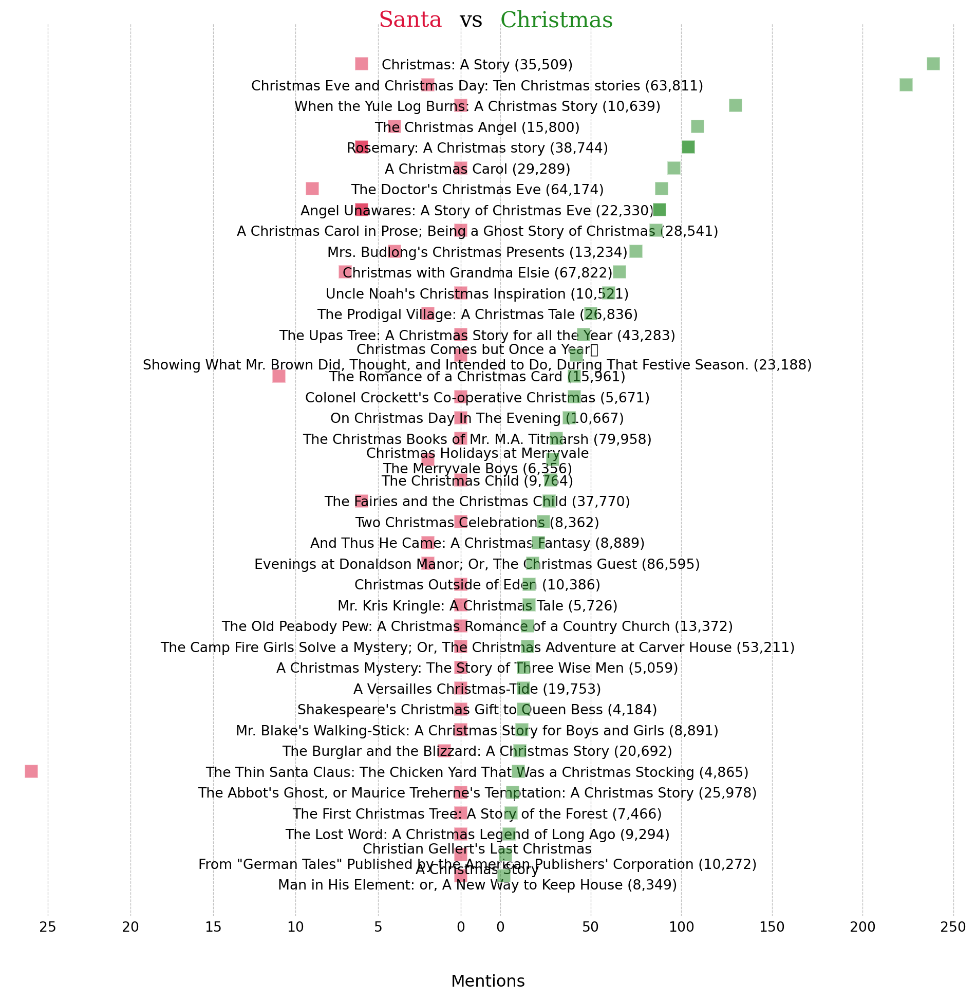

<script src="https://cdnjs.cloudflare.com/ajax/libs/require.js/2.3.6/require.min.js" integrity="sha512-c3Nl8+7g4LMSTdrm621y7kf9v3SDPnhxLNhcjFJbKECVnmZHTdo+IRO05sNLTH/D3vA6u1X32ehoLC7WFVdheg==" crossorigin="anonymous"></script>
<script src="https://cdnjs.cloudflare.com/ajax/libs/jquery/3.5.1/jquery.min.js" integrity="sha512-bLT0Qm9VnAYZDflyKcBaQ2gg0hSYNQrJ8RilYldYQ1FxQYoCLtUjuuRuZo+fjqhx/qtq/1itJ0C2ejDxltZVFg==" crossorigin="anonymous" data-relocate-top="true"></script>
<script type="application/javascript">define('jquery', [],function() {return window.jQuery;})</script>


## TidyTuesday dataset of [2025-12-30](https://github.com/rfordatascience/tidytuesday/blob/main/data/2025/2025-12-30)

``` python
import pandas as pd
import matplotlib.pyplot as plt
import seaborn as sns
```

``` python
christmas_novel_authors = pd.read_csv('https://raw.githubusercontent.com/rfordatascience/tidytuesday/main/data/2025/2025-12-30/christmas_novel_authors.csv')
christmas_novel_text = pd.read_csv('https://raw.githubusercontent.com/rfordatascience/tidytuesday/main/data/2025/2025-12-30/christmas_novel_text.csv')
christmas_novels = pd.read_csv('https://raw.githubusercontent.com/rfordatascience/tidytuesday/main/data/2025/2025-12-30/christmas_novels.csv')
```

``` python
christmas_novel_authors
```

<div>
<style scoped>
    .dataframe tbody tr th:only-of-type {
        vertical-align: middle;
    }

    .dataframe tbody tr th {
        vertical-align: top;
    }

    .dataframe thead th {
        text-align: right;
    }
</style>

|  | gutenberg_author_id | author | birthdate | deathdate | wikipedia | aliases |
|----|----|----|----|----|----|----|
| 0 | 37 | Dickens, Charles | 1812.0 | 1870.0 | https://en.wikipedia.org/wiki/Charles_Dickens | Boz/Dickens, Charles John Huffam |
| 1 | 266 | Wiggin, Kate Douglas Smith | 1856.0 | 1923.0 | https://en.wikipedia.org/wiki/Kate_Douglas_Wiggin | Riggs, Kate Douglas Smith Wiggin/Smith, Kate D\... |
| 2 | 313 | Thackeray, William Makepeace | 1811.0 | 1863.0 | https://en.wikipedia.org/wiki/William_Makepeac\... | Titmarsh, Michael Angelo/Thackeray, W. M./Titm\... |
| 3 | 362 | Van Dyke, Henry | 1852.0 | 1933.0 | https://en.wikipedia.org/wiki/Henry_van_Dyke | Dyke, Henry Van/Dyke, Henry Jackson Van/Dyke, \... |
| 4 | 102 | Alcott, Louisa May | 1832.0 | 1888.0 | https://en.wikipedia.org/wiki/Louisa_May_Alcott | Barnard, A. M./Alcott, Louisa M. (Louisa May)/\... |
| 5 | 1324 | Locke, William John | 1863.0 | 1930.0 | https://en.wikipedia.org/wiki/William_John_Locke | Locke, William J. (William John)/Locke, W. J. \... |
| 6 | 3695 | Boyd, Mary Stuart | 1860.0 | 1937.0 | NaN | NaN |
| 7 | 2334 | Hughes, Rupert | 1872.0 | 1956.0 | https://en.wikipedia.org/wiki/Rupert_Hughes | NaN |
| 8 | 2044 | Finley, Martha | 1828.0 | 1909.0 | https://en.wikipedia.org/wiki/Martha_Finley | Farquharson, Martha/Cousin Martha |
| 9 | 5591 | Brady, Cyrus Townsend | 1861.0 | 1920.0 | https://en.wikipedia.org/wiki/Cyrus_Townsend_B\... | NaN |
| 10 | 3939 | Miller, Alice Duer | 1874.0 | 1942.0 | https://en.wikipedia.org/wiki/Alice_Duer_Miller | Duer, Alice |
| 11 | 2497 | Dawson, Coningsby | 1883.0 | 1959.0 | https://en.wikipedia.org/wiki/Coningsby_Dawson | Dawson, Coningsby W. (Coningsby William)/Dawso\... |
| 12 | 5282 | Brown, Abbie Farwell | 1871.0 | 1927.0 | https://en.wikipedia.org/wiki/Abbie_Farwell_Brown | NaN |
| 13 | 6328 | Dalrymple, Leona | 1884.0 | 1968.0 | https://en.wikipedia.org/wiki/Leona_Dalrymple | Dalrymple, C. Leona |
| 14 | 1253 | Barclay, Florence L. (Florence Louisa) | 1862.0 | 1921.0 | https://en.wikipedia.org/wiki/Florence_L.\_Barclay | Barclay, Florence Louisa (Charlesworth), Mrs./\... |
| 15 | 7088 | Parker, Theodore | 1810.0 | 1860.0 | https://en.wikipedia.org/wiki/Theodore_Parker | Blodgett, Levi |
| 16 | 3522 | Williamson, C. N. (Charles Norris) | 1859.0 | 1920.0 | https://en.wikipedia.org/wiki/Charles_Norris_W\... | Williamson, Charles Norris |
| 17 | 3796 | Williamson, A. M. (Alice Muriel) | 1869.0 | 1933.0 | https://en.wikipedia.org/wiki/A.\_M.\_Williamson | Williamson, Alice Muriel/Williamson, Mrs. C. N. |
| 18 | 585 | Butler, Ellis Parker | 1869.0 | 1937.0 | https://en.wikipedia.org/wiki/Ellis_Parker_Butler | NaN |
| 19 | 8241 | Francis, Samuel W. (Samuel Ward) | 1835.0 | 1886.0 | https://en.wikipedia.org/wiki/Samuel_Ward_Francis | Francis, Samuel Ward/Syntax, Samuel |
| 20 | 2216 | Richmond, Grace S. (Grace Smith) | 1866.0 | 1959.0 | https://en.wikipedia.org/wiki/Grace_S.\_Richmond | Smith, Grace |
| 21 | 9034 | McIntosh, Maria J. (Maria Jane) | 1803.0 | 1878.0 | https://en.wikipedia.org/wiki/Maria_Jane_McIntosh | McIntosh, Maria Jane/McIntosh, M. J. (Maria Ja\... |
| 22 | 357 | Mitchell, S. Weir (Silas Weir) | 1829.0 | 1914.0 | https://en.wikipedia.org/wiki/Silas_Weir_Mitchell | Mitchell, Weir/Mitchell, Silas Weir |
| 23 | 9154 | McMahan, Anna Benneson | NaN | NaN | NaN | NaN |
| 24 | 9186 | Leighton, John | 1822.0 | 1912.0 | https://en.wikipedia.org/wiki/John_Leighton\_(a\... | Limner, Luke |
| 25 | 2440 | Stretton, Hesba | 1832.0 | 1911.0 | https://en.wikipedia.org/wiki/Hesba_Stretton | Smith, Sarah |
| 26 | 3531 | Gale, Zona | 1874.0 | 1938.0 | https://en.wikipedia.org/wiki/Zona_Gale | Breese, William Llywelyn, Mrs./Breese, William\... |
| 27 | 8194 | Auerbach, Berthold | 1812.0 | 1882.0 | https://en.wikipedia.org/wiki/Berthold_Auerbac\... | Baruch, Moses |
| 28 | 7166 | Burnett, Alice Hale | NaN | NaN | https://en.wikipedia.org/wiki/Alice_Hale_Burnett | NaN |
| 29 | 650 | Hale, Edward Everett | 1822.0 | 1909.0 | https://en.wikipedia.org/wiki/Edward_Everett_Hale | Ingham, Frederic/Darragh, J. Thomas/Hale, E. E\... |
| 30 | 38912 | Gask, Lilian | 1865.0 | NaN | https://en.wikipedia.org/wiki/Lilian_Gask | NaN |
| 31 | 2241 | Frey, Hildegard G. | 1891.0 | 1957.0 | NaN | Frey, Hildegard G. (Hildegard Gertrude)/Frey, \... |
| 32 | 869 | Allen, James Lane | 1849.0 | 1925.0 | https://en.wikipedia.org/wiki/James_Lane_Allen | NaN |
| 33 | 4001 | Bacheller, Irving | 1859.0 | 1950.0 | https://en.wikipedia.org/wiki/Irving_Bacheller | Bacheller, Addison Irving |
| 34 | 3293 | Eggleston, Edward | 1837.0 | 1902.0 | https://en.wikipedia.org/wiki/Edward_Eggleston | NaN |

</div>

``` python
christmas_novel_text
```

<div>
<style scoped>
    .dataframe tbody tr th:only-of-type {
        vertical-align: middle;
    }

    .dataframe tbody tr th {
        vertical-align: top;
    }

    .dataframe thead th {
        text-align: right;
    }
</style>

|        | gutenberg_id | text                                               |
|--------|--------------|----------------------------------------------------|
| 0      | 46           | A CHRISTMAS CAROL                                  |
| 1      | 46           | NaN                                                |
| 2      | 46           | IN PROSE                                           |
| 3      | 46           | BEING                                              |
| 4      | 46           | A Ghost Story of Christmas                         |
| \...   | \...         | \...                                               |
| 114129 | 52935        | think the givers found it more blessed than th\... |
| 114130 | 52935        | Mr. Blake heard in his rounds I cannot tell. I\... |
| 114131 | 52935        | must ask the Old Ebony.                            |
| 114132 | 52935        | NaN                                                |
| 114133 | 52935        | \[Illustration\]                                   |

<p>114134 rows × 2 columns</p>
</div>

``` python
christmas_novels
```

<div>
<style scoped>
    .dataframe tbody tr th:only-of-type {
        vertical-align: middle;
    }

    .dataframe tbody tr th {
        vertical-align: top;
    }

    .dataframe thead th {
        text-align: right;
    }
</style>

|  | gutenberg_id | title | gutenberg_author_id |
|----|----|----|----|
| 0 | 46 | A Christmas Carol in Prose; Being a Ghost Stor\... | 37 |
| 1 | 1902 | The Old Peabody Pew: A Christmas Romance of a \... | 266 |
| 2 | 2731 | The Christmas Books of Mr. M.A. Titmarsh | 313 |
| 3 | 4384 | The Lost Word: A Christmas Legend of Long Ago | 362 |
| 4 | 8694 | The Abbot\'s Ghost, or Maurice Treherne\'s Tempt\... | 102 |
| 5 | 10707 | A Christmas Mystery: The Story of Three Wise Men | 1324 |
| 6 | 10813 | A Versailles Christmas-Tide | 3695 |
| 7 | 12881 | Mrs. Budlong\'s Christmas Presents | 2334 |
| 8 | 14534 | Christmas with Grandma Elsie | 2044 |
| 9 | 14606 | And Thus He Came: A Christmas Fantasy | 5591 |
| 10 | 14835 | The Burglar and the Blizzard: A Christmas Story | 3939 |
| 11 | 15552 | Christmas Outside of Eden | 2497 |
| 12 | 15709 | The Christmas Angel | 5282 |
| 13 | 15826 | Uncle Noah\'s Christmas Inspiration | 6328 |
| 14 | 16134 | The First Christmas Tree: A Story of the Forest | 362 |
| 15 | 16454 | The Upas Tree: A Christmas Story for all the Year | 1253 |
| 16 | 17006 | Two Christmas Celebrations | 7088 |
| 17 | 17456 | The Romance of a Christmas Card | 266 |
| 18 | 17510 | When the Yule Log Burns: A Christmas Story | 6328 |
| 19 | 17743 | Rosemary: A Christmas story | 3522 |
| 20 | 17743 | Rosemary: A Christmas story | 3796 |
| 21 | 17937 | The Thin Santa Claus: The Chicken Yard That Wa\... | 585 |
| 22 | 18770 | A Christmas Story\nMan in His Element: or, A N\... | 8241 |
| 23 | 19337 | A Christmas Carol | 37 |
| 24 | 19384 | On Christmas Day In The Evening | 2216 |
| 25 | 20018 | Evenings at Donaldson Manor; Or, The Christmas\... | 9034 |
| 26 | 20180 | Mr. Kris Kringle: A Christmas Tale | 357 |
| 27 | 20210 | Shakespeare\'s Christmas Gift to Queen Bess | 9154 |
| 28 | 20251 | Christmas Comes but Once a Year\r\nShowing Wha\... | 9186 |
| 29 | 20453 | The Christmas Child | 2440 |
| 30 | 20516 | Christmas: A Story | 3531 |
| 31 | 22665 | Christian Gellert\'s Last Christmas\nFrom \"Germ\... | 8194 |
| 32 | 22696 | Colonel Crockett\'s Co-operative Christmas | 2334 |
| 33 | 23569 | Christmas Holidays at Merryvale\nThe Merryvale\... | 7166 |
| 34 | 32455 | Christmas Eve and Christmas Day: Ten Christmas\... | 650 |
| 35 | 37547 | The Fairies and the Christmas Child | 38912 |
| 36 | 38983 | The Camp Fire Girls Solve a Mystery; Or, The C\... | 2241 |
| 37 | 42919 | Angel Unawares: A Story of Christmas Eve | 3522 |
| 38 | 42919 | Angel Unawares: A Story of Christmas Eve | 3796 |
| 39 | 42923 | The Doctor\'s Christmas Eve | 869 |
| 40 | 44796 | The Prodigal Village: A Christmas Tale | 4001 |
| 41 | 52935 | Mr. Blake\'s Walking-Stick: A Christmas Story f\... | 3293 |

</div>

``` python
# find duplicates in christmas_novels based on 'gutenberg_id'
duplicates = christmas_novels[christmas_novels.duplicated(subset=['gutenberg_id'], keep=False)]
duplicates
```

<div>
<style scoped>
    .dataframe tbody tr th:only-of-type {
        vertical-align: middle;
    }

    .dataframe tbody tr th {
        vertical-align: top;
    }

    .dataframe thead th {
        text-align: right;
    }
</style>

|  | gutenberg_id | title | gutenberg_author_id |
|----|----|----|----|
| 19 | 17743 | Rosemary: A Christmas story | 3522 |
| 20 | 17743 | Rosemary: A Christmas story | 3796 |
| 37 | 42919 | Angel Unawares: A Story of Christmas Eve | 3522 |
| 38 | 42919 | Angel Unawares: A Story of Christmas Eve | 3796 |

</div>

``` python
# remove row with nan
christmas_novel_text['text'] = christmas_novel_text['text'].fillna('')

grp_novel_text = (
    christmas_novel_text
    .groupby('gutenberg_id')['text']
    .apply(' '.join)
    .reset_index()
)
```

``` python
grp_novel_text
```

<div>
<style scoped>
    .dataframe tbody tr th:only-of-type {
        vertical-align: middle;
    }

    .dataframe tbody tr th {
        vertical-align: top;
    }

    .dataframe thead th {
        text-align: right;
    }
</style>

|  | gutenberg_id | text |
|----|----|----|
| 0 | 46 | A CHRISTMAS CAROL IN PROSE BEING A Ghost Stor\... |
| 1 | 1902 | The Old Peabody Pew: A Christmas Romance of a \... |
| 2 | 2731 | THE CHRISTMAS BOOKS of MR. M. A. TITMARSH b\... |
| 3 | 4384 | THE LOST WORD A Christmas Legend of Long Ago\... |
| 4 | 8694 | THE ABBOT\'S GHOST OR, MAURICE TREHERNE\'S TEMP\... |
| 5 | 10707 | \"\_I cannot tell how the truth may be: I say th\... |
| 6 | 10813 | A VERSAILLES CHRISTMAS-TIDE By Mary Stuart B\... |
| 7 | 12881 | MRS. BUDLONG\'S CHRISTMAS PRESENTS BY RUPERT \... |
| 8 | 14534 | CHRISTMAS WITH GRANDMA ELSIE by MARTHA FINLE\... |
| 9 | 14606 | AND THUS HE CAME A Christmas Fantasy by CYR\... |
| 10 | 14835 | \[Illustration: The Burglar\] The Burglar an\... |
| 11 | 15552 | \[Illustration: Christmas Outside of Eden\--Book\... |
| 12 | 15709 | By Abbie Farwell Brown \* \* \... |
| 13 | 15826 | UNCLE NOAH\'S CHRISTMAS INSPIRATION by LEONA \... |
| 14 | 16134 | THE FIRST CHRISTMAS TREE A Story of the Fores\... |
| 15 | 16454 | \[Illustration: \"That figure was not his own.\" \... |
| 16 | 17006 | THE TWO CHRISTMAS CELEBRATIONS, A.D. I. and M\... |
| 17 | 17456 | \_The\_ \... |
| 18 | 17510 | \[Illustration: \"The Doctor\'s old-fashioned hou\... |
| 19 | 17743 | ROSEMARY: A CHRISTMAS STORY ROSEMARY: A CHRIST\... |
| 20 | 17937 | \[Illustration: \"\_Mrs. Gratz watched the t\... |
| 21 | 18770 | \[Transcriber\'s note: Irregularities in punctua\... |
| 22 | 19337 | A CHRISTMAS CAROL By CHARLES DICKENS ILLUSTR\... |
| 23 | 19384 | \[Illustration: \"It\'s a good thing to exerc\... |
| 24 | 20018 | Transcriber\'s note: Phrases enclosed in \"\_\" a\... |
| 25 | 20180 | \[Illustration: A SILENT GROUP ABOUT\... |
| 26 | 20210 | \[Illustration: Queen Elizabeth going to Whiteh\... |
| 27 | 20251 | \[Transcriber\'s Note: Rows of closely space\... |
| 28 | 20453 | THE CHRISTMAS CHILD BY HESBA STRETTO\... |
| 29 | 20516 | CHRISTMAS \-\-\-\-\-\-\-\-\-\-\-\-\-\-\-\-\-\-\-\-\-\-\-\-\-\-\-\-\-\-\-\-\-\--\... |
| 30 | 22665 | CHRISTIAN GELLERT\'S LAST CHRISTMAS By Berthol\... |
| 31 | 22696 | COL. CROCKETT\'S CO-OPERATIVE CHRISTMAS RUPERT\... |
| 32 | 23569 | THE MERRYVALE BOYS By ALICE HALE BURNETT \... |
| 33 | 32455 | CHRISTMAS EVE AND CHRISTMAS DAY. \[Illustra\... |
| 34 | 37547 | \[Illustration: Cover\] \[Illustration: The \... |
| 35 | 38983 | The Camp Fire Girls \... |
| 36 | 42919 | Angel Unawares Angel Unawares A Story of C\... |
| 37 | 42923 | THE DOCTOR\'S CHRISTMAS \... |
| 38 | 44796 | THE PRODIGAL VILLAGE A Christmas Tale \_By\_ \... |
| 39 | 52935 | \[Illustration\] \... |

</div>

``` python
# count how many times "santa" appears in each row of col text
grp_novel_text['santa_count'] = grp_novel_text['text'].str.lower().str.count('santa')
grp_novel_text['christmas_count'] = grp_novel_text['text'].str.lower().str.count('christmas')
grp_novel_text['word_count'] = grp_novel_text['text'].str.split().apply(len)
# sort by santa_count descending
grp_novel_text.sort_values(by=['christmas_count','santa_count'], ascending=False, inplace=True)
grp_novel_text
```

<div>
<style scoped>
    .dataframe tbody tr th:only-of-type {
        vertical-align: middle;
    }

    .dataframe tbody tr th {
        vertical-align: top;
    }

    .dataframe thead th {
        text-align: right;
    }
</style>

|  | gutenberg_id | text | santa_count | christmas_count | word_count |
|----|----|----|----|----|----|
| 29 | 20516 | CHRISTMAS \-\-\-\-\-\-\-\-\-\-\-\-\-\-\-\-\-\-\-\-\-\-\-\-\-\-\-\-\-\-\-\-\-\--\... | 6 | 239 | 35509 |
| 33 | 32455 | CHRISTMAS EVE AND CHRISTMAS DAY. \[Illustra\... | 2 | 224 | 63811 |
| 18 | 17510 | \[Illustration: \"The Doctor\'s old-fashioned hou\... | 0 | 130 | 10639 |
| 12 | 15709 | By Abbie Farwell Brown \* \* \... | 4 | 109 | 15800 |
| 19 | 17743 | ROSEMARY: A CHRISTMAS STORY ROSEMARY: A CHRIST\... | 6 | 104 | 38744 |
| 22 | 19337 | A CHRISTMAS CAROL By CHARLES DICKENS ILLUSTR\... | 0 | 96 | 29289 |
| 37 | 42923 | THE DOCTOR\'S CHRISTMAS \... | 9 | 89 | 64174 |
| 36 | 42919 | Angel Unawares Angel Unawares A Story of C\... | 6 | 88 | 22330 |
| 0 | 46 | A CHRISTMAS CAROL IN PROSE BEING A Ghost Stor\... | 0 | 86 | 28541 |
| 7 | 12881 | MRS. BUDLONG\'S CHRISTMAS PRESENTS BY RUPERT \... | 4 | 75 | 13234 |
| 8 | 14534 | CHRISTMAS WITH GRANDMA ELSIE by MARTHA FINLE\... | 7 | 66 | 67822 |
| 13 | 15826 | UNCLE NOAH\'S CHRISTMAS INSPIRATION by LEONA \... | 0 | 60 | 10521 |
| 38 | 44796 | THE PRODIGAL VILLAGE A Christmas Tale \_By\_ \... | 2 | 50 | 26836 |
| 15 | 16454 | \[Illustration: \"That figure was not his own.\" \... | 0 | 46 | 43283 |
| 27 | 20251 | \[Transcriber\'s Note: Rows of closely space\... | 0 | 42 | 23188 |
| 17 | 17456 | \_The\_ \... | 11 | 41 | 15961 |
| 31 | 22696 | COL. CROCKETT\'S CO-OPERATIVE CHRISTMAS RUPERT\... | 0 | 41 | 5671 |
| 23 | 19384 | \[Illustration: \"It\'s a good thing to exerc\... | 0 | 38 | 10667 |
| 2 | 2731 | THE CHRISTMAS BOOKS of MR. M. A. TITMARSH b\... | 0 | 31 | 79958 |
| 32 | 23569 | THE MERRYVALE BOYS By ALICE HALE BURNETT \... | 2 | 29 | 6356 |
| 28 | 20453 | THE CHRISTMAS CHILD BY HESBA STRETTO\... | 0 | 28 | 9764 |
| 34 | 37547 | \[Illustration: Cover\] \[Illustration: The \... | 6 | 27 | 37770 |
| 16 | 17006 | THE TWO CHRISTMAS CELEBRATIONS, A.D. I. and M\... | 0 | 24 | 8362 |
| 9 | 14606 | AND THUS HE CAME A Christmas Fantasy by CYR\... | 2 | 21 | 8889 |
| 24 | 20018 | Transcriber\'s note: Phrases enclosed in \"\_\" a\... | 2 | 18 | 86595 |
| 11 | 15552 | \[Illustration: Christmas Outside of Eden\--Book\... | 0 | 16 | 10386 |
| 25 | 20180 | \[Illustration: A SILENT GROUP ABOUT\... | 0 | 16 | 5726 |
| 1 | 1902 | The Old Peabody Pew: A Christmas Romance of a \... | 0 | 15 | 13372 |
| 35 | 38983 | The Camp Fire Girls \... | 0 | 15 | 53211 |
| 5 | 10707 | \"\_I cannot tell how the truth may be: I say th\... | 0 | 13 | 5059 |
| 6 | 10813 | A VERSAILLES CHRISTMAS-TIDE By Mary Stuart B\... | 0 | 13 | 19753 |
| 26 | 20210 | \[Illustration: Queen Elizabeth going to Whiteh\... | 0 | 13 | 4184 |
| 39 | 52935 | \[Illustration\] \... | 0 | 12 | 8891 |
| 10 | 14835 | \[Illustration: The Burglar\] The Burglar an\... | 1 | 11 | 20692 |
| 20 | 17937 | \[Illustration: \"\_Mrs. Gratz watched the t\... | 26 | 10 | 4865 |
| 4 | 8694 | THE ABBOT\'S GHOST OR, MAURICE TREHERNE\'S TEMP\... | 0 | 7 | 25978 |
| 14 | 16134 | THE FIRST CHRISTMAS TREE A Story of the Fores\... | 0 | 6 | 7466 |
| 3 | 4384 | THE LOST WORD A Christmas Legend of Long Ago\... | 0 | 5 | 9294 |
| 30 | 22665 | CHRISTIAN GELLERT\'S LAST CHRISTMAS By Berthol\... | 0 | 3 | 10272 |
| 21 | 18770 | \[Transcriber\'s note: Irregularities in punctua\... | 0 | 2 | 8349 |

</div>

``` python
# merge grp_novel_text with christmas_novels to get title
merged_novels = pd.merge(grp_novel_text, christmas_novels[['gutenberg_id', 'title']], on='gutenberg_id', how='left')
merged_novels[['gutenberg_id', 'title', 'santa_count', 'christmas_count', 'word_count']].sort_values(by=['christmas_count','santa_count'], ascending=False)
merged_novels['title_words'] = merged_novels.apply(lambda x: f"{x['title']} ({x['word_count']:,})", axis=1)
```

``` python
fig, ax = plt.subplots(1, 2, figsize=(10, 10), gridspec_kw={'wspace':0, 'hspace':0})
sns.scatterplot(data=merged_novels, x='santa_count', y='title', ax=ax[0], s=100, alpha=0.5, marker='s', color='crimson')
sns.scatterplot(data=merged_novels, x='christmas_count', y='title_words', ax=ax[1], s=100, alpha=0.5, marker='s', color='forestgreen')
ax[0].invert_xaxis()
ax[0].spines[['left', 'top', 'right','bottom']].set_visible(False)
ax[1].spines[['left', 'top', 'right', 'bottom']].set_visible(False)
ax[0].set_yticks([])
ax[1].tick_params(axis='y', length=0)
for label in ax[1].get_yticklabels():
    label.set_horizontalalignment('center')
ax[0].set_ylabel('')
ax[1].set_ylabel('')
ax[0].set_xlabel('')
ax[1].set_xlabel('')
ax[0].tick_params(axis='x', length=0)
ax[1].tick_params(axis='x', length=0)
for a in ax:
    a.grid(axis='x', color='gray', linestyle='--', linewidth=0.5, alpha=0.5)
    a.set_axisbelow(True) # Ensures dots stay on top of the gridlines

#fig.suptitle('Christmas vs Santa Mentions in Novels on Christmas', fontsize=16, y=1, fontfamily='serif')

ax[0].annotate('Santa', xy=(1, 1), xytext=(5, -1.8), fontsize=16, fontfamily='serif', color='crimson')
ax[0].annotate('vs', xy=(1, 1), xytext=(0.1, -1.8), fontsize=16, fontfamily='serif', color='black')
ax[1].annotate('Christmas', xy=(1, 1), xytext=(0, -1.8), fontsize=16, fontfamily='serif', color='forestgreen')
fig.supxlabel('Mentions', y=-0.01)
plt.subplots_adjust(bottom=0.15)

fig.savefig('Christmas_novels.png', dpi=300, bbox_inches='tight')
plt.tight_layout()
plt.show()
```


