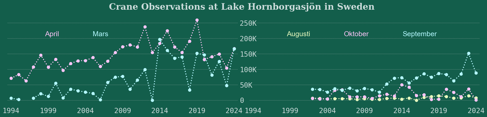

<script src="https://cdnjs.cloudflare.com/ajax/libs/require.js/2.3.6/require.min.js" integrity="sha512-c3Nl8+7g4LMSTdrm621y7kf9v3SDPnhxLNhcjFJbKECVnmZHTdo+IRO05sNLTH/D3vA6u1X32ehoLC7WFVdheg==" crossorigin="anonymous"></script>
<script src="https://cdnjs.cloudflare.com/ajax/libs/jquery/3.5.1/jquery.min.js" integrity="sha512-bLT0Qm9VnAYZDflyKcBaQ2gg0hSYNQrJ8RilYldYQ1FxQYoCLtUjuuRuZo+fjqhx/qtq/1itJ0C2ejDxltZVFg==" crossorigin="anonymous" data-relocate-top="true"></script>
<script type="application/javascript">define('jquery', [],function() {return window.jQuery;})</script>


## TidyTuesday dataset of [2025-09-30](https://github.com/rfordatascience/tidytuesday/blob/main/data/2025/2025-09-30)

``` python
import pandas as pd
import numpy as np
import matplotlib.pyplot as plt
from matplotlib.lines import Line2D
import seaborn as sns
```

``` python
cranes = pd.read_csv('https://raw.githubusercontent.com/rfordatascience/tidytuesday/main/data/2025/2025-09-30/cranes.csv')
```

``` python
cranes
```

<div>
<style scoped>
    .dataframe tbody tr th:only-of-type {
        vertical-align: middle;
    }

    .dataframe tbody tr th {
        vertical-align: top;
    }

    .dataframe thead th {
        text-align: right;
    }
</style>

|      | date       | observations | comment              | weather_disruption |
|------|------------|--------------|----------------------|--------------------|
| 0    | 2024-10-03 | 408.0        | Last count of season | False              |
| 1    | 2024-09-30 | 14940.0      | NaN                  | False              |
| 2    | 2024-09-26 | NaN          | Canceled/No count    | True               |
| 3    | 2024-09-23 | 18450.0      | NaN                  | False              |
| 4    | 2024-09-19 | 14900.0      | NaN                  | False              |
| \... | \...       | \...         | \...                 | \...               |
| 1543 | 1994-03-28 | NaN          | Canceled/No count    | False              |
| 1544 | 1994-03-27 | NaN          | Canceled/No count    | False              |
| 1545 | 1994-03-26 | NaN          | Canceled/No count    | False              |
| 1546 | 1994-03-25 | 200.0        | NaN                  | False              |
| 1547 | 1994-03-24 | 200.0        | NaN                  | False              |

<p>1548 rows × 4 columns</p>
</div>

``` python
cranes['date'] = pd.to_datetime(cranes['date'])
# add month and year columns. Month should be three letter

cranes['year'] = cranes['date'].dt.year
cranes['month'] = cranes['date'].dt.month

cranes['month'] = cranes['date'].dt.strftime('%b')
cranes['year_half'] = cranes['month'].apply(lambda x: 'first_half' if x in ['Jan', 'Feb', 'Mar', 'Apr', 'May', 'Jun'] else 'second_half')
```

``` python
cranes
```

<div>
<style scoped>
    .dataframe tbody tr th:only-of-type {
        vertical-align: middle;
    }

    .dataframe tbody tr th {
        vertical-align: top;
    }

    .dataframe thead th {
        text-align: right;
    }
</style>

|  | date | observations | comment | weather_disruption | year | month | year_half |
|----|----|----|----|----|----|----|----|
| 0 | 2024-10-03 | 408.0 | Last count of season | False | 2024 | Oct | second_half |
| 1 | 2024-09-30 | 14940.0 | NaN | False | 2024 | Sep | second_half |
| 2 | 2024-09-26 | NaN | Canceled/No count | True | 2024 | Sep | second_half |
| 3 | 2024-09-23 | 18450.0 | NaN | False | 2024 | Sep | second_half |
| 4 | 2024-09-19 | 14900.0 | NaN | False | 2024 | Sep | second_half |
| \... | \... | \... | \... | \... | \... | \... | \... |
| 1543 | 1994-03-28 | NaN | Canceled/No count | False | 1994 | Mar | first_half |
| 1544 | 1994-03-27 | NaN | Canceled/No count | False | 1994 | Mar | first_half |
| 1545 | 1994-03-26 | NaN | Canceled/No count | False | 1994 | Mar | first_half |
| 1546 | 1994-03-25 | 200.0 | NaN | False | 1994 | Mar | first_half |
| 1547 | 1994-03-24 | 200.0 | NaN | False | 1994 | Mar | first_half |

<p>1548 rows × 7 columns</p>
</div>

``` python
df_obs = cranes.groupby(['year','year_half', 'month'])['observations'].sum().reset_index()
```

``` python
month_mapping = {'Mar':'Mars', 'Apr':'April', 'Aug':'Augusti', 'Sep':'September', 'Oct':'Oktober'}
bg_color = '#135E4B'
fg_color = '#CCDCDB'
custom_map = ['#FCC5F8','#B3F7FE','#E7F8BE']
sns.set_theme(font_scale=1.75)
sns.set_style('white')
g = sns.catplot(data=df_obs, x='year', y='observations', col='year_half', kind='point', hue='month', \
            aspect=2, alpha=1, legend=True, linestyles=':', height=5, palette=custom_map)
g.set_titles(template="")  

legend_labels = list(g._legend_data.keys())

# remove legend
g._legend.remove()
# set x-tick at interval of 10
for ax in g.axes.flat:
    ax.set_xticks(range(0,32,5))
    ax.set_xlabel("")
    ax.set_ylabel("")
    ax.yaxis.grid(True,linestyle=':', linewidth=0.7,)
#    ax.xaxis.grid(True,linestyle=':', linewidth=0.3,)
    ax.spines[['left','bottom']].set_visible(False)
    yticks = [f'{int(x/1000)}K' if x > 0 else 0 for x in ax.get_yticks()]
    ax.set_yticklabels(yticks, fontfamily='monospace')
    ax.set_xticklabels(ax.get_xticklabels(), fontfamily='monospace')
    ax.set_facecolor(bg_color)
    ax.tick_params(colors=fg_color)


# Create separate legends for each subplot
for ind, ax in enumerate(g.axes.flat):
    # Get all lines in the subplot
    lines = ax.lines
    
    # Filter lines that have actual data (non-NaN y-values)
    valid_lines = []
    for line in lines:
        # Skip error bars (unlabeled lines)
        if line.get_label() == '':
            continue
            
        # Check if line has non-NaN data
        ydata = line.get_ydata()
        if not np.all(np.isnan(ydata)):
            valid_lines.append(line)
    
    # Extract labels from valid lines
    labels = [line.get_label() for line in valid_lines]
    
    # Sort labels numerically (if possible) or alphabetically
    try:
        # Try to convert labels to integers for numerical sorting
        sorted_indices = sorted(range(len(labels)), key=lambda i: int(labels[i]))
    except ValueError:
        # Fall back to alphabetical sorting if labels aren't numbers
        sorted_indices = sorted(range(len(labels)), key=lambda i: labels[i])
    
    # Reorder lines and labels
    sorted_lines = [valid_lines[i] for i in sorted_indices]
    sorted_labels = [labels[i] for i in sorted_indices]
#    print(sorted_labels)
    dummy_handles = [Line2D([], [], marker='none', linestyle='none') 
                         for _ in sorted_lines]
        
    # Add legend to subplot
    if ind==0:  
        legend = ax.legend(
            handles=dummy_handles, 
            labels=[month_mapping[label] for label in legend_labels[:2]], 
            title='month', 
            loc='upper left',
            frameon=False,
            ncol=3,
            bbox_to_anchor=(0.05, 0.9)
        )
    if ind>0:  
        legend = ax.legend(
            handles=dummy_handles, 
            labels=[month_mapping[label] for label in legend_labels[2:]], 
            title='month', 
            loc='upper left',
            frameon=False,
            ncol=3,
            bbox_to_anchor=(0.05, 0.9)
        )
    for text, line in zip(legend.get_texts(), sorted_lines):
        text.set_color(line.get_color())

     
        # Remove markers from legend handles
    legend.set_title('')


g.axes[0][0].tick_params(labelleft=False)
g.axes[0][1].tick_params(labelleft=True)
g.axes[0][1].tick_params(axis='y', labelleft=True, pad=20) 
g.axes[0][1].set_yticklabels(yticks, ha='left')
g.fig.subplots_adjust(wspace=0.05)
g.fig.suptitle('Crane Observations at Lake Hornborgasjön in Sweden', fontsize=24, family='Serif', \
                weight='bold', color=fg_color)
g.fig.patch.set_facecolor(bg_color)
plt.savefig("cranes_observations.png", dpi=300, bbox_inches='tight', pad_inches=0.1)
plt.show()
```

    The palette list has fewer values (3) than needed (5) and will cycle, which may produce an uninterpretable plot.
      g = sns.catplot(data=df_obs, x='year', y='observations', col='year_half', kind='point', hue='month', \
      ax.set_yticklabels(yticks, fontfamily='monospace')
      ax.set_yticklabels(yticks, fontfamily='monospace')
      g.axes[0][1].set_yticklabels(yticks, ha='left')


