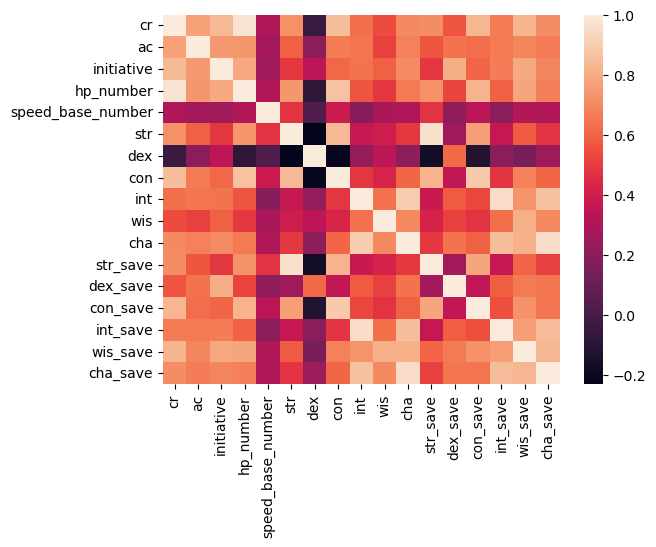
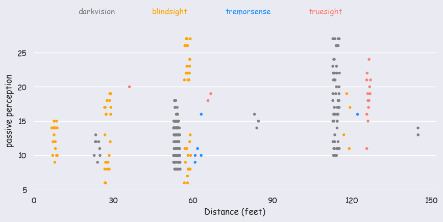
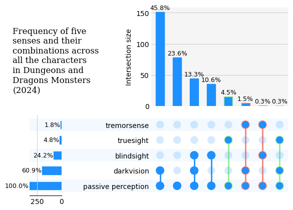

<script src="https://cdnjs.cloudflare.com/ajax/libs/require.js/2.3.6/require.min.js" integrity="sha512-c3Nl8+7g4LMSTdrm621y7kf9v3SDPnhxLNhcjFJbKECVnmZHTdo+IRO05sNLTH/D3vA6u1X32ehoLC7WFVdheg==" crossorigin="anonymous"></script>
<script src="https://cdnjs.cloudflare.com/ajax/libs/jquery/3.5.1/jquery.min.js" integrity="sha512-bLT0Qm9VnAYZDflyKcBaQ2gg0hSYNQrJ8RilYldYQ1FxQYoCLtUjuuRuZo+fjqhx/qtq/1itJ0C2ejDxltZVFg==" crossorigin="anonymous" data-relocate-top="true"></script>
<script type="application/javascript">define('jquery', [],function() {return window.jQuery;})</script>


# TidyTuesday dataset of [2025-05-27](https://github.com/rfordatascience/tidytuesday/blob/main/data/2025/2025-05-27)

``` python
import pandas as pd
import seaborn as sns
import matplotlib.pyplot as plt
```

``` python
monsters = pd.read_csv('https://raw.githubusercontent.com/rfordatascience/tidytuesday/main/data/2025/2025-05-27/monsters.csv')
```

``` python
monsters
```

<div>
<style scoped>
    .dataframe tbody tr th:only-of-type {
        vertical-align: middle;
    }

    .dataframe tbody tr th {
        vertical-align: top;
    }

    .dataframe thead th {
        text-align: right;
    }
</style>

|  | name | category | cr | size | type | descriptive_tags | alignment | ac | initiative | hp | \... | wis_save | cha_save | skills | resistances | vulnerabilities | immunities | gear | senses | languages | full_text |
|----|----|----|----|----|----|----|----|----|----|----|----|----|----|----|----|----|----|----|----|----|----|
| 0 | Aboleth | Aboleth | 10.000 | Large | Aberration | NaN | Lawful Evil | 17 | 7 | 150 (20d10 + 40) | \... | 6 | 4 | History +12, Perception +10 | NaN | NaN | NaN | NaN | Darkvision 120 ft.; Passive Perception 20 | Deep Speech; telepathy 120 ft. | Aboleth\nLarge Aberration, Lawful Evil\nAC 17\\.. |
| 1 | Air Elemental | Air Elemental | 5.000 | Large | Elemental | NaN | Neutral | 15 | 5 | 90 (12d10 + 24) | \... | 0 | -2 | NaN | Bludgeoning, Lightning, Piercing, Slashing | NaN | Poison, Thunder; Exhaustion, Grappled, Paralyz\... | NaN | Darkvision 60 ft.; Passive Perception 10 | Primordial (Auran) | Air Elemental\nLarge Elemental, Neutral\nAC 15\... |
| 2 | Animated Armor | Animated Objects | 1.000 | Medium | Construct | NaN | Unaligned | 18 | 2 | 33 (6d8 + 6) | \... | -4 | -5 | NaN | NaN | NaN | Poison, Psychic; Charmed, Deafened, Exhaustion\... | NaN | Blindsight 60 ft.; Passive Perception 6 | NaN | Animated Armor\nMedium Construct, Unaligned\nA\... |
| 3 | Animated Flying Sword | Animated Objects | 0.250 | Small | Construct | NaN | Unaligned | 17 | 4 | 14 (4d6) | \... | -3 | -5 | NaN | NaN | NaN | Poison, Psychic; Charmed, Deafened, Exhaustion\... | NaN | Blindsight 60 ft.; Passive Perception 7 | NaN | Animated Flying Sword\nSmall Construct, Unalig\... |
| 4 | Animated Rug of Smothering | Animated Objects | 2.000 | Large | Construct | NaN | Unaligned | 12 | 4 | 27 (5d10) | \... | -4 | -5 | NaN | NaN | NaN | Poison, Psychic; Charmed, Deafened, Exhaustion\... | NaN | Blindsight 60 ft.; Passive Perception 6 | NaN | Animated Rug of Smothering\nLarge Construct, U\... |
| \... | \... | \... | \... | \... | \... | \... | \... | \... | \... | \... | \... | \... | \... | \... | \... | \... | \... | \... | \... | \... | \... |
| 325 | Venomous Snake | Animals | 0.125 | Tiny | Beast | NaN | Unaligned | 12 | 2 | 5 (2d4) | \... | 0 | -4 | NaN | NaN | NaN | NaN | NaN | Blindsight 10 ft.; Passive Perception 10 | NaN | Venomous Snake\nTiny Beast, Unaligned\nAC 12 \\.. |
| 326 | Vulture | Animals | 0.000 | Medium | Beast | NaN | Unaligned | 10 | 0 | 5 (1d8 + 1) | \... | 1 | -3 | Perception +3 | NaN | NaN | NaN | NaN | Passive Perception 13 | NaN | Vulture\nMedium Beast, Unaligned\nAC 10 \t\t \... |
| 327 | Warhorse | Animals | 0.500 | Large | Beast | NaN | Unaligned | 11 | 1 | 19 (3d10 + 3) | \... | 3 | -2 | NaN | NaN | NaN | NaN | NaN | Passive Perception 11 | NaN | Warhorse\nLarge Beast, Unaligned\nAC 11 \t\t \... |
| 328 | Weasel | Animals | 0.000 | Tiny | Beast | NaN | Unaligned | 13 | 3 | 1 (1d4 − 1) | \... | 1 | -4 | Acrobatics +5, Perception +3, Stealth +5 | NaN | NaN | NaN | NaN | Darkvision 60 ft.; Passive Perception 13 | NaN | Weasel\nTiny Beast, Unaligned\nAC 13 \t\t \... |
| 329 | Wolf | Animals | 0.250 | Medium | Beast | NaN | Unaligned | 12 | 2 | 11 (2d8 + 2) | \... | 1 | -2 | Perception +5, Stealth +4 | NaN | NaN | NaN | NaN | Darkvision 60 ft.; Passive Perception 15 | NaN | Wolf\nMedium Beast, Unaligned\nAC 12 \t\t \... |

<p>330 rows × 33 columns</p>
</div>

``` python
monsters.columns
```

    Index(['name', 'category', 'cr', 'size', 'type', 'descriptive_tags',
           'alignment', 'ac', 'initiative', 'hp', 'hp_number', 'speed',
           'speed_base_number', 'str', 'dex', 'con', 'int', 'wis', 'cha',
           'str_save', 'dex_save', 'con_save', 'int_save', 'wis_save', 'cha_save',
           'skills', 'resistances', 'vulnerabilities', 'immunities', 'gear',
           'senses', 'languages', 'full_text'],
          dtype='object')

``` python
monsters.describe()
```

<div>
<style scoped>
    .dataframe tbody tr th:only-of-type {
        vertical-align: middle;
    }

    .dataframe tbody tr th {
        vertical-align: top;
    }

    .dataframe thead th {
        text-align: right;
    }
</style>

|  | cr | ac | initiative | hp_number | speed_base_number | str | dex | con | int | wis | cha | str_save | dex_save | con_save | int_save | wis_save | cha_save |
|----|----|----|----|----|----|----|----|----|----|----|----|----|----|----|----|----|----|
| count | 330.000000 | 330.000000 | 330.000000 | 330.000000 | 330.000000 | 330.000000 | 330.000000 | 330.000000 | 330.000000 | 330.000000 | 330.000000 | 330.000000 | 330.000000 | 330.000000 | 330.000000 | 330.000000 | 330.000000 |
| mean | 4.551136 | 14.287879 | 3.148485 | 86.669697 | 30.878788 | 15.384848 | 12.833333 | 15.178788 | 7.863636 | 11.815152 | 9.918182 | 2.675758 | 2.118182 | 2.784848 | -1.093939 | 1.872727 | 0.003030 |
| std | 5.797444 | 3.149589 | 3.944803 | 102.140570 | 12.339566 | 6.520047 | 3.261563 | 4.404492 | 5.675860 | 2.966748 | 5.969220 | 3.532010 | 2.452213 | 2.869886 | 3.224190 | 2.967224 | 3.524554 |
| min | 0.000000 | 5.000000 | -5.000000 | 1.000000 | 5.000000 | 1.000000 | 1.000000 | 8.000000 | 1.000000 | 3.000000 | 1.000000 | -5.000000 | -5.000000 | -1.000000 | -5.000000 | -4.000000 | -5.000000 |
| 25% | 0.500000 | 12.000000 | 1.000000 | 18.250000 | 30.000000 | 11.000000 | 10.000000 | 12.000000 | 2.000000 | 10.000000 | 5.000000 | 0.000000 | 1.000000 | 1.000000 | -4.000000 | 0.000000 | -3.000000 |
| 50% | 2.000000 | 14.000000 | 2.000000 | 52.000000 | 30.000000 | 16.000000 | 13.000000 | 14.500000 | 7.000000 | 12.000000 | 8.000000 | 3.000000 | 2.000000 | 2.000000 | -2.000000 | 1.000000 | -1.000000 |
| 75% | 6.000000 | 17.000000 | 4.000000 | 119.000000 | 40.000000 | 19.000000 | 15.000000 | 17.000000 | 12.000000 | 13.000000 | 14.000000 | 4.000000 | 3.000000 | 4.000000 | 1.000000 | 3.000000 | 2.000000 |
| max | 30.000000 | 25.000000 | 20.000000 | 697.000000 | 60.000000 | 30.000000 | 28.000000 | 30.000000 | 25.000000 | 25.000000 | 30.000000 | 17.000000 | 10.000000 | 15.000000 | 12.000000 | 12.000000 | 12.000000 |

</div>

``` python
monsters.groupby(["senses"]).size().sort_values(ascending=False)
```

    senses
    Darkvision 60 ft.; Passive Perception 10                         24
    Passive Perception 10                                            23
    Darkvision 60 ft.; Passive Perception 14                         15
    Darkvision 60 ft.; Passive Perception 13                         15
    Darkvision 60 ft.; Passive Perception 15                         14
                                                                     ..
    Darkvision 30 ft.; Passive Perception 11                          1
    Darkvision 30 ft.; Passive Perception 13                          1
    Darkvision 30 ft.; Passive Perception 9                           1
    Darkvision 60 ft., Tremorsense 120 ft.; Passive Perception 16     1
    Truesight 60 ft.; Passive Perception 19                           1
    Length: 100, dtype: int64

``` python
monsters.groupby(["size"]).describe()["cr"] 
```

<div>
<style scoped>
    .dataframe tbody tr th:only-of-type {
        vertical-align: middle;
    }

    .dataframe tbody tr th {
        vertical-align: top;
    }

    .dataframe thead th {
        text-align: right;
    }
</style>

|                 | count | mean      | std      | min    | 25%     | 50%   | 75%    | max  |
|-----------------|-------|-----------|----------|--------|---------|-------|--------|------|
| size            |       |           |          |        |         |       |        |      |
| Gargantuan      | 15.0  | 21.066667 | 4.366539 | 11.000 | 20.0000 | 22.00 | 23.000 | 30.0 |
| Huge            | 34.0  | 9.264706  | 5.088959 | 2.000  | 5.0000  | 8.50  | 13.750 | 19.0 |
| Large           | 107.0 | 5.003505  | 4.626958 | 0.125  | 1.5000  | 4.00  | 7.500  | 21.0 |
| Medium          | 90.0  | 2.183333  | 3.178238 | 0.000  | 0.2500  | 1.00  | 3.000  | 21.0 |
| Medium or Small | 36.0  | 3.524306  | 3.635124 | 0.000  | 0.8750  | 3.00  | 5.000  | 15.0 |
| Small           | 23.0  | 0.271739  | 0.254650 | 0.000  | 0.0625  | 0.25  | 0.500  | 1.0  |
| Tiny            | 25.0  | 0.235000  | 0.491225 | 0.000  | 0.0000  | 0.00  | 0.125  | 2.0  |

</div>

``` python
sns.heatmap(monsters.select_dtypes(include='number').corr())
```



``` python
monsters['senses'].values[:10]
```

    array(['Darkvision 120 ft.; Passive Perception 20',
           'Darkvision 60 ft.; Passive Perception 10',
           'Blindsight 60 ft.; Passive Perception 6',
           'Blindsight 60 ft.; Passive Perception 7',
           'Blindsight 60 ft.; Passive Perception 6',
           'Darkvision 60 ft., Tremorsense 60 ft.; Passive Perception 11',
           'Passive Perception 16', 'Passive Perception 10',
           'Passive Perception 10', 'Passive Perception 10'], dtype=object)

``` python
monsters[monsters['senses'].astype(str).str.contains('unimpeded', case=False, na=False)]
```

<div>
<style scoped>
    .dataframe tbody tr th:only-of-type {
        vertical-align: middle;
    }

    .dataframe tbody tr th {
        vertical-align: top;
    }

    .dataframe thead th {
        text-align: right;
    }
</style>

|  | name | category | cr | size | type | descriptive_tags | alignment | ac | initiative | hp | \... | wis_save | cha_save | skills | resistances | vulnerabilities | immunities | gear | senses | languages | full_text |
|----|----|----|----|----|----|----|----|----|----|----|----|----|----|----|----|----|----|----|----|----|----|
| 14 | Barbed Devil | Barbed Devil | 5.0 | Medium | Fiend | Devil | Lawful Evil | 15 | 3 | 110 (13d8 + 52) | \... | 5 | 5 | Deception +5, Insight +5, Perception +8 | Cold | NaN | Fire, Poison; Poisoned | NaN | Darkvision 120 ft. (unimpeded by magical Darkn\... | Infernal; telepathy 120 ft. | Barbed Devil\nMedium Fiend (Devil), Lawful Evi\... |
| 16 | Bearded Devil | Bearded Devil | 3.0 | Medium | Fiend | Devil | Lawful Evil | 13 | 2 | 58 (9d8 + 18) | \... | 0 | 4 | NaN | Cold | NaN | Fire, Poison; Frightened, Poisoned | NaN | Darkvision 120 ft. (unimpeded by magical Darkn\... | Infernal; telepathy 120 ft. | Bearded Devil\nMedium Fiend (Devil), Lawful Ev\... |
| 29 | Bone Devil | Bone Devil | 9.0 | Large | Fiend | Devil | Lawful Evil | 16 | 7 | 161 (17d10 + 68) | \... | 6 | 7 | Deception +7, Insight +6 | Cold | NaN | Fire, Poison; Poisoned | NaN | Darkvision 120 ft. (unimpeded by magical Darkn\... | Infernal; telepathy 120 ft. | Bone Devil\nLarge Fiend (Devil), Lawful Evil\n\... |
| 42 | Chain Devil | Chain Devil | 8.0 | Medium | Fiend | Devil | Lawful Evil | 15 | 5 | 85 (10d8 + 40) | \... | 4 | 2 | NaN | Bludgeoning, Cold, Piercing, Slashing | NaN | Fire, Poison; Poisoned | NaN | Darkvision 120 ft. (unimpeded by magical Darkn\... | Infernal; telepathy 120 ft. | Chain Devil\nMedium Fiend (Devil), Lawful Evil\... |
| 117 | Horned Devil | Horned Devil | 11.0 | Large | Fiend | Devil | Lawful Evil | 18 | 7 | 199 (19d10 + 95) | \... | 7 | 8 | NaN | Cold | NaN | Fire, Poison; Poisoned | NaN | Darkvision 150 ft. (unimpeded by magical Darkn\... | Infernal; telepathy 120 ft. | Horned Devil\nLarge Fiend (Devil), Lawful Evil\... |
| 120 | Imp | Imp | 1.0 | Tiny | Fiend | Devil | Lawful Evil | 13 | 3 | 21 (6d4 + 6) | \... | 1 | 2 | Deception +4, Insight +3, Stealth +5 | Cold | NaN | Fire, Poison; Poisoned | NaN | Darkvision 120 ft. (unimpeded by magical Darkn\... | Common, Infernal | Imp\nTiny Fiend (Devil), Lawful Evil\nAC 13 \t\... |
| 128 | Lemure | Lemure | 0.0 | Medium | Fiend | Devil | Lawful Evil | 9 | -3 | 9 (2d8) | \... | 0 | -4 | NaN | Cold | NaN | Fire, Poison; Charmed, Frightened, Poisoned | NaN | Darkvision 120 ft. (unimpeded by magical Darkn\... | Understands Infernal but can't speak | Lemure\nMedium Fiend (Devil), Lawful Evil\nAC \... |

<p>7 rows × 33 columns</p>
</div>

``` python
import re
```

``` python
def extract_senses(sense_str):
    result = {}
    if not isinstance(sense_str, str):
        return result

    # Senses to extract
    sense_names = ['darkvision', 'blindsight', 'tremorsense', 'truesight']
    
    # General pattern for senses with ft.
    for match in re.findall(r'([a-zA-Z]+)\s+(\d+)\s*ft*\.?', sense_str, flags=re.IGNORECASE):
        name, value = match
        name = name.strip().lower()
        if name in sense_names:
            result[name] = int(value)
    
    # Passive Perception (no ft.)
    pp_match = re.search(r'Passive Perception\s+(\d+)', sense_str, flags=re.IGNORECASE)
    if pp_match:
        result['passive perception'] = int(pp_match.group(1))
    
    return result

```

``` python
senses_df = monsters['senses'].apply(extract_senses).apply(pd.Series).fillna(0).astype(int)
senses_df
#(senses_df['passive perception'] == 0).any()
#senses_df[(senses_df == 0).sum(axis=1) == 2]
#senses_df[senses_df["tremorsense"] > 0]
```

<div>
<style scoped>
    .dataframe tbody tr th:only-of-type {
        vertical-align: middle;
    }

    .dataframe tbody tr th {
        vertical-align: top;
    }

    .dataframe thead th {
        text-align: right;
    }
</style>

|      | darkvision | passive perception | blindsight | tremorsense | truesight |
|------|------------|--------------------|------------|-------------|-----------|
| 0    | 120        | 20                 | 0          | 0           | 0         |
| 1    | 60         | 10                 | 0          | 0           | 0         |
| 2    | 0          | 6                  | 60         | 0           | 0         |
| 3    | 0          | 7                  | 60         | 0           | 0         |
| 4    | 0          | 6                  | 60         | 0           | 0         |
| \... | \...       | \...               | \...       | \...        | \...      |
| 325  | 0          | 10                 | 10         | 0           | 0         |
| 326  | 0          | 13                 | 0          | 0           | 0         |
| 327  | 0          | 11                 | 0          | 0           | 0         |
| 328  | 60         | 13                 | 0          | 0           | 0         |
| 329  | 60         | 15                 | 0          | 0           | 0         |

<p>330 rows × 5 columns</p>
</div>

``` python
senses_df_filtered = senses_df[(senses_df == 0).sum(axis=1) != 2]
senses_df_filtered
```

<div>
<style scoped>
    .dataframe tbody tr th:only-of-type {
        vertical-align: middle;
    }

    .dataframe tbody tr th {
        vertical-align: top;
    }

    .dataframe thead th {
        text-align: right;
    }
</style>

|      | darkvision | passive perception | blindsight | tremorsense | truesight |
|------|------------|--------------------|------------|-------------|-----------|
| 0    | 120        | 20                 | 0          | 0           | 0         |
| 1    | 60         | 10                 | 0          | 0           | 0         |
| 2    | 0          | 6                  | 60         | 0           | 0         |
| 3    | 0          | 7                  | 60         | 0           | 0         |
| 4    | 0          | 6                  | 60         | 0           | 0         |
| \... | \...       | \...               | \...       | \...        | \...      |
| 325  | 0          | 10                 | 10         | 0           | 0         |
| 326  | 0          | 13                 | 0          | 0           | 0         |
| 327  | 0          | 11                 | 0          | 0           | 0         |
| 328  | 60         | 13                 | 0          | 0           | 0         |
| 329  | 60         | 15                 | 0          | 0           | 0         |

<p>279 rows × 5 columns</p>
</div>

``` python
monsters_mod = pd.concat([monsters, senses_df], axis=1)
```

``` python
monsters_mod = monsters_mod[["size"]+list(monsters_mod.columns[-5:])]
```

``` python
import seaborn as sns
```

``` python
long_df = pd.melt(
    senses_df, #filtered
    id_vars=['passive perception'], #,'size'],             
    value_vars=['darkvision', 'blindsight', 'tremorsense', 'truesight'], 
    var_name='sense_type',
    value_name='distance'
)
long_df #[(long_df["sense_type"] == "tremorsense") & (long_df["distance"] != 0)]
```

<div>
<style scoped>
    .dataframe tbody tr th:only-of-type {
        vertical-align: middle;
    }

    .dataframe tbody tr th {
        vertical-align: top;
    }

    .dataframe thead th {
        text-align: right;
    }
</style>

|      | passive perception | sense_type | distance |
|------|--------------------|------------|----------|
| 0    | 20                 | darkvision | 120      |
| 1    | 10                 | darkvision | 60       |
| 2    | 6                  | darkvision | 0        |
| 3    | 7                  | darkvision | 0        |
| 4    | 6                  | darkvision | 0        |
| \... | \...               | \...       | \...     |
| 1315 | 10                 | truesight  | 0        |
| 1316 | 13                 | truesight  | 0        |
| 1317 | 11                 | truesight  | 0        |
| 1318 | 13                 | truesight  | 0        |
| 1319 | 15                 | truesight  | 0        |

<p>1320 rows × 3 columns</p>
</div>

### Two issues with the plot below.

1.  Cases with only passive perception are not there. If only `long_df` is used then there are lot many extra points.
2.  Two points for cases with more than two senses.

``` python
sns.set_theme(style="dark", font="Comic Sans MS")
current_style = sns.axes_style()
colors = ["grey", "orange", "dodgerblue", "salmon"]
plot1 = sns.catplot(data=long_df[long_df["distance"] != 0], x="distance", y="passive perception", hue="sense_type",\
            kind="strip", dodge=True, height=4, aspect=2, size=4, native_scale=True,\
                   jitter=0.25, palette=colors)
plot1._legend.remove()
plot1.add_legend(title='', ncol=4, bbox_to_anchor=(0.5, 1.05))
for ind, text in enumerate(plot1._legend.texts):
    text.set_color(colors[ind]) 
for handle in plot1._legend.legend_handles:
    handle.set_visible(False)
plot1.fig.set_facecolor(current_style['axes.facecolor'])
sns.despine(left=True, bottom=True, right=True, top=True)
for ax in plot1.axes.flat:
    ax.grid(axis='y', which='major')

plt.xticks(ticks=range(0,151,30))
plt.xlabel("Distance (feet)")
#plt.savefig("senses.png", dpi=300, bbox_inches="tight")
plt.show()
```



``` python
#plot1 = sns.catplot(data=long_df, x="distance", y="passive perception", hue="size",\
#            kind="strip", dodge=True, height=4, aspect=2, size=4, native_scale=True,\
#                   jitter=1, col="sense_type", col_wrap=2)
#plot1._legend.remove()
#plot1.add_legend(title='', ncol=7, bbox_to_anchor=(0.5, 1.05))
#plt.xticks(ticks=range(0,151,30))
#plt.xlabel("Distance (feet)")
#plt.tight_layout()
#plt.show()
```

``` python
sns.dark_palette("xkcd:golden", 4)
```

<svg  width="220" height="55"><rect x="0" y="0" width="55" height="55" style="fill:#282522;stroke-width:2;stroke:rgb(255,255,255)"/><rect x="55" y="0" width="55" height="55" style="fill:#6c5918;stroke-width:2;stroke:rgb(255,255,255)"/><rect x="110" y="0" width="55" height="55" style="fill:#b18c0d;stroke-width:2;stroke:rgb(255,255,255)"/><rect x="165" y="0" width="55" height="55" style="fill:#f5bf03;stroke-width:2;stroke:rgb(255,255,255)"/></svg>

## Upset plot

``` python
from upsetplot import plot
from upsetplot import UpSet
import textwrap
sns.reset_defaults()
```

``` python
binary_df = senses_df > 0
counts = binary_df.value_counts().sort_values(ascending=False)
```

``` python
upset = UpSet(counts, sort_by= "cardinality", show_percentages=True, facecolor="dodgerblue")
upset.style_subsets(present="truesight", edgecolor="lightgreen", linewidth=1)
upset.style_subsets(present="tremorsense", edgecolor="salmon", linewidth=1)

#upset.add_catplot(value="progression", kind="strip", color="blue")
upset.plot()
for ind, ax in enumerate(plt.gcf().get_axes()):
    if(ind == 3):
        ax.set_yticks(range(0,151,50))
        ax.set_facecolor("whitesmoke")
        ax.yaxis.grid(True, color="#D0D0D0")
    if(ind == 2):
        ax.xaxis.grid(True, color="#D0D0D0")
    ax.spines['left'].set_visible(False)
    ax.tick_params(axis='both', length=0)

    for text in ax.texts:
        if "%" in text.get_text():  
            text.set_fontsize(9)
#                text.set_fontfamily("Consolas")
title_text = "Frequency of five senses and their combinations across all the characters in Dungeons and Dragons Monsters (2024)"
plt.suptitle("\n".join(textwrap.wrap(title_text, width=20)), x=0.075, y=0.8, ha="left", fontfamily="Serif")
plt.savefig("senses_comb.png", dpi=300, facecolor="whitesmoke", bbox_inches='tight')
plt.show()
```

    The behavior will change in pandas 3.0. This inplace method will never work because the intermediate object on which we are setting values always behaves as a copy.

    For example, when doing 'df[col].method(value, inplace=True)', try using 'df.method({col: value}, inplace=True)' or df[col] = df[col].method(value) instead, to perform the operation inplace on the original object.


      styles["linewidth"].fillna(1, inplace=True)
    The behavior will change in pandas 3.0. This inplace method will never work because the intermediate object on which we are setting values always behaves as a copy.

    For example, when doing 'df[col].method(value, inplace=True)', try using 'df.method({col: value}, inplace=True)' or df[col] = df[col].method(value) instead, to perform the operation inplace on the original object.


      styles["facecolor"].fillna(self._facecolor, inplace=True)
    The behavior will change in pandas 3.0. This inplace method will never work because the intermediate object on which we are setting values always behaves as a copy.

    For example, when doing 'df[col].method(value, inplace=True)', try using 'df.method({col: value}, inplace=True)' or df[col] = df[col].method(value) instead, to perform the operation inplace on the original object.


      styles["edgecolor"].fillna(styles["facecolor"], inplace=True)
    The behavior will change in pandas 3.0. This inplace method will never work because the intermediate object on which we are setting values always behaves as a copy.

    For example, when doing 'df[col].method(value, inplace=True)', try using 'df.method({col: value}, inplace=True)' or df[col] = df[col].method(value) instead, to perform the operation inplace on the original object.


      styles["linestyle"].fillna("solid", inplace=True)


