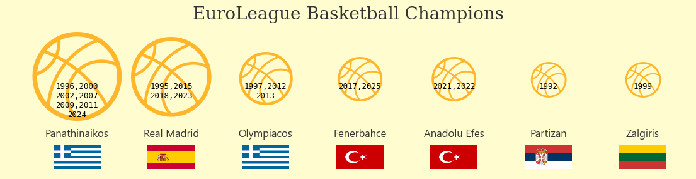

<script src="https://cdnjs.cloudflare.com/ajax/libs/require.js/2.3.6/require.min.js" integrity="sha512-c3Nl8+7g4LMSTdrm621y7kf9v3SDPnhxLNhcjFJbKECVnmZHTdo+IRO05sNLTH/D3vA6u1X32ehoLC7WFVdheg==" crossorigin="anonymous"></script>
<script src="https://cdnjs.cloudflare.com/ajax/libs/jquery/3.5.1/jquery.min.js" integrity="sha512-bLT0Qm9VnAYZDflyKcBaQ2gg0hSYNQrJ8RilYldYQ1FxQYoCLtUjuuRuZo+fjqhx/qtq/1itJ0C2ejDxltZVFg==" crossorigin="anonymous" data-relocate-top="true"></script>
<script type="application/javascript">define('jquery', [],function() {return window.jQuery;})</script>


## TidyTuesday dataset of [2025-10-07](https://github.com/rfordatascience/tidytuesday/blob/main/data/2025/2025-10-07)

``` python
import pandas as pd
import numpy as np
import matplotlib.pyplot as plt
import matplotlib.image as mpimg
from matplotlib.offsetbox import OffsetImage, AnnotationBbox
import flagpy as fp
```

``` python
euroleague_basketball = pd.read_csv('https://raw.githubusercontent.com/rfordatascience/tidytuesday/main/data/2025/2025-10-07/euroleague_basketball.csv')
```

``` python
euroleague_basketball
```

<div>
<style scoped>
    .dataframe tbody tr th:only-of-type {
        vertical-align: middle;
    }

    .dataframe tbody tr th {
        vertical-align: top;
    }

    .dataframe thead th {
        text-align: right;
    }
</style>

|  | Team | Home city | Arena | Capacity | Last season | Country | FinalFour_Appearances | Titles_Won | Years_of_FinalFour_Appearances | Years_of_Titles_Won |
|----|----|----|----|----|----|----|----|----|----|----|
| 0 | Anadolu Efes | Istanbul | Basketball Development Center | 10,000 | 6th | Turkey | 5 | 2 | 2000, 2001, 2019, 2021, 2022 | 2021, 2022 |
| 1 | Barcelona | Barcelona | Palau Blaugrana | 7,585 | 5th | Spain | 0 | 0 | NaN | NaN |
| 2 | Baskonia | Vitoria-Gasteiz | Buesa Arena | 15,431 | 14th | Spain | 0 | 0 | NaN | NaN |
| 3 | Bayern Munich | Munich | SAP Garden | 11,500 | 9th | Germany | 0 | 0 | NaN | NaN |
| 4 | Crvena zvezda Meridianbet | Belgrade | Belgrade Arena | 18,386 | 10th | Serbia | 0 | 0 | NaN | NaN |
| 5 | Dubai Basketball | Dubai | Coca-Cola Arena | 17,000 | NaN | United Arab Emirates | 0 | 0 | NaN | NaN |
| 6 | Fenerbahce | Istanbul | Ülker Sports and Event Hall | 13,000 | 1st | Turkey | 7 | 2 | 2015, 2016, 2017, 2018, 2019, 2024, 2025 | 2017, 2025 |
| 7 | Hapoel IBI Tel Aviv | Tel Aviv | Arena 8888 Sofia \\ Arena Botevgrad \\ Menora \... | 12,373 | (EuroCup) | Israel | 0 | 0 | NaN | NaN |
| 8 | LDLC ASVEL | Villeurbanne | LDLC Arena, Astroballe | 12,523, 5,556 | 15th | France | 0 | 0 | NaN | NaN |
| 9 | Maccabi Rapyd Tel Aviv | Tel Aviv | Menora Mivtachim Arena | 10,383 | 16th | Israel | 0 | 0 | NaN | NaN |
| 10 | Monaco | Monaco | Salle Gaston Médecin | 5,000 | 2nd | Monaco | 2 | 0 | 2023, 2025 | NaN |
| 11 | Olimpia Milano | Milan | Unipol Forum | 12,700 | 11th | Italy | 4 | 0 | 1992, 2021 | NaN |
| 12 | Olympiacos | Piraeus | Peace and Friendship Stadium | 12,300 | 3rd | Greece | 14 | 3 | 1994, 1995, 1997, 1999, 2009, 2010, 2012, 2013\... | 1997, 2012, 2013 |
| 13 | Panathinaikos | Athens | Telekom Center Athens | 18,300 | 4th | Greece | 13 | 7 | 1994, 1995, 1996, 2000, 2001, 2002, 2005, 2007\... | 1996, 2000, 2002, 2007, 2009, 2011, 2024 |
| 14 | Paris Basketball | Paris | Adidas Arena, Accor Arena | 8,000, 15,705 | 8th | France | 0 | 0 | NaN | NaN |
| 15 | Partizan | Belgrade | Belgrade Arena | 18,386 | 12th | Serbia | 3 | 1 | 1988, 1992, 1998, 2010 | 1992 |
| 16 | Real Madrid | Madrid | Movistar Arena | 15,000 | 7th | Spain | 12 | 6 | 1995, 1996, 2011, 2013, 2014, 2015, 2017, 2018\... | 1995, 2015, 2018, 2023 |
| 17 | Valencia Basket | Valencia | Roig Arena | 15,600 | (EuroCup) | Spain | 0 | 0 | NaN | NaN |
| 18 | Virtus Olidata Bologna | Bologna | Virtus Arena, PalaDozza | 9,980, 5,570 | 17th | Italy | 0 | 0 | NaN | NaN |
| 19 | Zalgiris | Kaunas | Žalgirio Arena | 15,415 | 13th | Lithuania | 2 | 1 | 1999, 2018 | 1999 |

</div>

``` python
countries = euroleague_basketball['Country'].unique()
countries
```

    array(['Turkey', 'Spain', 'Germany', 'Serbia', 'United Arab Emirates',
           'Israel', 'France', 'Monaco', 'Italy', 'Greece', 'Lithuania'],
          dtype=object)

``` python
# save flag for each country
for country in countries:
    if country=='United Arab Emirates':
        continue
    img = fp.get_flag_img(country)
    img.save(f'{country}_flag.png')
```

``` python
df_grp_team = (
            euroleague_basketball.groupby(['Country','Team'])
            .agg({'Titles_Won': 'sum',
                  'Years_of_Titles_Won': lambda x: ', '.join(x.dropna()),
                  })
            .sort_values(by='Titles_Won', ascending=False)
            .reset_index()
)
df_grp_team = df_grp_team[df_grp_team['Titles_Won'] > 0]
df_grp_team
```

<div>
<style scoped>
    .dataframe tbody tr th:only-of-type {
        vertical-align: middle;
    }

    .dataframe tbody tr th {
        vertical-align: top;
    }

    .dataframe thead th {
        text-align: right;
    }
</style>

|  | Country | Team | Titles_Won | Years_of_Titles_Won |
|----|----|----|----|----|
| 0 | Greece | Panathinaikos | 7 | 1996, 2000, 2002, 2007, 2009, 2011, 2024 |
| 1 | Spain | Real Madrid | 6 | 1995, 2015, 2018, 2023 |
| 2 | Greece | Olympiacos | 3 | 1997, 2012, 2013 |
| 3 | Turkey | Fenerbahce | 2 | 2017, 2025 |
| 4 | Turkey | Anadolu Efes | 2 | 2021, 2022 |
| 5 | Serbia | Partizan | 1 | 1992 |
| 6 | Lithuania | Zalgiris | 1 | 1999 |

</div>

## Plotting

``` python
plt.rcParams['font.family'] = 'Segoe UI Emoji'  
```

``` python
items = df_grp_team['Years_of_Titles_Won'].to_list()
def comma_newline(s):
    parts = [p.strip() for p in s.split(',')]
    separators = [',' if i % 2 == 0 else '\n' for i in range(len(parts) - 1)]
    return ''.join(p + sep for p, sep in zip(parts, separators)) + parts[-1]
#print(items)
year_won = [comma_newline(s) for s in items]
#print(year_won)

fig, ax = plt.subplots(figsize=(14, 3))#, subplot_kw=dict(polar=True))
plt.scatter(df_grp_team['Team'],[1]*len(df_grp_team['Titles_Won']), s=df_grp_team['Titles_Won']*1500, \
            color='orange', alpha=0)
for ind, (x, y, z) in enumerate(zip(df_grp_team['Team'],[1]*len(df_grp_team['Titles_Won']), year_won)):
    plt.text(x,y,z, fontsize=9, ha='center', va='top', color='black', family='monospace')
    plt.text(x, y,'\U0001F3C0', fontsize=(df_grp_team['Titles_Won'][ind]*10)+30, ha='center', va='center',\
            color='orange',zorder=1, alpha=0.8)
    plt.text(x, y-0.18,x, fontsize=12, ha='center', va='center', color='#333333')
    img = mpimg.imread(f'{df_grp_team["Country"][ind]}_flag.png')
    imagebox = OffsetImage(img, zoom=0.3)  
#    ab = AnnotationBbox(imagebox, (x, y-0.26), frameon=True, bboxprops=dict(edgecolor='lightgray'), zorder=2)  # Higher zorder
    ab = AnnotationBbox(imagebox, (x, y-0.26), frameon=False, zorder=2)  # Higher zorder
    ax.add_artist(ab)
plt.axis('off')
plt.xlim(-0.75,6.5)
plt.ylim(0.70,1.2)
plt.title("EuroLeague Basketball Champions", fontsize=20, family='Serif', color='#333333')
fig.patch.set_facecolor('#FFFDD0')
plt.savefig("euro_bb.png", dpi=300, bbox_inches="tight")
plt.show()
```



In the data, Real Madrid has six wins but only four years are given.
