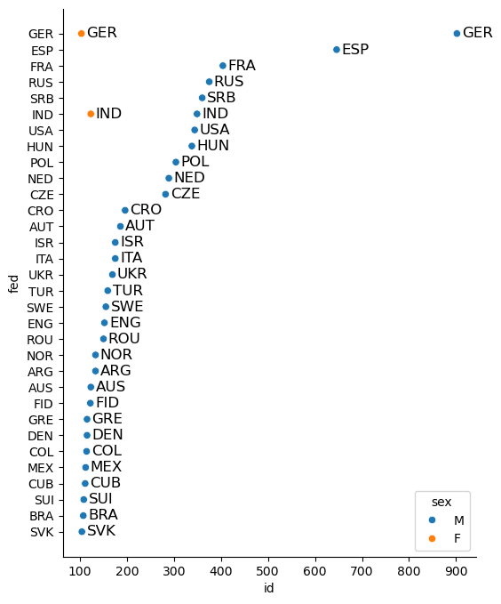
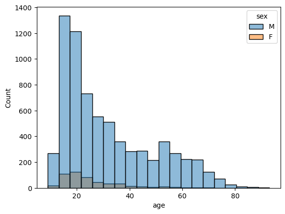

<script src="https://cdnjs.cloudflare.com/ajax/libs/require.js/2.3.6/require.min.js" integrity="sha512-c3Nl8+7g4LMSTdrm621y7kf9v3SDPnhxLNhcjFJbKECVnmZHTdo+IRO05sNLTH/D3vA6u1X32ehoLC7WFVdheg==" crossorigin="anonymous"></script>
<script src="https://cdnjs.cloudflare.com/ajax/libs/jquery/3.5.1/jquery.min.js" integrity="sha512-bLT0Qm9VnAYZDflyKcBaQ2gg0hSYNQrJ8RilYldYQ1FxQYoCLtUjuuRuZo+fjqhx/qtq/1itJ0C2ejDxltZVFg==" crossorigin="anonymous" data-relocate-top="true"></script>
<script type="application/javascript">define('jquery', [],function() {return window.jQuery;})</script>


## TidyTuesday dataset of [2025-09-23](https://github.com/rfordatascience/tidytuesday/blob/main/data/2025/2025-09-23)

``` python
import pandas as pd
import numpy as np
import matplotlib.pyplot as plt
import seaborn as sns
import textwrap
from plotnine import *
```

``` python
fide_ratings_august = pd.read_csv('https://raw.githubusercontent.com/rfordatascience/tidytuesday/main/data/2025/2025-09-23/fide_ratings_august.csv')
fide_ratings_september = pd.read_csv('https://raw.githubusercontent.com/rfordatascience/tidytuesday/main/data/2025/2025-09-23/fide_ratings_september.csv')
```

``` python
fide_ratings_august
```

<div>
<style scoped>
    .dataframe tbody tr th:only-of-type {
        vertical-align: middle;
    }

    .dataframe tbody tr th {
        vertical-align: top;
    }

    .dataframe thead th {
        text-align: right;
    }
</style>

|  | id | name | fed | sex | title | wtitle | otitle | foa | rating | games | k | bday |
|----|----|----|----|----|----|----|----|----|----|----|----|----|
| 0 | 53707043 | A Darshil | IND | M | NaN | NaN | NaN | NaN | 1412 | 4 | 40 | 2013 |
| 1 | 53200465 | A F M Ehteshamul, Hoque (tuhin | BAN | M | NaN | NaN | NaN | NaN | 1797 | 0 | 40 | 1977 |
| 2 | 5716365 | A Hamid, Harman | MAS | M | NaN | NaN | NaN | NaN | 1552 | 0 | 20 | 1970 |
| 3 | 53200553 | A I Sabbir | BAN | M | NaN | NaN | NaN | NaN | 1607 | 0 | 40 | 1995 |
| 4 | 5045886 | A K, Kalshyan | IND | M | NaN | NaN | NaN | NaN | 1747 | 0 | 20 | 1964 |
| \... | \... | \... | \... | \... | \... | \... | \... | \... | \... | \... | \... | \... |
| 201010 | 4600410 | Zysk, Robert | GER | M | IM | NaN | NaN | NaN | 2373 | 0 | 10 | 1966 |
| 201011 | 1141589 | Zysko, Jan | POL | M | NaN | NaN | NaN | NaN | 2129 | 6 | 20 | 1990 |
| 201012 | 80411533 | Zyskowski, Jean-Luc | FRA | M | NaN | NaN | NaN | NaN | 1517 | 6 | 20 | 1972 |
| 201013 | 21836060 | Zyto, Karol | POL | M | NaN | NaN | NaN | NaN | 1748 | 0 | 20 | 2006 |
| 201014 | 55812104 | Zyuryunina, Tatiana | RUS | F | NaN | NaN | NaN | NaN | 1416 | 0 | 40 | 2013 |

<p>201015 rows × 12 columns</p>
</div>

``` python
fide_Aug_fed_titles = (
    fide_ratings_august[fide_ratings_august['title'].notna()]
    .groupby(['fed','sex'])
    .count()
    .loc[lambda x: x['id']>100]
    .sort_values(by='id', ascending=False)
    .reset_index()
)
fide_Aug_fed_titles
```

<div>
<style scoped>
    .dataframe tbody tr th:only-of-type {
        vertical-align: middle;
    }

    .dataframe tbody tr th {
        vertical-align: top;
    }

    .dataframe thead th {
        text-align: right;
    }
</style>

|     | fed | sex | id  | name | title | wtitle | otitle | foa | rating | games | k   | bday |
|-----|-----|-----|-----|------|-------|--------|--------|-----|--------|-------|-----|------|
| 0   | GER | M   | 902 | 902  | 902   | 0      | 29     | 0   | 902    | 902   | 902 | 902  |
| 1   | ESP | M   | 646 | 646  | 646   | 0      | 45     | 0   | 646    | 646   | 646 | 646  |
| 2   | FRA | M   | 404 | 404  | 404   | 0      | 8      | 0   | 404    | 404   | 404 | 404  |
| 3   | RUS | M   | 375 | 375  | 375   | 0      | 3      | 0   | 375    | 375   | 375 | 375  |
| 4   | SRB | M   | 360 | 360  | 360   | 0      | 24     | 0   | 360    | 360   | 360 | 360  |
| 5   | IND | M   | 349 | 349  | 349   | 0      | 24     | 0   | 349    | 349   | 349 | 349  |
| 6   | USA | M   | 344 | 344  | 344   | 0      | 14     | 0   | 344    | 344   | 344 | 344  |
| 7   | HUN | M   | 338 | 338  | 338   | 0      | 29     | 0   | 338    | 338   | 338 | 338  |
| 8   | POL | M   | 304 | 304  | 304   | 0      | 5      | 0   | 304    | 304   | 304 | 304  |
| 9   | NED | M   | 289 | 289  | 289   | 0      | 6      | 0   | 289    | 289   | 289 | 289  |
| 10  | CZE | M   | 282 | 282  | 282   | 0      | 12     | 0   | 282    | 282   | 282 | 282  |
| 11  | CRO | M   | 196 | 196  | 196   | 0      | 17     | 0   | 196    | 196   | 196 | 196  |
| 12  | AUT | M   | 186 | 186  | 186   | 0      | 6      | 0   | 186    | 186   | 186 | 186  |
| 13  | ISR | M   | 175 | 175  | 175   | 0      | 8      | 0   | 175    | 175   | 175 | 175  |
| 14  | ITA | M   | 175 | 175  | 175   | 0      | 7      | 0   | 175    | 175   | 175 | 175  |
| 15  | UKR | M   | 169 | 169  | 169   | 0      | 3      | 0   | 169    | 169   | 169 | 169  |
| 16  | TUR | M   | 159 | 159  | 159   | 0      | 5      | 0   | 159    | 159   | 159 | 159  |
| 17  | SWE | M   | 155 | 155  | 155   | 0      | 7      | 0   | 155    | 155   | 155 | 155  |
| 18  | ENG | M   | 152 | 152  | 152   | 0      | 6      | 0   | 152    | 152   | 152 | 152  |
| 19  | ROU | M   | 150 | 150  | 150   | 0      | 8      | 0   | 150    | 150   | 150 | 150  |
| 20  | NOR | M   | 133 | 133  | 133   | 0      | 5      | 0   | 133    | 133   | 133 | 133  |
| 21  | ARG | M   | 133 | 133  | 133   | 0      | 10     | 0   | 133    | 133   | 133 | 133  |
| 22  | AUS | M   | 123 | 123  | 123   | 0      | 7      | 0   | 123    | 123   | 123 | 123  |
| 23  | IND | F   | 123 | 123  | 123   | 122    | 7      | 0   | 123    | 123   | 123 | 123  |
| 24  | FID | M   | 122 | 122  | 122   | 0      | 6      | 0   | 122    | 122   | 122 | 122  |
| 25  | GRE | M   | 115 | 115  | 115   | 0      | 9      | 0   | 115    | 115   | 115 | 115  |
| 26  | DEN | M   | 115 | 115  | 115   | 0      | 3      | 0   | 115    | 115   | 115 | 115  |
| 27  | COL | M   | 114 | 114  | 114   | 0      | 9      | 0   | 114    | 114   | 114 | 114  |
| 28  | MEX | M   | 112 | 112  | 112   | 0      | 3      | 0   | 112    | 112   | 112 | 112  |
| 29  | CUB | M   | 111 | 111  | 111   | 0      | 11     | 0   | 111    | 111   | 111 | 111  |
| 30  | SUI | M   | 108 | 108  | 108   | 0      | 7      | 0   | 108    | 108   | 108 | 108  |
| 31  | BRA | M   | 107 | 107  | 107   | 0      | 8      | 0   | 107    | 107   | 107 | 107  |
| 32  | SVK | M   | 104 | 104  | 104   | 0      | 7      | 0   | 104    | 104   | 104 | 104  |
| 33  | GER | F   | 103 | 103  | 103   | 102    | 6      | 0   | 103    | 103   | 103 | 103  |

</div>

``` python
fig,ax = plt.subplots(figsize=(6,8))
sns.scatterplot(data=fide_Aug_fed_titles, x='id', y='fed', hue='sex')
# add fed label to points
for i, row in fide_Aug_fed_titles.iterrows():
    plt.text(row['id']+10, row['fed'], row['fed'], fontsize=12, ha='left', va='center')
sns.despine()
plt.show()
```



``` python
fide_Aug_fed_titles['symbol'] = fide_Aug_fed_titles['sex'].apply(
    lambda s: '♔' if s == 'M' else '♕'
)
fide_Aug_fed_titles
```

<div>
<style scoped>
    .dataframe tbody tr th:only-of-type {
        vertical-align: middle;
    }

    .dataframe tbody tr th {
        vertical-align: top;
    }

    .dataframe thead th {
        text-align: right;
    }
</style>

|     | fed | sex | id  | name | title | wtitle | otitle | foa | rating | games | k   | bday | symbol |
|-----|-----|-----|-----|------|-------|--------|--------|-----|--------|-------|-----|------|--------|
| 0   | GER | M   | 902 | 902  | 902   | 0      | 29     | 0   | 902    | 902   | 902 | 902  | ♔      |
| 1   | ESP | M   | 646 | 646  | 646   | 0      | 45     | 0   | 646    | 646   | 646 | 646  | ♔      |
| 2   | FRA | M   | 404 | 404  | 404   | 0      | 8      | 0   | 404    | 404   | 404 | 404  | ♔      |
| 3   | RUS | M   | 375 | 375  | 375   | 0      | 3      | 0   | 375    | 375   | 375 | 375  | ♔      |
| 4   | SRB | M   | 360 | 360  | 360   | 0      | 24     | 0   | 360    | 360   | 360 | 360  | ♔      |
| 5   | IND | M   | 349 | 349  | 349   | 0      | 24     | 0   | 349    | 349   | 349 | 349  | ♔      |
| 6   | USA | M   | 344 | 344  | 344   | 0      | 14     | 0   | 344    | 344   | 344 | 344  | ♔      |
| 7   | HUN | M   | 338 | 338  | 338   | 0      | 29     | 0   | 338    | 338   | 338 | 338  | ♔      |
| 8   | POL | M   | 304 | 304  | 304   | 0      | 5      | 0   | 304    | 304   | 304 | 304  | ♔      |
| 9   | NED | M   | 289 | 289  | 289   | 0      | 6      | 0   | 289    | 289   | 289 | 289  | ♔      |
| 10  | CZE | M   | 282 | 282  | 282   | 0      | 12     | 0   | 282    | 282   | 282 | 282  | ♔      |
| 11  | CRO | M   | 196 | 196  | 196   | 0      | 17     | 0   | 196    | 196   | 196 | 196  | ♔      |
| 12  | AUT | M   | 186 | 186  | 186   | 0      | 6      | 0   | 186    | 186   | 186 | 186  | ♔      |
| 13  | ISR | M   | 175 | 175  | 175   | 0      | 8      | 0   | 175    | 175   | 175 | 175  | ♔      |
| 14  | ITA | M   | 175 | 175  | 175   | 0      | 7      | 0   | 175    | 175   | 175 | 175  | ♔      |
| 15  | UKR | M   | 169 | 169  | 169   | 0      | 3      | 0   | 169    | 169   | 169 | 169  | ♔      |
| 16  | TUR | M   | 159 | 159  | 159   | 0      | 5      | 0   | 159    | 159   | 159 | 159  | ♔      |
| 17  | SWE | M   | 155 | 155  | 155   | 0      | 7      | 0   | 155    | 155   | 155 | 155  | ♔      |
| 18  | ENG | M   | 152 | 152  | 152   | 0      | 6      | 0   | 152    | 152   | 152 | 152  | ♔      |
| 19  | ROU | M   | 150 | 150  | 150   | 0      | 8      | 0   | 150    | 150   | 150 | 150  | ♔      |
| 20  | NOR | M   | 133 | 133  | 133   | 0      | 5      | 0   | 133    | 133   | 133 | 133  | ♔      |
| 21  | ARG | M   | 133 | 133  | 133   | 0      | 10     | 0   | 133    | 133   | 133 | 133  | ♔      |
| 22  | AUS | M   | 123 | 123  | 123   | 0      | 7      | 0   | 123    | 123   | 123 | 123  | ♔      |
| 23  | IND | F   | 123 | 123  | 123   | 122    | 7      | 0   | 123    | 123   | 123 | 123  | ♕      |
| 24  | FID | M   | 122 | 122  | 122   | 0      | 6      | 0   | 122    | 122   | 122 | 122  | ♔      |
| 25  | GRE | M   | 115 | 115  | 115   | 0      | 9      | 0   | 115    | 115   | 115 | 115  | ♔      |
| 26  | DEN | M   | 115 | 115  | 115   | 0      | 3      | 0   | 115    | 115   | 115 | 115  | ♔      |
| 27  | COL | M   | 114 | 114  | 114   | 0      | 9      | 0   | 114    | 114   | 114 | 114  | ♔      |
| 28  | MEX | M   | 112 | 112  | 112   | 0      | 3      | 0   | 112    | 112   | 112 | 112  | ♔      |
| 29  | CUB | M   | 111 | 111  | 111   | 0      | 11     | 0   | 111    | 111   | 111 | 111  | ♔      |
| 30  | SUI | M   | 108 | 108  | 108   | 0      | 7      | 0   | 108    | 108   | 108 | 108  | ♔      |
| 31  | BRA | M   | 107 | 107  | 107   | 0      | 8      | 0   | 107    | 107   | 107 | 107  | ♔      |
| 32  | SVK | M   | 104 | 104  | 104   | 0      | 7      | 0   | 104    | 104   | 104 | 104  | ♔      |
| 33  | GER | F   | 103 | 103  | 103   | 102    | 6      | 0   | 103    | 103   | 103 | 103  | ♕      |

</div>

``` python
unique_fed_order = fide_Aug_fed_titles['fed'].drop_duplicates()[::-1].tolist()
fide_Aug_fed_titles['fed'] = pd.Categorical(
    fide_Aug_fed_titles['fed'],
    categories=unique_fed_order,
    ordered=True
)
fide_Aug_fed_titles['fed_label'] = fide_Aug_fed_titles.apply(
    lambda row: f"{row['fed']} ({row['id']})", axis=1
)
fed_list = ['IND', 'GER', 'ESP', 'FRA', 'CRO', 'SVK']
#label_df = fide_Aug_fed_titles[fide_Aug_fed_titles['fed'].isin(fed_list)].copy()
label_df = fide_Aug_fed_titles.copy()
label_df['label'] = label_df.apply(lambda row: f'({row.id})', axis=1)
wrapped_title = textwrap.fill("Number of male (♔) and female (♕) chess players with titles in August 2025. Countries with more than 100 titled players are shown.", \
                    width=35)

(
    ggplot(fide_Aug_fed_titles, aes(x='id', y='fed')) +
#    geom_point(size=2) +
    geom_text(aes(label='symbol'), size=15, va='center', color='#FFFFFF', show_legend=False) + 
    geom_text(aes(label='fed', color='sex'), nudge_x=20, size=10, ha='left', va='center',\
     show_legend=False, family='monospace') +
    geom_text(data=label_df, mapping=aes(label='label', color='sex'), nudge_x=65, \
    size=9, va='center', ha='left', family='monospace', show_legend=False) +
    annotate('text', x=325, y=10, label=wrapped_title, color='#EEEEEE', \
    size=14, ha='left', va='center') +
    theme_minimal() +
    scale_color_manual(values={'M':'skyblue', 'F':'pink'}) +
#    labs(x='Number of players with titles') +
    xlim(0, 985) +
    theme(figure_size=(6, 6),
        axis_title_y=element_blank(),
        axis_text_y=element_blank(),
        axis_ticks_major_y=element_blank(),
        axis_ticks_minor_y=element_blank(),
        panel_grid_major_y=element_blank(),
        axis_title_x=element_blank(),
        axis_text_x=element_blank(),
        axis_ticks_major_x=element_blank(),
        axis_ticks_minor_x=element_blank(),
        panel_grid_major_x=element_blank(),
        panel_grid_minor_x=element_blank(),
        plot_background=element_rect(fill='#2E2E2E'),
        panel_background=element_rect(fill='#2E2E2E')
    )
)#.save('chess_ratings.png', width=6, height=6, dpi=300)
```


``` python
df_sept_mod = (
    fide_ratings_september[(fide_ratings_september['rating']>2000) & 
    (fide_ratings_september['games']>0)]
    .groupby("fed")
    .obj
#    .loc[lambda x: x['id']>100]
#    .loc[lambda x: x['fed']=="IND"]
#    .sort_values(by='id', ascending=False)
    # change bday to datetime
    .assign(bday=lambda x: pd.to_datetime(x['bday'], format='%Y'))
    .assign(age=lambda x: 2025 - x['bday'].dt.year)
)

df_sept_mod
```

<div>
<style scoped>
    .dataframe tbody tr th:only-of-type {
        vertical-align: middle;
    }

    .dataframe tbody tr th {
        vertical-align: top;
    }

    .dataframe thead th {
        text-align: right;
    }
</style>

|  | id | name | fed | sex | title | wtitle | otitle | foa | rating | games | k | bday | age |
|----|----|----|----|----|----|----|----|----|----|----|----|----|----|
| 57 | 33362041 | Aadik Theophane Lenin | IND | M | NaN | NaN | NaN | AIM | 2108 | 9 | 40 | 2012-01-01 | 13 |
| 77 | 25678191 | Aaditya Dhingra | IND | M | IM | NaN | NaN | NaN | 2391 | 17 | 10 | 2006-01-01 | 19 |
| 127 | 25644394 | Aakash G | IND | M | FM | NaN | NaN | NaN | 2349 | 17 | 20 | 2010-01-01 | 15 |
| 131 | 25033220 | Aakash Sharadchandra, Dalvi | IND | M | IM | NaN | NaN | NaN | 2420 | 18 | 10 | 2002-01-01 | 23 |
| 137 | 510726 | Aalto, Patrik | FIN | M | FM | NaN | NaN | NaN | 2296 | 9 | 20 | 2004-01-01 | 21 |
| \... | \... | \... | \... | \... | \... | \... | \... | \... | \... | \... | \... | \... | \... |
| 203110 | 393770 | Zvolensky, David | CZE | M | NaN | NaN | NaN | NaN | 2157 | 18 | 20 | 2002-01-01 | 23 |
| 203124 | 325511 | Zwardon, Vojtech | CZE | M | IM | NaN | NaN | NaN | 2431 | 10 | 10 | 1990-01-01 | 35 |
| 203127 | 1332252 | Zweifel, Richard | SUI | M | CM | NaN | NaN | NaN | 2196 | 1 | 20 | 1973-01-01 | 52 |
| 203145 | 1036432 | Zwirs, Nico | NED | M | IM | NaN | NaN | NaN | 2432 | 9 | 10 | 1994-01-01 | 31 |
| 203163 | 4200292 | Zygouris, Hristos | GRE | M | NaN | NaN | NaN | NaN | 2194 | 9 | 20 | 1974-01-01 | 51 |

<p>7581 rows × 13 columns</p>
</div>

``` python
sns.histplot(data=df_sept_mod, x='age', bins=20, hue='sex')
```


