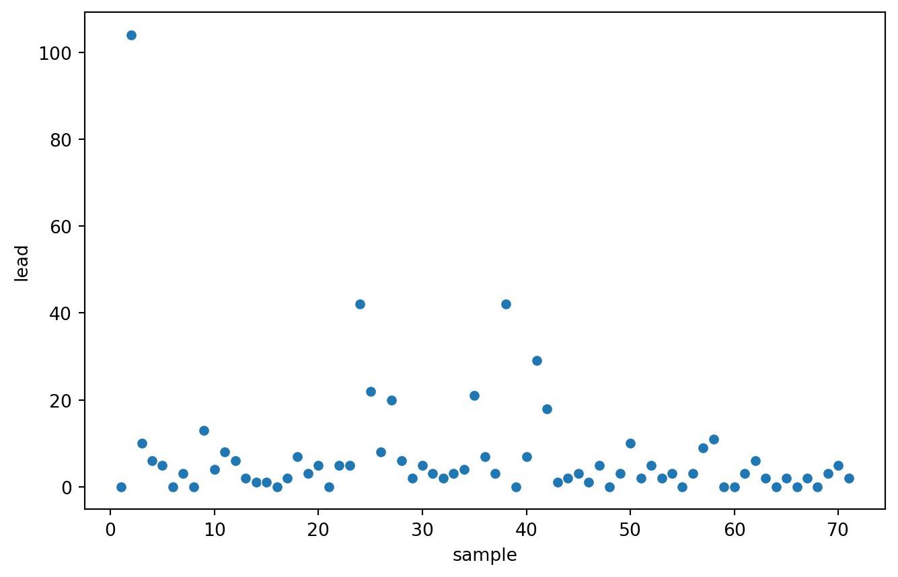
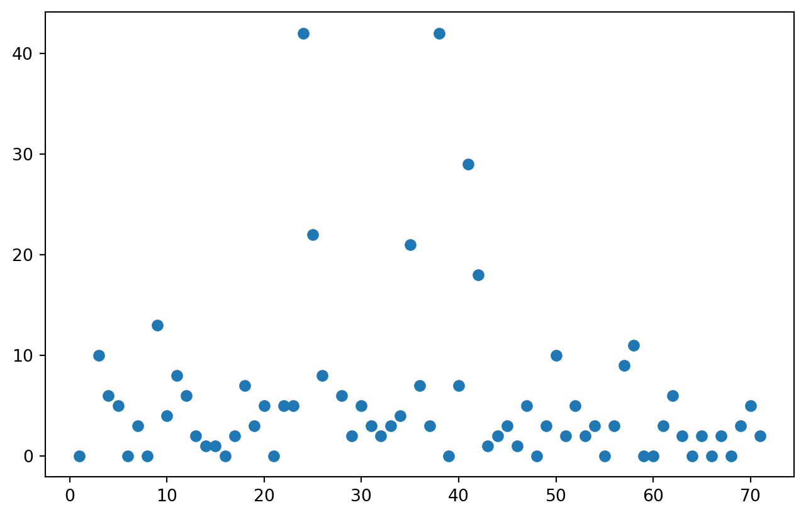
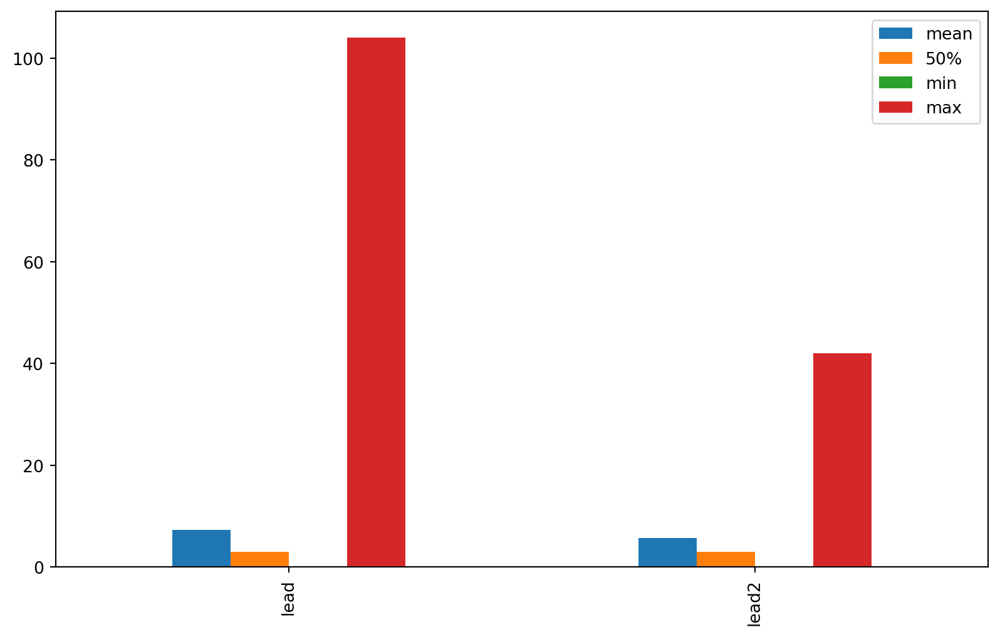
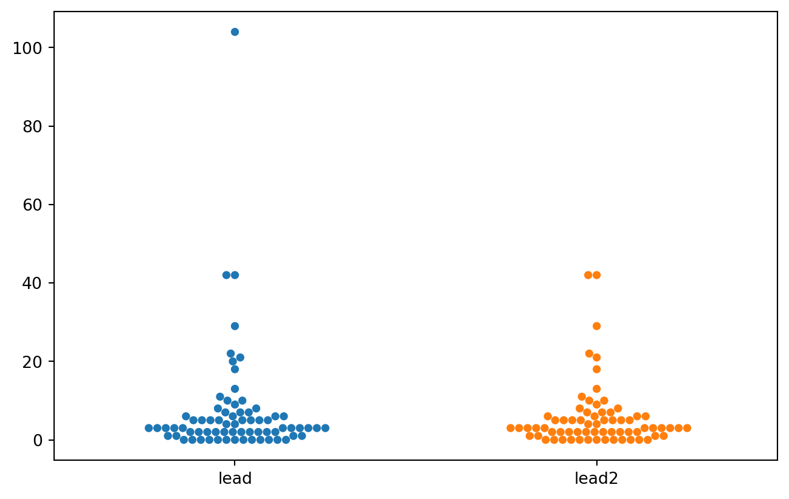
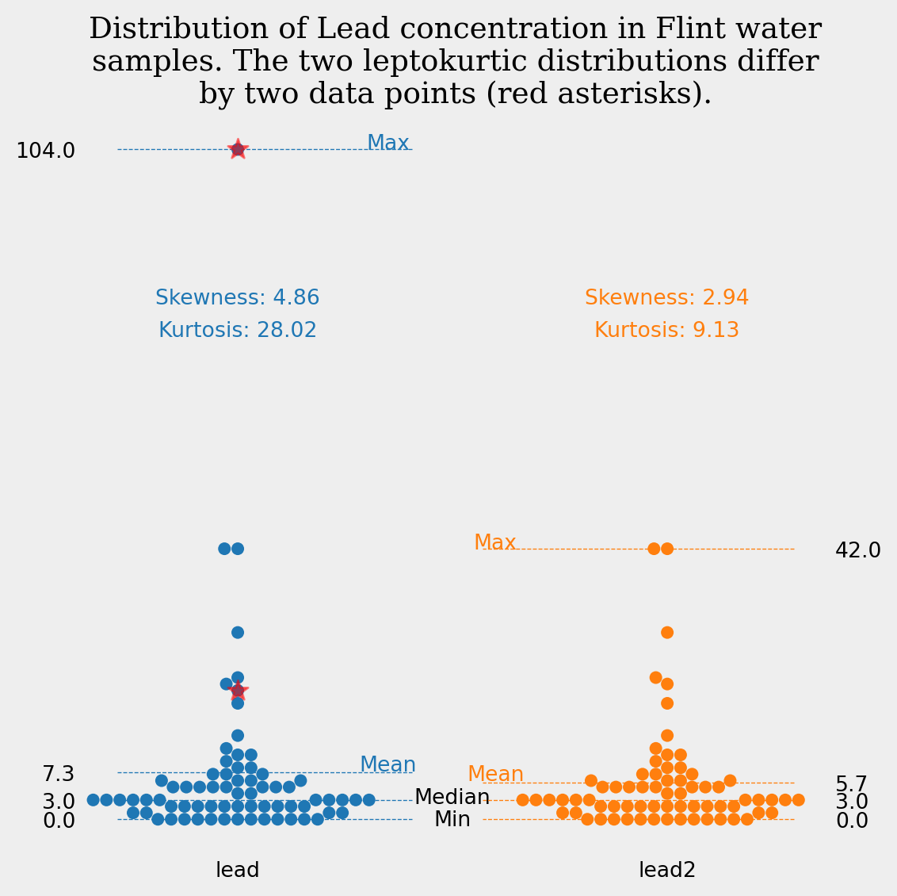
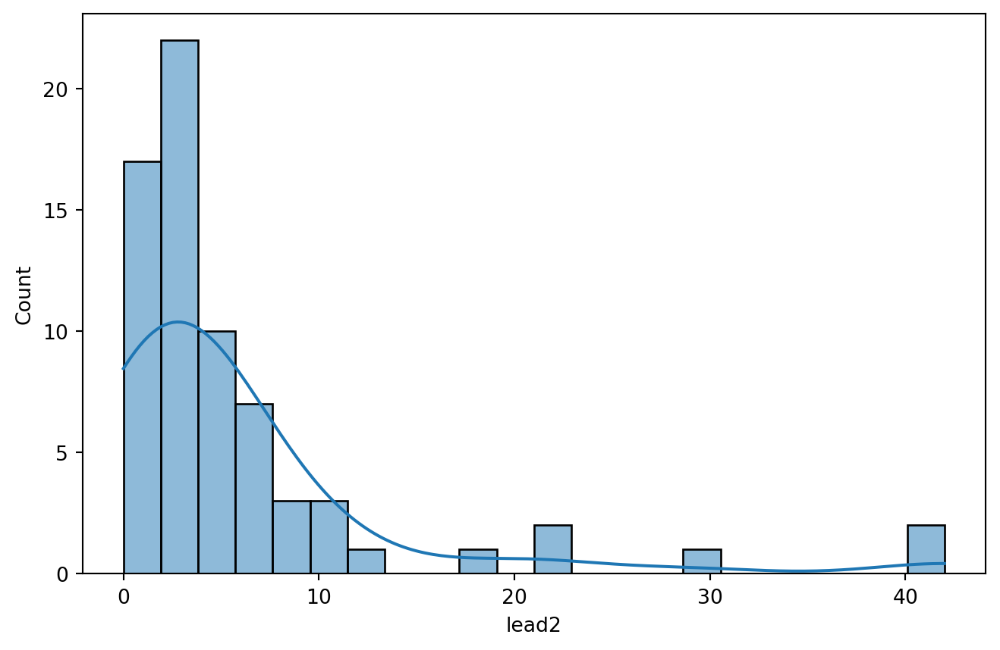

<script src="https://cdnjs.cloudflare.com/ajax/libs/require.js/2.3.6/require.min.js" integrity="sha512-c3Nl8+7g4LMSTdrm621y7kf9v3SDPnhxLNhcjFJbKECVnmZHTdo+IRO05sNLTH/D3vA6u1X32ehoLC7WFVdheg==" crossorigin="anonymous"></script>
<script src="https://cdnjs.cloudflare.com/ajax/libs/jquery/3.5.1/jquery.min.js" integrity="sha512-bLT0Qm9VnAYZDflyKcBaQ2gg0hSYNQrJ8RilYldYQ1FxQYoCLtUjuuRuZo+fjqhx/qtq/1itJ0C2ejDxltZVFg==" crossorigin="anonymous" data-relocate-top="true"></script>
<script type="application/javascript">define('jquery', [],function() {return window.jQuery;})</script>


## TidyTuesday dataset of [2025-11-04](https://github.com/rfordatascience/tidytuesday/blob/main/data/2025/2025-11-04)

``` python
import pandas as pd
import matplotlib.pyplot as plt
from matplotlib.ticker import FuncFormatter
import seaborn as sns
from scipy.stats import skew, kurtosis
import textwrap
```

``` python
flint_mdeq = pd.read_csv('https://raw.githubusercontent.com/rfordatascience/tidytuesday/main/data/2025/2025-11-04/flint_mdeq.csv')
flint_vt = pd.read_csv('https://raw.githubusercontent.com/rfordatascience/tidytuesday/main/data/2025/2025-11-04/flint_vt.csv')
```

``` python
flint_mdeq
```

<div>
<style scoped>
    .dataframe tbody tr th:only-of-type {
        vertical-align: middle;
    }

    .dataframe tbody tr th {
        vertical-align: top;
    }

    .dataframe thead th {
        text-align: right;
    }
</style>

|      | sample | lead | lead2 | notes                              |
|------|--------|------|-------|------------------------------------|
| 0    | 1      | 0    | 0.0   | NaN                                |
| 1    | 2      | 104  | NaN   | sample removed: house had a filter |
| 2    | 3      | 10   | 10.0  | NaN                                |
| 3    | 4      | 6    | 6.0   | NaN                                |
| 4    | 5      | 5    | 5.0   | NaN                                |
| \... | \...   | \... | \...  | \...                               |
| 66   | 67     | 2    | 2.0   | NaN                                |
| 67   | 68     | 0    | 0.0   | NaN                                |
| 68   | 69     | 3    | 3.0   | NaN                                |
| 69   | 70     | 5    | 5.0   | NaN                                |
| 70   | 71     | 2    | 2.0   | NaN                                |

<p>71 rows × 4 columns</p>
</div>

``` python
sns.scatterplot(data=flint_mdeq, x='sample', y='lead')
```



``` python
plt.scatter(flint_mdeq['sample'],flint_mdeq['lead2'])
#plt.scatter(flint_vt['sample'],flint_vt['lead'])
```



``` python
flint_mdeq.describe()
```

<div>
<style scoped>
    .dataframe tbody tr th:only-of-type {
        vertical-align: middle;
    }

    .dataframe tbody tr th {
        vertical-align: top;
    }

    .dataframe thead th {
        text-align: right;
    }
</style>

|       | sample    | lead       | lead2     |
|-------|-----------|------------|-----------|
| count | 71.000000 | 71.000000  | 69.000000 |
| mean  | 36.000000 | 7.309859   | 5.724638  |
| std   | 20.639767 | 14.347316  | 8.336461  |
| min   | 1.000000  | 0.000000   | 0.000000  |
| 25%   | 18.500000 | 2.000000   | 2.000000  |
| 50%   | 36.000000 | 3.000000   | 3.000000  |
| 75%   | 53.500000 | 6.500000   | 6.000000  |
| max   | 71.000000 | 104.000000 | 42.000000 |

</div>

``` python
desc = flint_mdeq[['lead','lead2']].describe().T[['mean','50%', 'min','max']]
desc
```

<div>
<style scoped>
    .dataframe tbody tr th:only-of-type {
        vertical-align: middle;
    }

    .dataframe tbody tr th {
        vertical-align: top;
    }

    .dataframe thead th {
        text-align: right;
    }
</style>

|       | mean     | 50% | min | max   |
|-------|----------|-----|-----|-------|
| lead  | 7.309859 | 3.0 | 0.0 | 104.0 |
| lead2 | 5.724638 | 3.0 | 0.0 | 42.0  |

</div>

``` python
desc.plot(kind='bar', figsize=(10,6))
```



``` python
sns.swarmplot(flint_mdeq[['lead','lead2']])
```



``` python
flint_mdeq
```

<div>
<style scoped>
    .dataframe tbody tr th:only-of-type {
        vertical-align: middle;
    }

    .dataframe tbody tr th {
        vertical-align: top;
    }

    .dataframe thead th {
        text-align: right;
    }
</style>

|      | sample | lead | lead2 | notes                              |
|------|--------|------|-------|------------------------------------|
| 0    | 1      | 0    | 0.0   | NaN                                |
| 1    | 2      | 104  | NaN   | sample removed: house had a filter |
| 2    | 3      | 10   | 10.0  | NaN                                |
| 3    | 4      | 6    | 6.0   | NaN                                |
| 4    | 5      | 5    | 5.0   | NaN                                |
| \... | \...   | \... | \...  | \...                               |
| 66   | 67     | 2    | 2.0   | NaN                                |
| 67   | 68     | 0    | 0.0   | NaN                                |
| 68   | 69     | 3    | 3.0   | NaN                                |
| 69   | 70     | 5    | 5.0   | NaN                                |
| 70   | 71     | 2    | 2.0   | NaN                                |

<p>71 rows × 4 columns</p>
</div>

``` python
flint_mdeq['diff'] = flint_mdeq.apply(
    lambda row: row['lead'] if pd.isna(row['lead2']) else None,
    axis=1
)
```

``` python
d = flint_mdeq['lead2'].dropna()
print("Skewness:", skew(d))
print("Kurtosis:", kurtosis(d))
```

    Skewness: 2.9376969574953016
    Kurtosis: 9.133276189367894

``` python
melted = flint_mdeq[['lead', 'lead2','diff']].melt(var_name='Source', value_name='Lead Level')
fig,ax=plt.subplots(figsize=(6, 6))
ax2 = ax.twinx()
sns.swarmplot(x='Source', y='Lead Level', data=melted[melted['Source'].isin(['lead', 'lead2'])], size=6, hue='Source')
temp = melted[melted['Source']=='diff']
temp['Source'] = temp['Source'].str.replace('diff','lead')
plt.scatter(temp['Source'], temp['Lead Level'],marker='*', color='red',s=100,zorder=10, alpha=0.5)
desc.plot(ax=ax, alpha=0, legend=False)
ax.set_yticks(desc.loc['lead'])
ax2.set_yticks(desc.loc['lead2'])
#ax.grid(True, axis='y', color='#1f77b4')
yticks = ax.get_yticks()

# Get x-axis limits
xlim = ax.get_xlim()
x_half = (xlim[0] + xlim[1]) / 2  # midpoint of x-axis

# Draw custom horizontal lines from left to midpoint
for ytick in yticks:
    ax.hlines(y=ytick, xmin=xlim[0], xmax=x_half-0.1, color='#1f77b4', linestyle='--', linewidth=0.5)

#ax2.grid(True, axis='y', color='#ff7f0e')
yticks = ax2.get_yticks()

# Get x-axis limits
xlim = ax2.get_xlim()
x_half = (xlim[0] + xlim[1]) / 2  # midpoint of x-axis

# Draw custom horizontal lines from left to midpoint
for ytick in yticks:
    ax2.hlines(y=ytick, xmin=xlim[1], xmax=x_half+0.1, color='#ff7f0e', linestyle='--', linewidth=0.5)

ax.tick_params(axis='both', which='both', length=0)
ax2.tick_params(axis='both', which='both', length=0)
formatter = FuncFormatter(lambda val, pos: f'{val:.1f}')
ax2.yaxis.set_major_formatter(formatter)
ax.text(0.5, -1, 'Min',ha='center')
ax.text(0.5, 2.5, 'Median',ha='center')
ax.text(0.35, 7.5, 'Mean',ha='center', color='#1f77b4')
ax.text(0.6, 6, 'Mean',ha='center', color='#ff7f0e')
ax.text(0.35, 104, 'Max',ha='center', color='#1f77b4')
ax.text(0.6, 42, 'Max',ha='center', color='#ff7f0e')

ax.text(0,80,f'Skewness: {round(skew(flint_mdeq["lead"]),2)}', ha='center', color='#1f77b4')
ax.text(0,75,f'Kurtosis: {round(kurtosis(flint_mdeq["lead"]),2)}', ha='center', color='#1f77b4')

ax.text(1,80,f'Skewness: {round(skew(flint_mdeq["lead2"].dropna()),2)}', ha='center', color='#ff7f0e')
ax.text(1,75,f'Kurtosis: {round(kurtosis(flint_mdeq["lead2"].dropna()),2)}', ha='center', color='#ff7f0e')

plt.ylabel('')
sns.despine(left=True,bottom=True)
title="Distribution of Lead concentration in Flint water samples. The two leptokurtic distributions differ by two data points (red asterisks)."
plt.title('\n'.join(textwrap.wrap(title,50)), fontfamily='Serif', fontsize=14)
ax.set_facecolor('#EEEEEE')  
fig.set_facecolor('#EEEEEE')
plt.tight_layout()
plt.savefig('Flint_water.png', dpi=300, bbox_inches='tight')
plt.show()
```


    A value is trying to be set on a copy of a slice from a DataFrame.
    Try using .loc[row_indexer,col_indexer] = value instead

    See the caveats in the documentation: https://pandas.pydata.org/pandas-docs/stable/user_guide/indexing.html#returning-a-view-versus-a-copy



``` python
sns.histplot(flint_mdeq['lead2'], kde=True)
plt.show()
```


