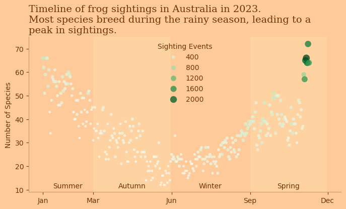
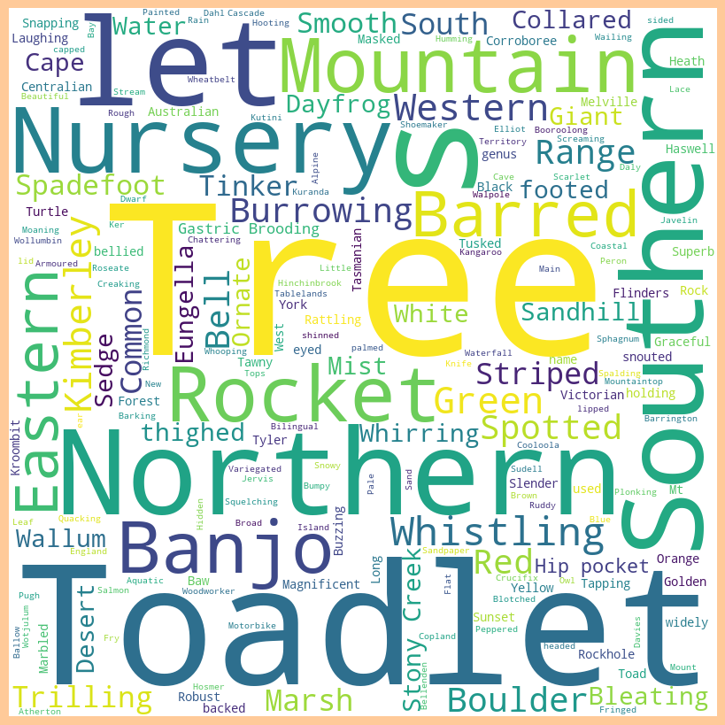

<script src="https://cdnjs.cloudflare.com/ajax/libs/require.js/2.3.6/require.min.js" integrity="sha512-c3Nl8+7g4LMSTdrm621y7kf9v3SDPnhxLNhcjFJbKECVnmZHTdo+IRO05sNLTH/D3vA6u1X32ehoLC7WFVdheg==" crossorigin="anonymous"></script>
<script src="https://cdnjs.cloudflare.com/ajax/libs/jquery/3.5.1/jquery.min.js" integrity="sha512-bLT0Qm9VnAYZDflyKcBaQ2gg0hSYNQrJ8RilYldYQ1FxQYoCLtUjuuRuZo+fjqhx/qtq/1itJ0C2ejDxltZVFg==" crossorigin="anonymous" data-relocate-top="true"></script>
<script type="application/javascript">define('jquery', [],function() {return window.jQuery;})</script>


# TidyTuesday dataset of [2025-09-02](https://github.com/rfordatascience/tidytuesday/blob/main/data/2025/2025-09-02)

``` python
import pandas as pd
import matplotlib.pyplot as plt
import seaborn as sns
```

``` python
frogID_data = pd.read_csv('https://raw.githubusercontent.com/rfordatascience/tidytuesday/main/data/2025/2025-09-02/frogID_data.csv')
frog_names = pd.read_csv('https://raw.githubusercontent.com/rfordatascience/tidytuesday/main/data/2025/2025-09-02/frog_names.csv')
```

``` python
frogID_data
```

<div>
<style scoped>
    .dataframe tbody tr th:only-of-type {
        vertical-align: middle;
    }

    .dataframe tbody tr th {
        vertical-align: top;
    }

    .dataframe thead th {
        text-align: right;
    }
</style>

|  | occurrenceID | eventID | decimalLatitude | decimalLongitude | scientificName | eventDate | eventTime | timezone | coordinateUncertaintyInMeters | recordedBy | stateProvince |
|----|----|----|----|----|----|----|----|----|----|----|----|
| 0 | 12832 | 525618 | -28.500000 | 153.100000 | Philoria loveridgei | 2023-01-01 | 11:18:32 | GMT+1100 | 10000.000000 | 41480 | New South Wales |
| 1 | 12833 | 526341 | -33.700000 | 151.200000 | Heleioporus australiacus | 2023-01-02 | 20:39:30 | GMT+1100 | 10000.000000 | 834983 | New South Wales |
| 2 | 12834 | 526673 | -28.700000 | 152.700000 | Mixophyes iteratus | 2023-01-02 | 21:30:07 | GMT+1100 | 10000.000000 | 804177 | New South Wales |
| 3 | 12835 | 526673 | -28.700000 | 152.700000 | Mixophyes fasciolatus | 2023-01-02 | 21:30:07 | GMT+1100 | 10000.000000 | 804177 | New South Wales |
| 4 | 12836 | 526673 | -28.700000 | 152.700000 | Litoria latopalmata | 2023-01-02 | 21:30:07 | GMT+1100 | 10000.000000 | 804177 | New South Wales |
| \... | \... | \... | \... | \... | \... | \... | \... | \... | \... | \... | \... |
| 136616 | 974110 | 619213 | -35.126800 | 150.753000 | Crinia signifera | 2023-11-09 | 17:29:47 | GMT+1100 | 8.000000 | 825385 | Other Territories |
| 136617 | 974111 | 658692 | -35.152206 | 150.759737 | Crinia signifera | 2023-03-21 | 11:59:24 | GMT+1100 | 4.741598 | 12486 | Other Territories |
| 136618 | 974112 | 691758 | -35.125944 | 150.755366 | Limnodynastes peronii | 2023-08-25 | 11:36:58 | GMT+1000 | 11.824237 | 826303 | Other Territories |
| 136619 | 974118 | 802152 | -35.126700 | 150.755000 | Paracrinia haswelli | 2023-06-06 | 11:16:39 | GMT+1000 | 4.357000 | 35183 | Other Territories |
| 136620 | 974119 | 802152 | -35.126700 | 150.755000 | Crinia signifera | 2023-06-06 | 11:16:39 | GMT+1000 | 4.357000 | 35183 | Other Territories |

<p>136621 rows × 11 columns</p>
</div>

``` python
frog_names
```

<div>
<style scoped>
    .dataframe tbody tr th:only-of-type {
        vertical-align: middle;
    }

    .dataframe tbody tr th {
        vertical-align: top;
    }

    .dataframe thead th {
        text-align: right;
    }
</style>

|  | subfamily | tribe | scientificName | commonName | secondary_commonNames |
|----|----|----|----|----|----|
| 0 | Hylid | Pelodryadidae | Cyclorana | --- | --- |
| 1 | Hylid | Pelodryadidae | Cyclorana alboguttata | Striped Burrowing Frog | Green-striped Frog |
| 2 | Hylid | Pelodryadidae | Cyclorana australis | Northern Snapping Frog | Giant Frog |
| 3 | Hylid | Pelodryadidae | Cyclorana brevipes | Superb Collared Frog | Short-footed Frog |
| 4 | Hylid | Pelodryadidae | Cyclorana cryptotis | Hidden-ear Frog | Earless Frog |
| \... | \... | \... | \... | \... | \... |
| 289 | Myobatrachid | Myobatrachidae | Uperoleia tyleri | Tyler's Toadlet | --- |
| 290 | Ranid | Ranidae | Papurana | No widely used common name for the genus | --- |
| 291 | Ranid | Ranidae | Papurana daemeli | Wood Frog | Australian Wood Frog |
| 292 | Toad | Bufonidae | Rhinella | South American Toads | --- |
| 293 | Toad | Bufonidae | Rhinella marina | Cane Toad | --- |

<p>294 rows × 5 columns</p>
</div>

``` python
frogID_data['genus'] = frogID_data['scientificName'].str.split(' ').str[0]
frogID_data['species'] = frogID_data['scientificName'].str.split(' ').str[1]
frogID_data
```

<div>
<style scoped>
    .dataframe tbody tr th:only-of-type {
        vertical-align: middle;
    }

    .dataframe tbody tr th {
        vertical-align: top;
    }

    .dataframe thead th {
        text-align: right;
    }
</style>

|  | occurrenceID | eventID | decimalLatitude | decimalLongitude | scientificName | eventDate | eventTime | timezone | coordinateUncertaintyInMeters | recordedBy | stateProvince | genus | species |
|----|----|----|----|----|----|----|----|----|----|----|----|----|----|
| 0 | 12832 | 525618 | -28.500000 | 153.100000 | Philoria loveridgei | 2023-01-01 | 11:18:32 | GMT+1100 | 10000.000000 | 41480 | New South Wales | Philoria | loveridgei |
| 1 | 12833 | 526341 | -33.700000 | 151.200000 | Heleioporus australiacus | 2023-01-02 | 20:39:30 | GMT+1100 | 10000.000000 | 834983 | New South Wales | Heleioporus | australiacus |
| 2 | 12834 | 526673 | -28.700000 | 152.700000 | Mixophyes iteratus | 2023-01-02 | 21:30:07 | GMT+1100 | 10000.000000 | 804177 | New South Wales | Mixophyes | iteratus |
| 3 | 12835 | 526673 | -28.700000 | 152.700000 | Mixophyes fasciolatus | 2023-01-02 | 21:30:07 | GMT+1100 | 10000.000000 | 804177 | New South Wales | Mixophyes | fasciolatus |
| 4 | 12836 | 526673 | -28.700000 | 152.700000 | Litoria latopalmata | 2023-01-02 | 21:30:07 | GMT+1100 | 10000.000000 | 804177 | New South Wales | Litoria | latopalmata |
| \... | \... | \... | \... | \... | \... | \... | \... | \... | \... | \... | \... | \... | \... |
| 136616 | 974110 | 619213 | -35.126800 | 150.753000 | Crinia signifera | 2023-11-09 | 17:29:47 | GMT+1100 | 8.000000 | 825385 | Other Territories | Crinia | signifera |
| 136617 | 974111 | 658692 | -35.152206 | 150.759737 | Crinia signifera | 2023-03-21 | 11:59:24 | GMT+1100 | 4.741598 | 12486 | Other Territories | Crinia | signifera |
| 136618 | 974112 | 691758 | -35.125944 | 150.755366 | Limnodynastes peronii | 2023-08-25 | 11:36:58 | GMT+1000 | 11.824237 | 826303 | Other Territories | Limnodynastes | peronii |
| 136619 | 974118 | 802152 | -35.126700 | 150.755000 | Paracrinia haswelli | 2023-06-06 | 11:16:39 | GMT+1000 | 4.357000 | 35183 | Other Territories | Paracrinia | haswelli |
| 136620 | 974119 | 802152 | -35.126700 | 150.755000 | Crinia signifera | 2023-06-06 | 11:16:39 | GMT+1000 | 4.357000 | 35183 | Other Territories | Crinia | signifera |

<p>136621 rows × 13 columns</p>
</div>

``` python
frogID_data.groupby('genus').nunique()['species'].sort_values(ascending=False)
```

    genus
    Litoria            64
    Uperoleia          21
    Crinia             14
    Cyclorana          11
    Pseudophryne       10
    Limnodynastes      10
    Mixophyes           8
    Cophixalus          7
    Neobatrachus        6
    Heleioporus         6
    Austrochaperina     5
    Geocrinia           4
    Philoria            4
    Platyplectrum       2
    Notaden             2
    Anstisia            2
    Myobatrachus        1
    Papurana            1
    Paracrinia          1
    Metacrinia          1
    Lechriodus          1
    Assa                1
    Rhinella            1
    Spicospina          1
    Taudactylus         1
    Adelotus            1
    Name: species, dtype: int64

``` python
frogID_data['eventDate'] = pd.to_datetime(frogID_data['eventDate'])
df_grp = frogID_data.groupby('eventDate').nunique().reset_index()
df_grp
```

<div>
<style scoped>
    .dataframe tbody tr th:only-of-type {
        vertical-align: middle;
    }

    .dataframe tbody tr th {
        vertical-align: top;
    }

    .dataframe thead th {
        text-align: right;
    }
</style>

|  | eventDate | occurrenceID | eventID | decimalLatitude | decimalLongitude | scientificName | eventTime | timezone | coordinateUncertaintyInMeters | recordedBy | stateProvince | genus | species |
|----|----|----|----|----|----|----|----|----|----|----|----|----|----|
| 0 | 2023-01-01 | 1042 | 574 | 518 | 476 | 66 | 571 | 5 | 413 | 349 | 8 | 17 | 62 |
| 1 | 2023-01-02 | 722 | 398 | 372 | 347 | 62 | 398 | 5 | 292 | 257 | 8 | 15 | 58 |
| 2 | 2023-01-03 | 438 | 268 | 251 | 234 | 51 | 267 | 5 | 219 | 194 | 8 | 12 | 49 |
| 3 | 2023-01-04 | 604 | 397 | 367 | 351 | 59 | 392 | 5 | 310 | 281 | 9 | 13 | 56 |
| 4 | 2023-01-05 | 941 | 485 | 419 | 394 | 66 | 483 | 5 | 369 | 300 | 8 | 16 | 62 |
| \... | \... | \... | \... | \... | \... | \... | \... | \... | \... | \... | \... | \... | \... |
| 308 | 2023-11-05 | 3405 | 1981 | 1761 | 1588 | 65 | 1946 | 5 | 1403 | 1089 | 9 | 15 | 61 |
| 309 | 2023-11-06 | 4253 | 2155 | 1960 | 1760 | 66 | 2103 | 5 | 1517 | 1193 | 9 | 15 | 60 |
| 310 | 2023-11-07 | 3601 | 1864 | 1721 | 1561 | 64 | 1828 | 5 | 1334 | 1077 | 8 | 14 | 61 |
| 311 | 2023-11-08 | 3540 | 1755 | 1622 | 1476 | 72 | 1718 | 5 | 1292 | 1003 | 8 | 14 | 68 |
| 312 | 2023-11-09 | 3200 | 1512 | 1398 | 1294 | 64 | 1480 | 5 | 1116 | 844 | 9 | 15 | 59 |

<p>313 rows × 13 columns</p>
</div>

``` python
aus_seasons = {'Summer': ('2023-01-01', '2023-02-28'),
               'Autumn': ('2023-03-01', '2023-05-31'),
               'Winter': ('2023-06-01', '2023-08-31'),
               'Spring': ('2023-09-01', '2023-11-30')}
fig, ax = plt.subplots(figsize=(8, 4))
plt.rcParams['figure.facecolor'] = '#FFCA99'  # Dark grey figure background
plt.rcParams['axes.facecolor'] = '#FFCA99'  
plt.rcParams['axes.edgecolor'] = '#D69456'
plt.rcParams['xtick.color'] = '#713600'
plt.rcParams['ytick.color'] = '#713600'
plt.rcParams['text.color'] = '#713600'
plt.rcParams['axes.labelcolor'] = '#713600'
plt.rcParams['axes.titlecolor'] = '#713600'


for season, (start, end) in aus_seasons.items():
    if (season == 'Autumn' or season == 'Spring'):
        ax.axvspan(pd.to_datetime(start), pd.to_datetime(end), color='#FFE5B4', alpha=0.3, lw=0)
    ax.text((pd.to_datetime(end) - pd.to_datetime(start)) / 2 + pd.to_datetime(start), 10, season, fontsize=10, ha='center', va='bottom', color='#713600')

sns.scatterplot(data=df_grp, x='eventDate', y='scientificName',alpha=0.75, hue='eventID', \
palette='Greens', edgecolor='none', size='eventID', sizes=(10,100), ax=ax)
sns.despine()
#handles, labels = ax.get_legend_handles_labels()
#ax.legend(handles[::-1], labels[::-1], frameon=False, loc='upper center', title='Sighting Events', title_fontsize='medium')
ax.legend(frameon=False, loc='upper center', title='Sighting Events', title_fontsize='medium')
plt.xlabel('')
plt.ylabel('Number of Species')
plt.title('Timeline of frog sightings in Australia in 2023. \nMost species breed during the rainy season, leading to a \npeak in sightings.', fontsize=14, fontfamily="Serif", \
ha='left', x=0, y=1)

dates = pd.date_range(start='2023-01-01', end='2023-12-31', freq='MS')
labels = ['Jan', '', 'Mar', '', '', 'Jun', '', '', 'Sep', '', '', 'Dec']
# Filter out blank labels
filtered_dates = [date for date, label in zip(dates, labels) if label != '']
filtered_labels = [label for label in labels if label != '']
plt.xticks(filtered_dates, filtered_labels)

#plt.xticks(pd.date_range(start='2023-01-01', end='2023-12-31', freq='MS'), ['Jan', '', 'Mar', 'Apr', 'May', 'Jun', 'Jul', 'Aug', 'Sep', 'Oct', 'Nov', 'Dec'])
plt.savefig("Frogs_AUS.png", dpi=300, bbox_inches='tight')
plt.show()
```



``` python
# count commonName values having Tree in it.
print(frog_names['commonName'].str.contains('Tree').sum())
print(frog_names['commonName'].str.contains('Green').sum())
```

    46
    6

``` python
from wordcloud import WordCloud
all_cnames = ' '.join(frog_names['commonName'])
# remove frog from all_cnames
all_cnames = all_cnames.replace('Frog', '')
wordcloud = WordCloud(width = 800, height = 800, background_color ='white').generate(all_cnames)

plt.figure(figsize = (8, 8), facecolor = None)
plt.imshow(wordcloud)
plt.axis("off")
plt.tight_layout(pad = 0)
```


