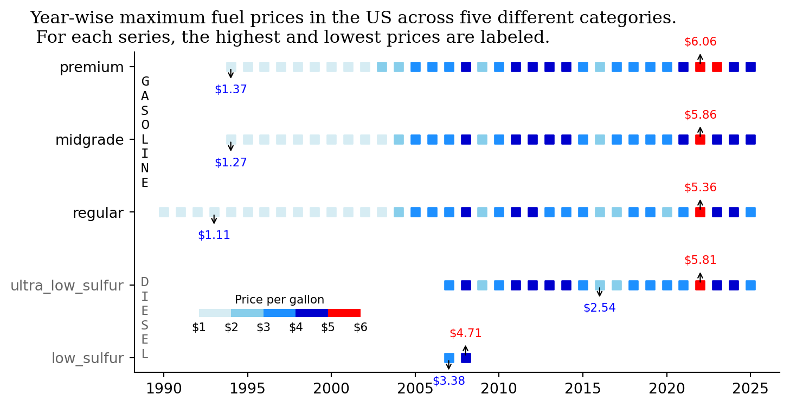

<script src="https://cdnjs.cloudflare.com/ajax/libs/require.js/2.3.6/require.min.js" integrity="sha512-c3Nl8+7g4LMSTdrm621y7kf9v3SDPnhxLNhcjFJbKECVnmZHTdo+IRO05sNLTH/D3vA6u1X32ehoLC7WFVdheg==" crossorigin="anonymous"></script>
<script src="https://cdnjs.cloudflare.com/ajax/libs/jquery/3.5.1/jquery.min.js" integrity="sha512-bLT0Qm9VnAYZDflyKcBaQ2gg0hSYNQrJ8RilYldYQ1FxQYoCLtUjuuRuZo+fjqhx/qtq/1itJ0C2ejDxltZVFg==" crossorigin="anonymous" data-relocate-top="true"></script>
<script type="application/javascript">define('jquery', [],function() {return window.jQuery;})</script>


## **TidyTuesday data for [2025-07-1](https://github.com/rfordatascience/tidytuesday/blob/main/data/2025/2025-07-01/readme.md)**

``` python
import pandas as pd
import matplotlib.pyplot as plt
import matplotlib.colors as mcolors
from mpl_toolkits.axes_grid1.inset_locator import inset_axes
```

``` python
weekly_gas_prices = pd.read_csv('https://raw.githubusercontent.com/rfordatascience/tidytuesday/main/data/2025/2025-07-01/weekly_gas_prices.csv')
```

``` python
weekly_gas_prices['date'] = pd.to_datetime(weekly_gas_prices['date'])
```

``` python
weekly_gas_prices
```

<div>
<style scoped>
    .dataframe tbody tr th:only-of-type {
        vertical-align: middle;
    }

    .dataframe tbody tr th {
        vertical-align: top;
    }

    .dataframe thead th {
        text-align: right;
    }
</style>

|       | date       | fuel     | grade            | formulation  | price |
|-------|------------|----------|------------------|--------------|-------|
| 0     | 1990-08-20 | gasoline | regular          | all          | 1.191 |
| 1     | 1990-08-20 | gasoline | regular          | conventional | 1.191 |
| 2     | 1990-08-27 | gasoline | regular          | all          | 1.245 |
| 3     | 1990-08-27 | gasoline | regular          | conventional | 1.245 |
| 4     | 1990-09-03 | gasoline | regular          | all          | 1.242 |
| \...  | \...       | \...     | \...             | \...         | \...  |
| 22355 | 2025-06-23 | gasoline | premium          | all          | 4.128 |
| 22356 | 2025-06-23 | gasoline | premium          | conventional | 3.950 |
| 22357 | 2025-06-23 | gasoline | premium          | reformulated | 4.333 |
| 22358 | 2025-06-23 | diesel   | all              | NaN          | 3.775 |
| 22359 | 2025-06-23 | diesel   | ultra_low_sulfur | NaN          | 3.775 |

<p>22360 rows × 5 columns</p>
</div>

``` python
weekly_gas_prices['year'] = weekly_gas_prices['date'].dt.year
```

``` python
# create a new col fuel_grade by combining values from fuel and grade columns
weekly_gas_prices['fuel_grade'] = weekly_gas_prices['fuel'] + '-' + weekly_gas_prices['grade']
weekly_gas_prices
```

<div>
<style scoped>
    .dataframe tbody tr th:only-of-type {
        vertical-align: middle;
    }

    .dataframe tbody tr th {
        vertical-align: top;
    }

    .dataframe thead th {
        text-align: right;
    }
</style>

|  | date | fuel | grade | formulation | price | year | fuel_grade |
|----|----|----|----|----|----|----|----|
| 0 | 1990-08-20 | gasoline | regular | all | 1.191 | 1990 | gasoline-regular |
| 1 | 1990-08-20 | gasoline | regular | conventional | 1.191 | 1990 | gasoline-regular |
| 2 | 1990-08-27 | gasoline | regular | all | 1.245 | 1990 | gasoline-regular |
| 3 | 1990-08-27 | gasoline | regular | conventional | 1.245 | 1990 | gasoline-regular |
| 4 | 1990-09-03 | gasoline | regular | all | 1.242 | 1990 | gasoline-regular |
| \... | \... | \... | \... | \... | \... | \... | \... |
| 22355 | 2025-06-23 | gasoline | premium | all | 4.128 | 2025 | gasoline-premium |
| 22356 | 2025-06-23 | gasoline | premium | conventional | 3.950 | 2025 | gasoline-premium |
| 22357 | 2025-06-23 | gasoline | premium | reformulated | 4.333 | 2025 | gasoline-premium |
| 22358 | 2025-06-23 | diesel | all | NaN | 3.775 | 2025 | diesel-all |
| 22359 | 2025-06-23 | diesel | ultra_low_sulfur | NaN | 3.775 | 2025 | diesel-ultra_low_sulfur |

<p>22360 rows × 7 columns</p>
</div>

## Plotting

``` python
fig, ax = plt.subplots(figsize=(8, 4))

intervals = [1.0, 2.0, 3.0, 4.0, 5.0, 6.0]  
colors = ['#D6ECF3', '#87CEEB', '#1E90FF', '#0000CD', 'red']

cmap = mcolors.ListedColormap(colors)
norm = mcolors.BoundaryNorm(intervals, cmap.N)

df_max_price = weekly_gas_prices.groupby(['year', 'fuel_grade'])['price'].max().reset_index()

fuel_cat = ['gasoline-all', 'gasoline-premium', 'gasoline-midgrade', 'gasoline-regular', 'diesel-all', 'diesel-ultra_low_sulfur', 'diesel-low_sulfur']
df_max_price['fuel_grade'] = pd.Categorical(df_max_price['fuel_grade'], categories=fuel_cat, ordered=True)
# sort by year and fuel_grade
df_max_price = df_max_price.sort_values(by=['fuel_grade'])

# remove rows where fuel_grade contains "all"
df_max_price = df_max_price[~df_max_price['fuel_grade'].str.contains('all')]

s1 = ax.scatter(
    df_max_price['year'], 
    df_max_price['fuel_grade'], 
    c=df_max_price['price'], 
    cmap=cmap, 
    norm=norm,
    marker='s'
)

ax.invert_yaxis()

cbar_ax = inset_axes(ax,
                     width="50%",  # Width as a percent of the parent axis
                     height="5%",  # Height as a percent of the parent axis
                     loc='lower center',  # Position inside the main plot
                     bbox_to_anchor=(-0.025, 0.15, 0.5, 0.5),
                     bbox_transform=ax.transAxes)

cbar = plt.colorbar(s1, cax=cbar_ax, shrink=0.5, orientation='horizontal')
cbar.set_ticklabels([f'${interval:.0f}' for interval in intervals])
cbar.outline.set_visible(False)
cbar.set_label('Price per gallon', fontsize=8)
cbar.ax.xaxis.set_label_position('top')   
cbar.ax.tick_params(length=0, labelsize=8)  

for label in ax.get_yticklabels():
    if "diesel" in label.get_text():
        label.set_color('#666666')

ax.set_yticks(ax.get_yticks())
ax.set_yticklabels([k.get_text().split('-')[1] for k in ax.get_yticklabels()])

ax.text(0.01, 0.925, '\n'.join("GASOLINE"), transform=ax.transAxes, fontsize=10,
        verticalalignment='top', fontfamily='Consolas')
ax.text(0.01, 0.30, '\n'.join("DIESEL"), transform=ax.transAxes, fontsize=10,
        verticalalignment='top', color='#666666', fontfamily='Consolas')
ax.spines[['top', 'right']].set_visible(False)


# Label max and min for each fuel_grade
for grade in df_max_price['fuel_grade'].unique():
    subset = df_max_price[df_max_price['fuel_grade'] == grade]

    # Skip if empty or NaNs
    if subset.empty or subset['price'].isnull().all():
        continue

    max_row = subset.loc[subset['price'].idxmax()]
    min_row = subset.loc[subset['price'].idxmin()]

    arrow = dict(arrowstyle='<-', color='black', linewidth=0.8)

    # Annotate max
    ax.annotate(
        f"${max_row['price']:.2f}",
        xy=(max_row['year'], max_row['fuel_grade']),
        xytext=(0, 13),  
        textcoords='offset points',
        ha='center', va='bottom',
        fontsize=8, color='red',
        arrowprops=arrow
    )
    # Annotate min
    ax.annotate(
        f"${min_row['price']:.2f}",
        xy=(min_row['year'], min_row['fuel_grade']),
        xytext=(0, -20),  
        textcoords='offset points',
        ha='center', va='bottom',
        fontsize=8, color='blue',
        arrowprops=arrow
    )
fig.suptitle('Year-wise maximum fuel prices in the US across five different categories. \n For each series, the highest and lowest prices are labeled.',x=0, ha='left', fontfamily='Serif')
plt.savefig('gas_prices.png', dpi=300, bbox_inches='tight')
plt.show()
```


