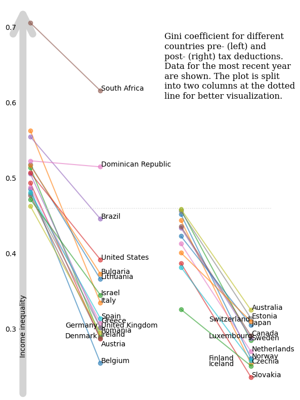

<script src="https://cdnjs.cloudflare.com/ajax/libs/require.js/2.3.6/require.min.js" integrity="sha512-c3Nl8+7g4LMSTdrm621y7kf9v3SDPnhxLNhcjFJbKECVnmZHTdo+IRO05sNLTH/D3vA6u1X32ehoLC7WFVdheg==" crossorigin="anonymous"></script>
<script src="https://cdnjs.cloudflare.com/ajax/libs/jquery/3.5.1/jquery.min.js" integrity="sha512-bLT0Qm9VnAYZDflyKcBaQ2gg0hSYNQrJ8RilYldYQ1FxQYoCLtUjuuRuZo+fjqhx/qtq/1itJ0C2ejDxltZVFg==" crossorigin="anonymous" data-relocate-top="true"></script>
<script type="application/javascript">define('jquery', [],function() {return window.jQuery;})</script>


# TidyTuesday dataset of [2025-08-05](https://github.com/rfordatascience/tidytuesday/blob/main/data/2025/2025-08-05)

``` python
import pandas as pd
import matplotlib.pyplot as plt
from matplotlib.lines import Line2D
import textwrap
```

``` python
income_inequality_processed = pd.read_csv('https://raw.githubusercontent.com/rfordatascience/tidytuesday/main/data/2025/2025-08-05/income_inequality_processed.csv')
income_inequality_raw = pd.read_csv('https://raw.githubusercontent.com/rfordatascience/tidytuesday/main/data/2025/2025-08-05/income_inequality_raw.csv')
```

``` python
income_inequality_processed
```

<div>
<style scoped>
    .dataframe tbody tr th:only-of-type {
        vertical-align: middle;
    }

    .dataframe tbody tr th {
        vertical-align: top;
    }

    .dataframe thead th {
        text-align: right;
    }
</style>

|      | Entity    | Code | Year | gini_mi_eq | gini_dhi_eq |
|------|-----------|------|------|------------|-------------|
| 0    | Australia | AUS  | 1989 | 0.431      | 0.304       |
| 1    | Australia | AUS  | 1995 | 0.470      | 0.311       |
| 2    | Australia | AUS  | 2001 | 0.481      | 0.320       |
| 3    | Australia | AUS  | 2003 | 0.469      | 0.316       |
| 4    | Australia | AUS  | 2004 | 0.467      | 0.316       |
| \... | \...      | \... | \... | \...       | \...        |
| 942  | Vietnam   | VNM  | 2005 | NaN        | 0.369       |
| 943  | Vietnam   | VNM  | 2007 | NaN        | 0.401       |
| 944  | Vietnam   | VNM  | 2009 | NaN        | 0.398       |
| 945  | Vietnam   | VNM  | 2011 | NaN        | 0.364       |
| 946  | Vietnam   | VNM  | 2013 | NaN        | 0.350       |

<p>947 rows × 5 columns</p>
</div>

``` python
income_inequality_raw
```

<div>
<style scoped>
    .dataframe tbody tr th:only-of-type {
        vertical-align: middle;
    }

    .dataframe tbody tr th {
        vertical-align: top;
    }

    .dataframe thead th {
        text-align: right;
    }
</style>

|  | Entity | Code | Year | gini_disposable\_\_age_total | gini_market\_\_age_total | population_historical | owid_region |
|----|----|----|----|----|----|----|----|
| 0 | Afghanistan | AFG | -10000 | NaN | NaN | 14737.0 | NaN |
| 1 | Afghanistan | AFG | -9000 | NaN | NaN | 20405.0 | NaN |
| 2 | Afghanistan | AFG | -8000 | NaN | NaN | 28253.0 | NaN |
| 3 | Afghanistan | AFG | -7000 | NaN | NaN | 39120.0 | NaN |
| 4 | Afghanistan | AFG | -6000 | NaN | NaN | 54166.0 | NaN |
| \... | \... | \... | \... | \... | \... | \... | \... |
| 58920 | Zimbabwe | ZWE | 2019 | NaN | NaN | 15271330.0 | NaN |
| 58921 | Zimbabwe | ZWE | 2020 | NaN | NaN | 15526837.0 | NaN |
| 58922 | Zimbabwe | ZWE | 2021 | NaN | NaN | 15797165.0 | NaN |
| 58923 | Zimbabwe | ZWE | 2022 | NaN | NaN | 16069010.0 | NaN |
| 58924 | Zimbabwe | ZWE | 2023 | NaN | NaN | 16340778.0 | Africa |

<p>58925 rows × 7 columns</p>
</div>

``` python
income_inequality_processed_noNA = income_inequality_processed.dropna(subset=['gini_mi_eq'])
income_inequality_processed_noNA['diff'] = income_inequality_processed_noNA['gini_mi_eq'] - income_inequality_processed_noNA['gini_dhi_eq']
df1 = income_inequality_processed_noNA.sort_values('Year').groupby('Entity').last()
df1 = df1.sort_values('diff', ascending=False)
df1
```

    A value is trying to be set on a copy of a slice from a DataFrame.
    Try using .loc[row_indexer,col_indexer] = value instead

    See the caveats in the documentation: https://pandas.pydata.org/pandas-docs/stable/user_guide/indexing.html#returning-a-view-versus-a-copy
      income_inequality_processed_noNA['diff'] = income_inequality_processed_noNA['gini_mi_eq'] - income_inequality_processed_noNA['gini_dhi_eq']

<div>
<style scoped>
    .dataframe tbody tr th:only-of-type {
        vertical-align: middle;
    }

    .dataframe tbody tr th {
        vertical-align: top;
    }

    .dataframe thead th {
        text-align: right;
    }
</style>

|                    | Code | Year | gini_mi_eq | gini_dhi_eq | diff  |
|--------------------|------|------|------------|-------------|-------|
| Entity             |      |      |            |             |       |
| Belgium            | BEL  | 2021 | 0.486      | 0.255       | 0.231 |
| Italy              | ITA  | 2020 | 0.563      | 0.335       | 0.228 |
| Ireland            | IRL  | 2021 | 0.514      | 0.290       | 0.224 |
| Austria            | AUT  | 2022 | 0.494      | 0.287       | 0.207 |
| Germany            | DEU  | 2020 | 0.506      | 0.302       | 0.204 |
| Norway             | NOR  | 2004 | 0.452      | 0.261       | 0.191 |
| Czechia            | CZE  | 2016 | 0.444      | 0.254       | 0.190 |
| Denmark            | DNK  | 2022 | 0.477      | 0.288       | 0.189 |
| Greece             | GRC  | 2021 | 0.488      | 0.308       | 0.180 |
| United Kingdom     | GBR  | 2021 | 0.479      | 0.302       | 0.177 |
| Sweden             | SWE  | 2021 | 0.458      | 0.285       | 0.173 |
| Romania            | ROU  | 2021 | 0.463      | 0.295       | 0.168 |
| Spain              | ESP  | 2022 | 0.481      | 0.314       | 0.167 |
| Lithuania          | LTU  | 2021 | 0.518      | 0.366       | 0.152 |
| Slovakia           | SVK  | 2018 | 0.387      | 0.236       | 0.151 |
| Luxembourg         | LUX  | 2021 | 0.434      | 0.288       | 0.146 |
| Canada             | CAN  | 2021 | 0.436      | 0.291       | 0.145 |
| Bulgaria           | BGR  | 2022 | 0.517      | 0.373       | 0.144 |
| Netherlands        | NLD  | 2021 | 0.413      | 0.270       | 0.143 |
| Estonia            | EST  | 2016 | 0.456      | 0.314       | 0.142 |
| Australia          | AUS  | 2020 | 0.459      | 0.325       | 0.134 |
| Israel             | ISR  | 2021 | 0.472      | 0.345       | 0.127 |
| Finland            | FIN  | 2016 | 0.382      | 0.258       | 0.124 |
| Japan              | JPN  | 2020 | 0.423      | 0.305       | 0.118 |
| United States      | USA  | 2023 | 0.507      | 0.392       | 0.115 |
| Brazil             | BRA  | 2015 | 0.555      | 0.446       | 0.109 |
| Switzerland        | CHE  | 2019 | 0.401      | 0.310       | 0.091 |
| South Africa       | ZAF  | 2017 | 0.706      | 0.616       | 0.090 |
| Iceland            | ISL  | 2017 | 0.326      | 0.251       | 0.075 |
| Dominican Republic | DOM  | 2007 | 0.523      | 0.515       | 0.008 |

</div>

## Plotting

``` python
cutoff = 0.460
set1 = df1[df1['gini_mi_eq']>=cutoff]
set2 = df1[df1['gini_mi_eq']<cutoff]
```

``` python
x = [0,1]

categories1 = sorted(set(set1['gini_mi_eq']).union(set(set1['gini_dhi_eq'])))
categories2 = sorted(set(set2['gini_mi_eq']).union(set(set2['gini_dhi_eq'])))
categories = categories1 + categories2

fig, (ax1,ax2) = plt.subplots(1,2,figsize=(6, 8),sharey=True)
for ind, (row_ind, row) in enumerate(set1.iterrows()):
    ax1.plot(x, [row['gini_mi_eq'], row['gini_dhi_eq']], marker='o', label=row_ind, alpha=0.6)
    if (row_ind in ['Germany', 'Denmark']):
        ax1.annotate(row_ind, (0.5, row['gini_dhi_eq']))
    elif (row_ind in ['Austria']):
        ax1.annotate(row_ind, (1.01, row['gini_dhi_eq']-0.01))
    else:
        ax1.annotate(row_ind, (1.01, row['gini_dhi_eq']))

for ind, (row_ind, row) in enumerate(set2.iterrows()):
    ax2.plot(x, [row['gini_mi_eq'], row['gini_dhi_eq']], marker='o', label=row_ind, alpha=0.6)
    if (row_ind in ['Switzerland', 'Luxembourg', 'Finland', 'Iceland']):
        ax2.annotate(row_ind, (0.4, row['gini_dhi_eq']))
    else:
        ax2.annotate(row_ind, (1.01, row['gini_dhi_eq']))

ax1.spines[['top', 'right', 'bottom', 'left']].set_visible(False)
ax2.spines[['top', 'right', 'bottom', 'left']].set_visible(False)

ax1.set_xticks([])
ax2.set_xticks([])

ax1.tick_params(axis='y', pad=15)
ax1.tick_params(axis='y', length=0)
ax2.tick_params(axis='y', length=0)


#ax1.set_ylabel(r'Income inequality $\longrightarrow\!\!\!\!\!\!>$', fontsize=12)

title_text = textwrap.fill("Gini coefficient for different countries pre- (left) and post- (right) tax deductions. Data for the most recent year are shown. The plot is split into two columns at the dotted line for better visualization.",30)
fig.text(x=.55,y=.75,s=title_text, fontsize=12, fontfamily='Serif')

ax1.annotate(
    '', 
    xy=(-0.05, 1), xycoords='axes fraction',
    xytext=(-0.05, 0), textcoords='axes fraction',
    arrowprops=dict(arrowstyle='->', lw=10, mutation_scale=70, color='lightgrey'),
    zorder=-1
)

ax1.annotate(
    'Income inequality', 
    xy=(-0.09, 1), xycoords='axes fraction',
    xytext=(-0.09, 0.10), textcoords='axes fraction',
    rotation=90
)

plt.tight_layout()

y_display = ax1.transData.transform((0, cutoff))[1]
y_fig = fig.transFigure.inverted().transform((0, y_display))[1]

# Add horizontal line across the figure at the data-level cutoff
line = Line2D([0.125, 0.9], [y_fig, y_fig],  # X in figure coords, Y is now in figure coords too
              transform=fig.transFigure,
              color='lightgrey', linewidth=1, linestyle='dotted')

fig.add_artist(line)

#plt.savefig("income_inequality.png", dpi=300)
plt.show()
```


