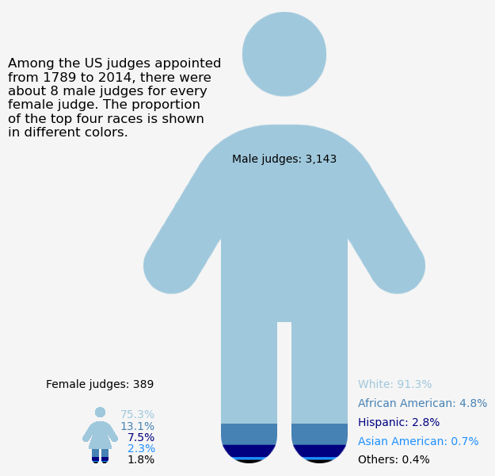

<script src="https://cdnjs.cloudflare.com/ajax/libs/require.js/2.3.6/require.min.js" integrity="sha512-c3Nl8+7g4LMSTdrm621y7kf9v3SDPnhxLNhcjFJbKECVnmZHTdo+IRO05sNLTH/D3vA6u1X32ehoLC7WFVdheg==" crossorigin="anonymous"></script>
<script src="https://cdnjs.cloudflare.com/ajax/libs/jquery/3.5.1/jquery.min.js" integrity="sha512-bLT0Qm9VnAYZDflyKcBaQ2gg0hSYNQrJ8RilYldYQ1FxQYoCLtUjuuRuZo+fjqhx/qtq/1itJ0C2ejDxltZVFg==" crossorigin="anonymous" data-relocate-top="true"></script>
<script type="application/javascript">define('jquery', [],function() {return window.jQuery;})</script>


``` python
import pandas as pd
```

``` python
judges_appointments = pd.read_csv('https://raw.githubusercontent.com/rfordatascience/tidytuesday/main/data/2025/2025-06-10/judges_appointments.csv')
judges_people = pd.read_csv('https://raw.githubusercontent.com/rfordatascience/tidytuesday/main/data/2025/2025-06-10/judges_people.csv')
```

``` python
judges_appointments
```

<div>
<style scoped>
    .dataframe tbody tr th:only-of-type {
        vertical-align: middle;
    }

    .dataframe tbody tr th {
        vertical-align: top;
    }

    .dataframe thead th {
        text-align: right;
    }
</style>

|  | judge_id | court_name | court_type | president_name | president_party | nomination_date | predecessor_last_name | predecessor_first_name | senate_confirmation_date | commission_date | chief_judge_begin | chief_judge_end | retirement_from_active_service | termination_date | termination_reason |
|----|----|----|----|----|----|----|----|----|----|----|----|----|----|----|----|
| 0 | 3419 | U. S. District Court, Southern District of New\... | USDC | Barack Obama | Democratic | 07/28/2011 | Kaplan | Lewis A. | 03/22/2012 | 03/23/2012 | NaN | NaN | NaN | NaN | NaN |
| 1 | 1 | U. S. District Court, Eastern District of New \... | USDC | Franklin D. Roosevelt | Democratic | 02/03/1936 | new | NaN | 02/12/1936 | 02/15/1936 | NaN | NaN | 02/15/1966 | 05/28/1971 | Death |
| 2 | 2 | U. S. District Court, Western District of Penn\... | USDC | Rutherford B. Hayes | Republican | 01/06/1880 | Ketcham | Winthrop | 01/14/1880 | 01/14/1880 | NaN | NaN | NaN | 02/09/1891 | Appointment to Another Judicial Position |
| 3 | 3 | U. S. District Court, Northern District of Ala\... | USDC | Ronald Reagan | Republican | 07/22/1982 | McFadden | Frank H. | 08/18/1982 | 08/18/1982 | NaN | NaN | 05/31/1996 | NaN | NaN |
| 4 | 4 | U. S. District Court, District of New Jersey | USDC | Jimmy Carter | Democratic | 09/28/1979 | Barlow | George H. | 10/31/1979 | 11/02/1979 | NaN | NaN | 02/15/1994 | 12/02/2009 | Death |
| \... | \... | \... | \... | \... | \... | \... | \... | \... | \... | \... | \... | \... | \... | \... | \... |
| 4197 | 2201 | U. S. District Courts, Albemarle, Cape Fear & \... | USDC | Reassignment | Reassignment | NaN | new | NaN | NaN | 02/13/1801 | NaN | NaN | NaN | 03/04/1802 | Death |
| 4198 | 2689 | U. S. District Court, Eastern District of Miss\... | USDC | Harry S Truman | Democratic | 01/13/1949 | Harper | Roy Winfield | 01/31/1949 | 02/02/1949 | NaN | NaN | 01/05/1971 | 02/13/1994 | Death |
| 4199 | 1126 | U. S. Court of Appeals for the Ninth Circuit | USCA | William H. Taft | Republican | 12/12/1910 | new | NaN | 01/31/1911 | 02/08/1911 | NaN | NaN | 01/31/1928 | 11/30/1928 | Retirement |
| 4200 | 1453 | U. S. Court of Appeals for the Second Circuit | USCA | Reassignment | Reassignment | NaN | new | NaN | NaN | 07/01/1929 | NaN | NaN | 09/06/1940 | 09/05/1943 | Death |
| 4201 | 2689 | U. S. District Court, Western District of Miss\... | USDC | Harry S Truman | Democratic | 01/13/1949 | Harper | Roy Winfield | 01/31/1949 | 02/02/1949 | NaN | NaN | 01/05/1971 | 02/13/1994 | Death |

<p>4202 rows × 15 columns</p>
</div>

``` python
judges_appointments['commission_date'] = pd.to_datetime(judges_appointments['commission_date'])
judges_appointments['commission_date'].dt.year.min()
```

    1789.0

``` python
judges_people
```

<div>
<style scoped>
    .dataframe tbody tr th:only-of-type {
        vertical-align: middle;
    }

    .dataframe tbody tr th {
        vertical-align: top;
    }

    .dataframe thead th {
        text-align: right;
    }
</style>

|  | judge_id | name_first | name_middle | name_last | name_suffix | birth_date | birthplace_city | birthplace_state | death_date | death_city | death_state | gender | race |
|----|----|----|----|----|----|----|----|----|----|----|----|----|----|
| 0 | 3419 | Ronnie | NaN | Abrams | NaN | 1968.0 | New York | NY | NaN | NaN | NaN | F | White |
| 1 | 1 | Matthew | T. | Abruzzo | NaN | 1889.0 | Brooklyn | NY | 1971.0 | Potomac | MD | M | White |
| 2 | 2 | Marcus | Wilson | Acheson | NaN | 1828.0 | Washington | PA | 1906.0 | Pittsburgh | PA | M | White |
| 3 | 3 | William | Marsh | Acker | Jr. | 1927.0 | Birmingham | AL | NaN | NaN | NaN | M | White |
| 4 | 4 | Harold | Arnold | Ackerman | NaN | 1928.0 | Newark | NJ | 2009.0 | West Orange | NJ | M | White |
| \... | \... | \... | \... | \... | \... | \... | \... | \... | \... | \... | \... | \... | \... |
| 3527 | 3391 | Jennifer | Guerin | Zipps | NaN | 1964.0 | Ashland | OH | NaN | NaN | NaN | F | White |
| 3528 | 2687 | Alfonso | Joseph | Zirpoli | NaN | 1905.0 | Denver | CO | 1995.0 | San Francisco | CA | M | White |
| 3529 | 2688 | William | J. | Zloch | NaN | 1944.0 | Fort Lauderdale | FL | NaN | NaN | NaN | M | White |
| 3530 | 2690 | Rya | Weickert | Zobel | NaN | 1931.0 | Zwickau | Germany | NaN | NaN | NaN | F | White |
| 3531 | 3106 | Jack | NaN | Zouhary | NaN | 1951.0 | Toledo | OH | NaN | NaN | NaN | M | White |

<p>3532 rows × 13 columns</p>
</div>

``` python
judges_people.groupby(["gender"]).size()
```

    gender
    F     389
    M    3143
    dtype: int64

``` python
judges_people['race']=judges_people['race'].fillna("Others")
```

``` python
df_grp = judges_people.groupby(["gender","race"]).count().sort_values(["gender","judge_id"], ascending=[True,False])
df_grp
```

<div>
<style scoped>
    .dataframe tbody tr th:only-of-type {
        vertical-align: middle;
    }

    .dataframe tbody tr th {
        vertical-align: top;
    }

    .dataframe thead th {
        text-align: right;
    }
</style>

|  |  | judge_id | name_first | name_middle | name_last | name_suffix | birth_date | birthplace_city | birthplace_state | death_date | death_city | death_state |
|----|----|----|----|----|----|----|----|----|----|----|----|----|
| gender | race |  |  |  |  |  |  |  |  |  |  |  |
| F | White | 293 | 293 | 265 | 293 | 0 | 293 | 293 | 293 | 28 | 24 | 24 |
|  | African American | 51 | 51 | 50 | 51 | 0 | 51 | 51 | 51 | 3 | 3 | 3 |
|  | Hispanic | 29 | 29 | 21 | 29 | 0 | 29 | 29 | 29 | 1 | 1 | 1 |
|  | Asian American | 9 | 9 | 9 | 9 | 0 | 9 | 9 | 9 | 0 | 0 | 0 |
|  | Others | 3 | 3 | 3 | 3 | 0 | 3 | 3 | 3 | 0 | 0 | 0 |
|  | African Am./Hispanic | 1 | 1 | 1 | 1 | 0 | 1 | 1 | 1 | 0 | 0 | 0 |
|  | American Indian | 1 | 1 | 1 | 1 | 0 | 1 | 1 | 1 | 0 | 0 | 0 |
|  | Hispanic/Asian Am. | 1 | 1 | 0 | 1 | 0 | 1 | 1 | 1 | 0 | 0 | 0 |
|  | White/Asian Am. | 1 | 1 | 0 | 1 | 0 | 1 | 1 | 1 | 0 | 0 | 0 |
| M | White | 2871 | 2871 | 2483 | 2871 | 299 | 2870 | 2848 | 2869 | 1906 | 1350 | 1352 |
|  | African American | 150 | 150 | 135 | 150 | 41 | 150 | 150 | 150 | 42 | 38 | 38 |
|  | Hispanic | 87 | 87 | 70 | 87 | 5 | 87 | 86 | 86 | 15 | 9 | 9 |
|  | Asian American | 22 | 22 | 18 | 22 | 0 | 22 | 22 | 22 | 6 | 4 | 4 |
|  | Others | 6 | 6 | 6 | 6 | 1 | 6 | 6 | 6 | 1 | 1 | 1 |
|  | American Indian | 2 | 2 | 2 | 2 | 0 | 2 | 2 | 2 | 0 | 0 | 0 |
|  | Pac. Isl./Asian Am. | 2 | 2 | 2 | 2 | 0 | 2 | 2 | 2 | 0 | 0 | 0 |
|  | African Am./Hispanic | 1 | 1 | 1 | 1 | 0 | 1 | 1 | 1 | 0 | 0 | 0 |
|  | Hispanic/White | 1 | 1 | 1 | 1 | 0 | 1 | 1 | 1 | 0 | 0 | 0 |
|  | Pac. Isl./White | 1 | 1 | 1 | 1 | 0 | 1 | 1 | 1 | 1 | 1 | 1 |

</div>

``` python
df1 = df_grp["judge_id"].reset_index()
df1
```

<div>
<style scoped>
    .dataframe tbody tr th:only-of-type {
        vertical-align: middle;
    }

    .dataframe tbody tr th {
        vertical-align: top;
    }

    .dataframe thead th {
        text-align: right;
    }
</style>

|     | gender | race                 | judge_id |
|-----|--------|----------------------|----------|
| 0   | F      | White                | 293      |
| 1   | F      | African American     | 51       |
| 2   | F      | Hispanic             | 29       |
| 3   | F      | Asian American       | 9        |
| 4   | F      | Others               | 3        |
| 5   | F      | African Am./Hispanic | 1        |
| 6   | F      | American Indian      | 1        |
| 7   | F      | Hispanic/Asian Am.   | 1        |
| 8   | F      | White/Asian Am.      | 1        |
| 9   | M      | White                | 2871     |
| 10  | M      | African American     | 150      |
| 11  | M      | Hispanic             | 87       |
| 12  | M      | Asian American       | 22       |
| 13  | M      | Others               | 6        |
| 14  | M      | American Indian      | 2        |
| 15  | M      | Pac. Isl./Asian Am.  | 2        |
| 16  | M      | African Am./Hispanic | 1        |
| 17  | M      | Hispanic/White       | 1        |
| 18  | M      | Pac. Isl./White      | 1        |

</div>

``` python
def process_group(group):
    top_rows = group.nlargest(4, 'judge_id')  
    remaining_rows = group.iloc[4:]  
    if not remaining_rows.empty:
        other_sum = remaining_rows['judge_id'].sum()
        other_row = pd.DataFrame({'gender': [group.name], 'race': ['Others'], 'judge_id': [other_sum]})
        return pd.concat([top_rows, other_row], ignore_index=True)
    return top_rows

# Apply function to each group
df_grouped = df1.groupby('gender', group_keys=False).apply(process_group)

df_grouped
```

      df_grouped = df1.groupby('gender', group_keys=False).apply(process_group)

<div>
<style scoped>
    .dataframe tbody tr th:only-of-type {
        vertical-align: middle;
    }

    .dataframe tbody tr th {
        vertical-align: top;
    }

    .dataframe thead th {
        text-align: right;
    }
</style>

|     | gender | race             | judge_id |
|-----|--------|------------------|----------|
| 0   | F      | White            | 293      |
| 1   | F      | African American | 51       |
| 2   | F      | Hispanic         | 29       |
| 3   | F      | Asian American   | 9        |
| 4   | F      | Others           | 7        |
| 0   | M      | White            | 2871     |
| 1   | M      | African American | 150      |
| 2   | M      | Hispanic         | 87       |
| 3   | M      | Asian American   | 22       |
| 4   | M      | Others           | 13       |

</div>

``` python
import matplotlib.pyplot as plt
import numpy as np
from matplotlib.offsetbox import OffsetImage, AnnotationBbox
from PIL import Image
import textwrap

# Define race colors
race_colors = {
    'White': (160, 200, 220), 
    'African American': (70, 130, 180),
    'Hispanic': (0, 0, 128), 
    'Asian American': (30, 144, 255),  
    'Others': (0, 0, 0)  
}
df_grouped_dict = df_grouped.groupby("gender").apply(lambda x: dict(zip(x["race"], x["judge_id"]))).to_dict()

df_percentages = {gender: {race: (count / sum(race_counts.values())) * 100 for race, count in race_counts.items()}
                  for gender, race_counts in df_grouped_dict.items()}

# Function to recolor an icon with stacked race colors
def recolor_icon_layers(icon_path, race_counts, race_colors):
    img = Image.open(icon_path).convert("RGBA")  # Convert to RGBA
    data = np.array(img)  # Convert image to array

    total_count = sum(race_counts.values())
    height = data.shape[0]
    y_start = 0

    for race, count in race_counts.items():
        layer_height = int((count / total_count) * height)
        y_end = y_start + layer_height
        mask = data[y_start:y_end, :, 3] > 0  # Keep only non-transparent pixels
        data[y_start:y_end, :, :-1][mask] = race_colors.get(race, (128, 128, 128))  # Apply race color
        y_start = y_end

    return Image.fromarray(data)

fig, ax = plt.subplots(figsize=(6, 4))

# Calculate total counts for scaling
total_category1 = sum(df_grouped_dict.get("F", {}).values())
total_category2 = sum(df_grouped_dict.get("M", {}).values())

race_colors_mpl = {race: (r/255, g/255, b/255) for race, (r, g, b) in race_colors.items()}

for i, (category, race_counts) in enumerate(df_grouped_dict.items()):
    icon_path = "person-dress.png" if category == "F" else "person.png"
    icon_array = recolor_icon_layers(icon_path, race_counts, race_colors)

    scale_factor = sum(race_counts.values()) / max(total_category1, total_category2)
    base_zoom = 0.8  # Adjust zoom level
    imagebox = OffsetImage(np.array(icon_array), zoom=base_zoom * scale_factor)

    ab = AnnotationBbox(imagebox, (i, 0), frameon=False, xycoords="data", box_alignment=(0.5, 0))
    ax.add_artist(ab)

    percentages = df_percentages[category]
    for j, (race, percent) in enumerate(reversed(percentages.items())):
        if(category == "F"):
            ax.text(i+0.3, j*150, f"{percent:.1f}%", ha='right', fontsize=10, color=race_colors_mpl[race])
        else:            
            ax.text(i+0.4, j*250, f"{race}: {percent:.1f}%", ha='left', fontsize=10, color=race_colors_mpl[race])

ax.text(0, 1000, f"Female judges: {total_category1}", ha='center', fontsize=10, color="black")
ax.text(1, 4000, f"Male judges: {total_category2:,}", ha='center', fontsize=10, color="black")

ax.set_xticks([0, 1])
ax.set_xlim(-0.5, 1.5)
ax.set_ylim(0, max(total_category1, total_category2) + 100)
title = f"Among the US judges appointed from {judges_appointments['commission_date'].dt.year.min():.0f} to {judges_appointments['commission_date'].dt.year.max():.0f}, there were about 8 male judges for every female judge. The proportion of the top four races is shown in different colors."
wrapped_title = "\n".join(textwrap.wrap(title, width=30))
ax.set_title(wrapped_title, loc='left', pad=75)
ax.axis("off")
fig.patch.set_facecolor("whitesmoke")
fig.savefig("judges_appoint.png", bbox_inches="tight", dpi=300)
plt.show()
```

      df_grouped_dict = df_grouped.groupby("gender").apply(lambda x: dict(zip(x["race"], x["judge_id"]))).to_dict()


