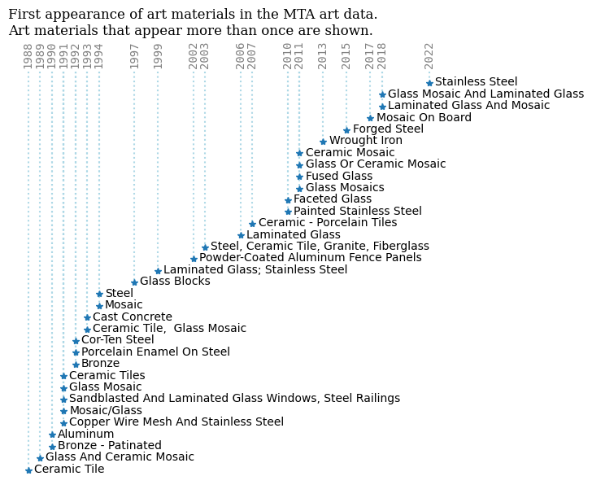

<script src="https://cdnjs.cloudflare.com/ajax/libs/require.js/2.3.6/require.min.js" integrity="sha512-c3Nl8+7g4LMSTdrm621y7kf9v3SDPnhxLNhcjFJbKECVnmZHTdo+IRO05sNLTH/D3vA6u1X32ehoLC7WFVdheg==" crossorigin="anonymous"></script>
<script src="https://cdnjs.cloudflare.com/ajax/libs/jquery/3.5.1/jquery.min.js" integrity="sha512-bLT0Qm9VnAYZDflyKcBaQ2gg0hSYNQrJ8RilYldYQ1FxQYoCLtUjuuRuZo+fjqhx/qtq/1itJ0C2ejDxltZVFg==" crossorigin="anonymous" data-relocate-top="true"></script>
<script type="application/javascript">define('jquery', [],function() {return window.jQuery;})</script>


## TidyTuesday data for [2025-07-08](https://github.com/rfordatascience/tidytuesday/tree/main/data/2025/2025-07-22)

``` python
import pandas as pd
import matplotlib.pyplot as plt
```

``` python
mta_art = pd.read_csv('https://raw.githubusercontent.com/rfordatascience/tidytuesday/main/data/2025/2025-07-22/mta_art.csv')
station_lines = pd.read_csv('https://raw.githubusercontent.com/rfordatascience/tidytuesday/main/data/2025/2025-07-22/station_lines.csv')
```

``` python
mta_art
```

<div>
<style scoped>
    .dataframe tbody tr th:only-of-type {
        vertical-align: middle;
    }

    .dataframe tbody tr th {
        vertical-align: top;
    }

    .dataframe thead th {
        text-align: right;
    }
</style>

|  | agency | station_name | line | artist | art_title | art_date | art_material | art_description | art_image_link |
|----|----|----|----|----|----|----|----|----|----|
| 0 | NYCT | Clark St | 2,3 | Ray Ring | Clark Street Passage | 1987 | Terrazzo floor tile | The first model that Brooklyn-born artist Ray \... | https://new.mta.info/agency/arts-design/collec\... |
| 1 | NYCT | 125 St | 4,5,6 | Houston Conwill | The Open Secret | 1986 | Bronze - polychromed | The Open Secret, in the 125th Street and Lexin\... | https://new.mta.info/agency/arts-design/collec\... |
| 2 | NYCT | Astor Pl | 6 | Milton Glaser | Untitled | 1986 | Porcelain enamel murals | Milton Glaser, best known for his work in grap\... | https://new.mta.info/agency/arts-design/collec\... |
| 3 | NYCT | Kings Hwy | B,Q | Rhoda Andors | Kings Highway Hieroglyphs | 1987 | Porcelain Enamel Murals on Steel | The artist discusses her work: ÒIf public art\... | https://new.mta.info/agency/arts-design/collec\... |
| 4 | NYCT | Newkirk Av | B,Q | David Wilson | Transit Skylight | 1988 | Zinc-glazed Apolycarbonate skylight | The artist recalls, ÒAbout the same time that \... | https://new.mta.info/agency/arts-design/collec\... |
| \... | \... | \... | \... | \... | \... | \... | \... | \... | \... |
| 376 | NYCT | Alabama Av | J,Z | Scott Redden | Untitled | 2007 | Faceted glass | Images of rural America evoke a nostalgia past\... | https://new.mta.info/agency/arts-design/collec\... |
| 377 | NYCT | Woodside-61 St | 7 | John Cavanagh | Commuting/Community | 1986 | Porcelain enamel photomontage murals on steel | Commuting/Community reflects John Cavanagh\'s i\... | https://new.mta.info/agency/arts-design/collec\... |
| 378 | NYCT | Fulton St | A, C, J, Z, 2, 3, 4, 5 | Nancy Holt | Astral Grating | 1987 | Wrought iron, light elements | Nancy Holt\'s steel ceiling sculpture incorpora\... | https://new.mta.info/agency/arts-design/collec\... |
| 379 | NYCT | 5 Av/53 St | E,M | Ralph Fasanella | Subway Riders | 1995 | Painting - Oil | All of us find ourselves from time to time mus\... | https://new.mta.info/agency/arts-design/collec\... |
| 380 | NYCT | Cleveland St | J | Amy Cheng | Las Flores | 2007 | Faceted glass | Located within the platform windscreens, color\... | https://new.mta.info/agency/arts-design/collec\... |

<p>381 rows × 9 columns</p>
</div>

``` python
mta_art_date = mta_art.groupby('art_date').nunique()
mta_art_date
```

<div>
<style scoped>
    .dataframe tbody tr th:only-of-type {
        vertical-align: middle;
    }

    .dataframe tbody tr th {
        vertical-align: top;
    }

    .dataframe thead th {
        text-align: right;
    }
</style>

|  | agency | station_name | line | artist | art_title | art_material | art_description | art_image_link |
|----|----|----|----|----|----|----|----|----|
| art_date |  |  |  |  |  |  |  |  |
| 1980 | 1 | 1 | 1 | 1 | 1 | 1 | 1 | 1 |
| 1986 | 1 | 3 | 3 | 3 | 3 | 3 | 3 | 3 |
| 1987 | 1 | 3 | 3 | 3 | 3 | 3 | 3 | 3 |
| 1988 | 1 | 3 | 3 | 3 | 3 | 3 | 3 | 3 |
| 1989 | 1 | 2 | 2 | 2 | 2 | 2 | 2 | 2 |
| 1990 | 2 | 10 | 5 | 5 | 6 | 6 | 5 | 5 |
| 1991 | 2 | 12 | 7 | 10 | 13 | 11 | 11 | 10 |
| 1992 | 3 | 6 | 5 | 6 | 6 | 6 | 6 | 6 |
| 1993 | 2 | 3 | 2 | 2 | 3 | 2 | 2 | 2 |
| 1994 | 2 | 11 | 7 | 9 | 9 | 8 | 9 | 9 |
| 1995 | 2 | 4 | 3 | 4 | 4 | 4 | 4 | 4 |
| 1996 | 2 | 11 | 10 | 11 | 11 | 9 | 10 | 9 |
| 1997 | 2 | 6 | 6 | 6 | 6 | 6 | 6 | 6 |
| 1998 | 3 | 9 | 9 | 10 | 10 | 9 | 10 | 10 |
| 1999 | 3 | 15 | 10 | 13 | 13 | 10 | 13 | 13 |
| 2000 | 2 | 9 | 9 | 9 | 9 | 9 | 9 | 9 |
| 2001 | 2 | 9 | 9 | 10 | 10 | 8 | 10 | 10 |
| 2002 | 3 | 15 | 13 | 17 | 17 | 10 | 17 | 17 |
| 2003 | 1 | 3 | 3 | 3 | 3 | 3 | 3 | 3 |
| 2004 | 1 | 14 | 13 | 14 | 14 | 11 | 14 | 14 |
| 2005 | 3 | 12 | 11 | 12 | 12 | 10 | 12 | 11 |
| 2006 | 2 | 15 | 6 | 15 | 15 | 8 | 15 | 15 |
| 2007 | 2 | 14 | 7 | 14 | 14 | 6 | 14 | 14 |
| 2008 | 2 | 11 | 8 | 11 | 11 | 8 | 11 | 11 |
| 2009 | 3 | 8 | 7 | 8 | 8 | 7 | 8 | 8 |
| 2010 | 2 | 7 | 5 | 7 | 7 | 7 | 7 | 7 |
| 2011 | 2 | 21 | 10 | 20 | 21 | 14 | 20 | 20 |
| 2012 | 2 | 15 | 5 | 15 | 15 | 8 | 15 | 15 |
| 2013 | 3 | 8 | 3 | 6 | 6 | 8 | 6 | 6 |
| 2014 | 2 | 3 | 2 | 3 | 3 | 3 | 3 | 3 |
| 2015 | 3 | 11 | 6 | 11 | 11 | 8 | 11 | 11 |
| 2016 | 2 | 5 | 4 | 5 | 5 | 5 | 5 | 5 |
| 2017 | 3 | 16 | 5 | 13 | 14 | 11 | 14 | 13 |
| 2018 | 4 | 35 | 20 | 36 | 36 | 16 | 36 | 36 |
| 2019 | 3 | 12 | 7 | 12 | 12 | 11 | 12 | 12 |
| 2020 | 3 | 7 | 7 | 8 | 8 | 6 | 8 | 8 |
| 2021 | 3 | 8 | 4 | 8 | 8 | 7 | 8 | 8 |
| 2022 | 2 | 5 | 5 | 6 | 6 | 4 | 6 | 6 |
| 2023 | 3 | 9 | 6 | 9 | 9 | 5 | 8 | 8 |

</div>

``` python
# change art_matrial to sentence case
mta_art['art_material'] = mta_art['art_material'].str.title()
am_vc = mta_art['art_material'].value_counts()
#am_vc
# get am_vc greater than 1
am_vc[am_vc > 1]
```

    art_material
    Faceted Glass                                                                               50
    Glass Mosaic                                                                                49
    Laminated Glass                                                                             46
    Stainless Steel                                                                             15
    Ceramic Mosaic                                                                              11
    Bronze                                                                                       6
    Glass And Ceramic Mosaic                                                                     6
    Copper Wire Mesh And Stainless Steel                                                         5
    Mosaic                                                                                       4
    Painted Stainless Steel                                                                      4
    Glass Or Ceramic Mosaic                                                                      4
    Aluminum                                                                                     4
    Fused Glass                                                                                  3
    Glass Mosaics                                                                                3
    Powder-Coated Aluminum Fence Panels                                                          3
    Steel                                                                                        3
    Ceramic - Porcelain Tiles                                                                    2
    Steel, Ceramic Tile, Granite, Fiberglass                                                     2
    Sandblasted And Laminated Glass Windows, Steel Railings (Stair Railing & Exterior Fence)     2
    Laminated Glass And Mosaic                                                                   2
    Mosaic/Glass                                                                                 2
    Glass Mosaic And Laminated Glass                                                             2
    Porcelain Enamel On Steel                                                                    2
    Wrought Iron                                                                                 2
    Ceramic Tile,  Glass Mosaic                                                                  2
    Glass Blocks                                                                                 2
    Ceramic Tiles                                                                                2
    Ceramic Tile                                                                                 2
    Mosaic On Board                                                                              2
    Cast Concrete                                                                                2
    Cor-Ten Steel                                                                                2
    Forged Steel                                                                                 2
    Bronze - Patinated                                                                           2
    Laminated Glass; Stainless Steel                                                             2
    Name: count, dtype: int64

``` python
# Filter art_materials that appear more than once
filtered_materials = am_vc[am_vc > 1].index

# Filter the dataset for these materials
filtered_mta_art = mta_art[mta_art['art_material'].isin(filtered_materials)]

# Find the first date for each art_material
material_timeline = filtered_mta_art.groupby('art_material')['art_date'].min().reset_index()
material_timeline = material_timeline.sort_values(by='art_date')
# split art_material by "(" and keep only the first part
material_timeline['art_material'] = material_timeline['art_material'].str.split('(').str[0]
material_timeline
```

<div>
<style scoped>
    .dataframe tbody tr th:only-of-type {
        vertical-align: middle;
    }

    .dataframe tbody tr th {
        vertical-align: top;
    }

    .dataframe thead th {
        text-align: right;
    }
</style>

|     | art_material                                       | art_date |
|-----|----------------------------------------------------|----------|
| 1   | Bronze                                             | 1988     |
| 6   | Ceramic Tile                                       | 1989     |
| 2   | Bronze - Patinated                                 | 1990     |
| 9   | Copper Wire Mesh And Stainless Steel               | 1990     |
| 3   | Cast Concrete                                      | 1991     |
| 31  | Steel                                              | 1991     |
| 14  | Glass And Ceramic Mosaic                           | 1991     |
| 10  | Cor-Ten Steel                                      | 1991     |
| 8   | Ceramic Tiles                                      | 1991     |
| 0   | Aluminum                                           | 1992     |
| 16  | Glass Mosaic                                       | 1992     |
| 7   | Ceramic Tile, Glass Mosaic                         | 1992     |
| 11  | Faceted Glass                                      | 1993     |
| 4   | Ceramic - Porcelain Tiles                          | 1993     |
| 29  | Sandblasted And Laminated Glass Windows, Steel\... | 1994     |
| 5   | Ceramic Mosaic                                     | 1994     |
| 27  | Porcelain Enamel On Steel                          | 1997     |
| 33  | Wrought Iron                                       | 1999     |
| 32  | Steel, Ceramic Tile, Granite, Fiberglass           | 2002     |
| 18  | Glass Mosaics                                      | 2003     |
| 20  | Laminated Glass                                    | 2006     |
| 13  | Fused Glass                                        | 2007     |
| 30  | Stainless Steel                                    | 2010     |
| 12  | Forged Steel                                       | 2010     |
| 19  | Glass Or Ceramic Mosaic                            | 2011     |
| 21  | Laminated Glass And Mosaic                         | 2011     |
| 24  | Mosaic On Board                                    | 2011     |
| 15  | Glass Blocks                                       | 2011     |
| 17  | Glass Mosaic And Laminated Glass                   | 2013     |
| 23  | Mosaic                                             | 2015     |
| 26  | Painted Stainless Steel                            | 2017     |
| 25  | Mosaic/Glass                                       | 2018     |
| 28  | Powder-Coated Aluminum Fence Panels                | 2018     |
| 22  | Laminated Glass; Stainless Steel                   | 2022     |

</div>

## Plotting

``` python
fig, ax = plt.subplots(figsize=(7,7))
ml,sl,bl = ax.stem(material_timeline['art_date'], material_timeline['art_material'],\
 basefmt=' ', bottom=34)
plt.setp(sl, linestyle=':', color='lightblue')
plt.setp(ml,  marker="*")
for i, txt in enumerate(material_timeline['art_material']):
    ax.annotate(txt, (material_timeline['art_date'][i]+0.5, material_timeline['art_material'][i]), xytext=(0, -2), textcoords='offset points')
ax.get_yaxis().set_visible(False)
#ax.invert_yaxis()
ax.set_xticks(material_timeline['art_date'].unique())
ax.set_xticklabels(material_timeline['art_date'].unique(), rotation=90)
ax.xaxis.set_ticks_position('top')
ax.xaxis.set_label_position('top')
ax.tick_params(axis='x', which='both', length=0)
plt.xticks(fontfamily='monospace', color="gray")
plt.tick_params(axis='x', pad=-15)
ax.spines[['top', 'right', 'bottom', 'left']].set_visible(False)
plt.title("First appearance of art materials in the MTA art data.\nArt materials that appear more than once are shown.", fontfamily='serif', fontsize=12, loc='left')
#plt.savefig("MTA_art.png", dpi=300)
plt.show()
```


