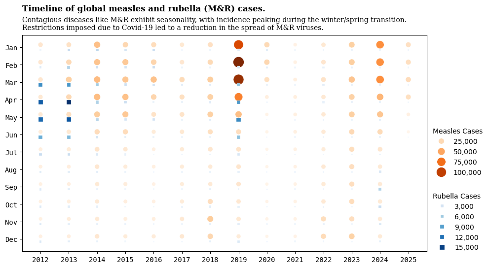

<script src="https://cdnjs.cloudflare.com/ajax/libs/require.js/2.3.6/require.min.js" integrity="sha512-c3Nl8+7g4LMSTdrm621y7kf9v3SDPnhxLNhcjFJbKECVnmZHTdo+IRO05sNLTH/D3vA6u1X32ehoLC7WFVdheg==" crossorigin="anonymous"></script>
<script src="https://cdnjs.cloudflare.com/ajax/libs/jquery/3.5.1/jquery.min.js" integrity="sha512-bLT0Qm9VnAYZDflyKcBaQ2gg0hSYNQrJ8RilYldYQ1FxQYoCLtUjuuRuZo+fjqhx/qtq/1itJ0C2ejDxltZVFg==" crossorigin="anonymous" data-relocate-top="true"></script>
<script type="application/javascript">define('jquery', [],function() {return window.jQuery;})</script>


## TidyTuesday data for [2025-06-24](https://github.com/rfordatascience/tidytuesday/blob/main/data/2025/2025-06-24/readme.md)

``` python
import pandas as pd
import matplotlib.pyplot as plt
import seaborn as sns

cases_month = pd.read_csv('https://raw.githubusercontent.com/rfordatascience/tidytuesday/main/data/2025/2025-06-24/cases_month.csv')
cases_year = pd.read_csv('https://raw.githubusercontent.com/rfordatascience/tidytuesday/main/data/2025/2025-06-24/cases_year.csv')
cases_month
```

<div>
<style scoped>
    .dataframe tbody tr th:only-of-type {
        vertical-align: middle;
    }

    .dataframe tbody tr th {
        vertical-align: top;
    }

    .dataframe thead th {
        text-align: right;
    }
</style>

|  | region | country | iso3 | year | month | measles_suspect | measles_clinical | measles_epi_linked | measles_lab_confirmed | measles_total | rubella_clinical | rubella_epi_linked | rubella_lab_confirmed | rubella_total | discarded |
|----|----|----|----|----|----|----|----|----|----|----|----|----|----|----|----|
| 0 | AFR | Algeria | DZA | 2012 | 1 | 8.0 | 6.0 | 0.0 | 2.0 | 8.0 | NaN | NaN | NaN | NaN | 0.0 |
| 1 | AFR | Algeria | DZA | 2012 | 2 | 10.0 | 10.0 | 0.0 | 0.0 | 10.0 | NaN | NaN | NaN | NaN | 0.0 |
| 2 | AFR | Algeria | DZA | 2012 | 3 | 17.0 | 17.0 | 0.0 | 0.0 | 17.0 | NaN | NaN | NaN | NaN | 0.0 |
| 3 | AFR | Algeria | DZA | 2012 | 4 | 7.0 | 5.0 | 0.0 | 0.0 | 5.0 | 0.0 | 0.0 | 1.0 | 1.0 | 2.0 |
| 4 | AFR | Algeria | DZA | 2012 | 5 | 14.0 | 11.0 | 0.0 | 0.0 | 11.0 | 0.0 | 0.0 | 3.0 | 3.0 | 3.0 |
| \... | \... | \... | \... | \... | \... | \... | \... | \... | \... | \... | \... | \... | \... | \... | \... |
| 22775 | WPR | Viet Nam | VNM | 2024 | 10 | 379.0 | 19.0 | 56.0 | 256.0 | 331.0 | 5.0 | 0.0 | 5.0 | 10.0 | 48.0 |
| 22776 | WPR | Viet Nam | VNM | 2024 | 11 | 584.0 | 37.0 | 125.0 | 347.0 | 509.0 | 0.0 | 0.0 | 1.0 | 1.0 | 75.0 |
| 22777 | WPR | Viet Nam | VNM | 2024 | 12 | 588.0 | 56.0 | 134.0 | 338.0 | 528.0 | 0.0 | 0.0 | 1.0 | 1.0 | 60.0 |
| 22778 | WPR | Viet Nam | VNM | 2025 | 1 | 156.0 | 7.0 | 0.0 | 124.0 | 131.0 | NaN | NaN | NaN | NaN | 25.0 |
| 22779 | WPR | Viet Nam | VNM | 2025 | 2 | 22.0 | 0.0 | 0.0 | 20.0 | 20.0 | NaN | NaN | NaN | NaN | 2.0 |

<p>22780 rows × 15 columns</p>
</div>

``` python
cases_year
```

<div>
<style scoped>
    .dataframe tbody tr th:only-of-type {
        vertical-align: middle;
    }

    .dataframe tbody tr th {
        vertical-align: top;
    }

    .dataframe thead th {
        text-align: right;
    }
</style>

|  | region | country | iso3 | year | total_population | annualized_population_most_recent_year_only | total_suspected_measles_rubella_cases | measles_total | measles_lab_confirmed | measles_epi_linked | measles_clinical | measles_incidence_rate_per_1000000_total_population | rubella_total | rubella_lab_confirmed | rubella_epi_linked | rubella_clinical | rubella_incidence_rate_per_1000000_total_population | discarded_cases | discarded_non_measles_rubella_cases_per_100000_total_population |
|----|----|----|----|----|----|----|----|----|----|----|----|----|----|----|----|----|----|----|----|
| 0 | AFRO | Algeria | DZA | 2012 | 37646166 | 37646166 | 76.0 | 55 | 2 | 0 | 53 | 1.46 | 13 | 13 | 0 | 0 | 0.35 | 8.0 | 0.02 |
| 1 | AFRO | Algeria | DZA | 2013 | 38414172 | 38414172 | 85.0 | 0 | 0 | 0 | 0 | 0.00 | 29 | 29 | 0 | 0 | 0.75 | 56.0 | 0.15 |
| 2 | AFRO | Algeria | DZA | 2014 | 39205031 | 39205031 | 49.0 | 0 | 0 | 0 | 0 | 0.00 | 3 | 3 | 0 | 0 | 0.08 | 46.0 | 0.12 |
| 3 | AFRO | Algeria | DZA | 2015 | 40019529 | 40019529 | 109.0 | 62 | 2 | 60 | 0 | 1.55 | 2 | 2 | 0 | 0 | 0.05 | 45.0 | 0.11 |
| 4 | AFRO | Algeria | DZA | 2016 | 40850721 | 40850721 | 93.0 | 49 | 21 | 27 | 1 | 1.20 | 11 | 11 | 0 | 0 | 0.27 | 33.0 | 0.08 |
| \... | \... | \... | \... | \... | \... | \... | \... | \... | \... | \... | \... | \... | \... | \... | \... | \... | \... | \... | \... |
| 2377 | WPRO | Viet Nam | VNM | 2021 | 98935099 | 98935099 | 346.0 | 180 | 33 | 0 | 147 | 1.82 | 6 | 5 | 0 | 1 | 0.06 | 160.0 | 0.16 |
| 2378 | WPRO | Viet Nam | VNM | 2022 | 99680655 | 99680655 | 585.0 | 38 | 10 | 1 | 27 | 0.38 | 25 | 21 | 0 | 4 | 0.25 | 522.0 | 0.52 |
| 2379 | WPRO | Viet Nam | VNM | 2023 | 100352192 | 100352192 | 499.0 | 98 | 8 | 2 | 88 | 0.98 | 42 | 34 | 0 | 8 | 0.42 | 359.0 | 0.36 |
| 2380 | WPRO | Viet Nam | VNM | 2024 | 100987687 | 100987687 | 2807.0 | 2105 | 1500 | 412 | 193 | 20.84 | 41 | 22 | 0 | 19 | 0.41 | 661.0 | 0.65 |
| 2381 | WPRO | Viet Nam | VNM | 2025 | 101598527 | 42332720 | 178.0 | 151 | 144 | 0 | 7 | 3.57 | 0 | 0 | 0 | 0 | 0.00 | 27.0 | 0.06 |

<p>2382 rows × 19 columns</p>
</div>

``` python
cases_month.groupby("country").size().sort_values(ascending=False)
```

    country
    Pakistan                            162
    Afghanistan                         161
    Thailand                            161
    Democratic Republic of the Congo    161
    Côte d'Ivoire                       161
                                       ... 
    Cabo Verde                            7
    Samoa                                 6
    Dominica                              5
    Tonga                                 3
    Monaco                                3
    Length: 193, dtype: int64

``` python
df_grp = cases_month.groupby(["month","year"])[["measles_total", "rubella_total"]].sum().reset_index()
df_grp
```

<div>
<style scoped>
    .dataframe tbody tr th:only-of-type {
        vertical-align: middle;
    }

    .dataframe tbody tr th {
        vertical-align: top;
    }

    .dataframe thead th {
        text-align: right;
    }
</style>

|      | month | year | measles_total | rubella_total |
|------|-------|------|---------------|---------------|
| 0    | 1     | 2012 | 15412.0       | 897.0         |
| 1    | 1     | 2013 | 18572.0       | 3990.0        |
| 2    | 1     | 2014 | 38442.0       | 4378.0        |
| 3    | 1     | 2015 | 26097.0       | 2788.0        |
| 4    | 1     | 2016 | 22264.0       | 3596.0        |
| \... | \...  | \... | \...          | \...          |
| 157  | 12    | 2020 | 1631.0        | 352.0         |
| 158  | 12    | 2021 | 3593.0        | 639.0         |
| 159  | 12    | 2022 | 22938.0       | 871.0         |
| 160  | 12    | 2023 | 29330.0       | 493.0         |
| 161  | 12    | 2024 | 11199.0       | 1288.0        |

<p>162 rows × 4 columns</p>
</div>

``` python
import matplotlib.font_manager as fm
monospace_font = fm.FontProperties(family='monospace')
```

``` python
months_order = ['Jan', 'Feb', 'Mar', 'Apr', 'May', 'Jun',
                'Jul', 'Aug', 'Sep', 'Oct', 'Nov', 'Dec']

fig, ax = plt.subplots(figsize=(10, 6))
jitter = 0.15
df_grp['month_measles'] = df_grp['month'] - jitter
df_grp['month_rubella'] = df_grp['month'] + jitter

s1 = sns.scatterplot(data=df_grp, y="month_measles", x="year", size="measles_total", sizes=(25,250),
                hue="measles_total", marker="o", palette="Oranges", legend='brief')

handles1, labels1 = s1.get_legend_handles_labels()
labels1 = [f"{int(x):,}" for x in labels1]
legend1 = ax.legend(handles1, labels1, title="Measles Cases", loc="upper left", 
                    bbox_to_anchor=(1, 0.6), frameon=False)
ax.add_artist(legend1)  

s2 = sns.scatterplot(data=df_grp, y="month_rubella", x="year", size="rubella_total", sizes=(5,50),
                hue="rubella_total", marker="s", palette="Blues", legend='brief')

all_handles, all_labels = s2.get_legend_handles_labels()

rubella_handles = all_handles[len(handles1):]
rubella_labels = all_labels[len(labels1):] #[l for h, l in zip(all_handles, all_labels) if h not in handles1]
rubella_labels = [f"{int(x):,}" for x in rubella_labels]

legend2 = ax.legend(rubella_handles, rubella_labels, title="Rubella Cases", loc="upper left", 
                    bbox_to_anchor=(1, 0.3), frameon=False)

title = "Timeline of global measles and rubella (M&R) cases."
sub_title = "Contagious diseases like M&R exhibit seasonality, with incidence peaking during the winter/spring transition.\nRestrictions imposed due to Covid-19 led to a reduction in the spread of M&R viruses."
plt.title(textwrap.fill(title, width=60), fontfamily="Serif", loc='left',pad=35, fontweight="bold")
#plt.suptitle(textwrap.fill(sub_title, width=90), fontfamily="Serif", y=0.82, x=.05, ha="left", fontsize=10)
plt.suptitle(sub_title, fontfamily="Serif", y=0.86, x=.05, ha="left", fontsize=10)
plt.xlabel("")
plt.ylabel("")
plt.yticks(ticks=range(1, 13), labels=months_order,fontfamily='monospace')
plt.xticks(ticks=range(2012,2026),fontfamily='monospace')
ax.invert_yaxis()
plt.tight_layout()
#plt.savefig('measles_cases.png', bbox_inches='tight', pad_inches=0.1, dpi=300)
plt.show()
```


