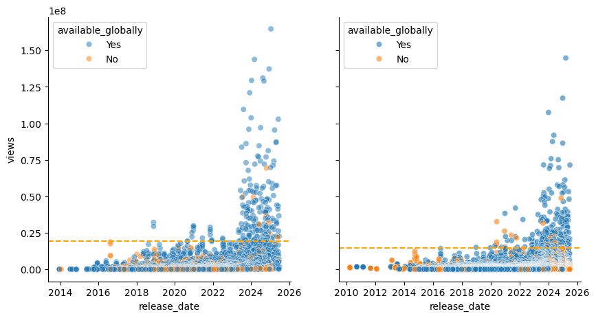
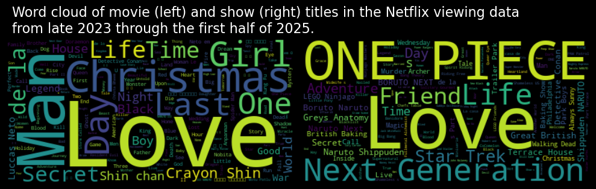

<script src="https://cdnjs.cloudflare.com/ajax/libs/require.js/2.3.6/require.min.js" integrity="sha512-c3Nl8+7g4LMSTdrm621y7kf9v3SDPnhxLNhcjFJbKECVnmZHTdo+IRO05sNLTH/D3vA6u1X32ehoLC7WFVdheg==" crossorigin="anonymous"></script>
<script src="https://cdnjs.cloudflare.com/ajax/libs/jquery/3.5.1/jquery.min.js" integrity="sha512-bLT0Qm9VnAYZDflyKcBaQ2gg0hSYNQrJ8RilYldYQ1FxQYoCLtUjuuRuZo+fjqhx/qtq/1itJ0C2ejDxltZVFg==" crossorigin="anonymous" data-relocate-top="true"></script>
<script type="application/javascript">define('jquery', [],function() {return window.jQuery;})</script>


## TidyTuesday data for [2025-07-29](https://github.com/rfordatascience/tidytuesday/blob/main/data/2025/2025-07-29/readme.md)

``` python
import pandas as pd
import numpy as np
import matplotlib.pyplot as plt
import seaborn as sns
from wordcloud import WordCloud
import re
```

``` python
movies = pd.read_csv('https://raw.githubusercontent.com/rfordatascience/tidytuesday/main/data/2025/2025-07-29/movies.csv')
shows = pd.read_csv('https://raw.githubusercontent.com/rfordatascience/tidytuesday/main/data/2025/2025-07-29/shows.csv')
```

``` python
movies
```

<div>
<style scoped>
    .dataframe tbody tr th:only-of-type {
        vertical-align: middle;
    }

    .dataframe tbody tr th {
        vertical-align: top;
    }

    .dataframe thead th {
        text-align: right;
    }
</style>

|  | source | report | title | available_globally | release_date | hours_viewed | runtime | views |
|----|----|----|----|----|----|----|----|----|
| 0 | 1_What_We_Watched_A_Netflix_Engagement_Report\_\... | 2025Jan-Jun | Back in Action | Yes | 2025-01-17 | 313000000\.0 | 1H 54M 0S | 164700000\.0 |
| 1 | 1_What_We_Watched_A_Netflix_Engagement_Report\_\... | 2025Jan-Jun | STRAW | Yes | 2025-06-06 | 185200000\.0 | 1H 48M 0S | 102900000\.0 |
| 2 | 1_What_We_Watched_A_Netflix_Engagement_Report\_\... | 2025Jan-Jun | The Life List | Yes | 2025-03-28 | 198900000\.0 | 2H 5M 0S | 95500000.0 |
| 3 | 1_What_We_Watched_A_Netflix_Engagement_Report\_\... | 2025Jan-Jun | Exterritorial | Yes | 2025-04-30 | 159000000\.0 | 1H 49M 0S | 87500000.0 |
| 4 | 1_What_We_Watched_A_Netflix_Engagement_Report\_\... | 2025Jan-Jun | Havoc | Yes | 2025-04-25 | 154900000\.0 | 1H 47M 0S | 86900000.0 |
| \... | \... | \... | \... | \... | \... | \... | \... | \... |
| 36116 | 4_What_We_Watched_A_Netflix_Engagement_Report\_\... | 2023Jul-Dec | الرجل الرابع | No | NaN | 100000.0 | 1H 32M 0S | 100000.0 |
| 36117 | 4_What_We_Watched_A_Netflix_Engagement_Report\_\... | 2023Jul-Dec | 두근두근 내 인생 | No | NaN | 100000.0 | 1H 52M 0S | 100000.0 |
| 36118 | 4_What_We_Watched_A_Netflix_Engagement_Report\_\... | 2023Jul-Dec | 라디오 스타 | No | NaN | 100000.0 | 1H 56M 0S | 100000.0 |
| 36119 | 4_What_We_Watched_A_Netflix_Engagement_Report\_\... | 2023Jul-Dec | 선생 김봉두 | No | NaN | 100000.0 | 1H 57M 0S | 100000.0 |
| 36120 | 4_What_We_Watched_A_Netflix_Engagement_Report\_\... | 2023Jul-Dec | 표적 | No | NaN | 100000.0 | 1H 38M 0S | 100000.0 |

<p>36121 rows × 8 columns</p>
</div>

``` python
shows
```

<div>
<style scoped>
    .dataframe tbody tr th:only-of-type {
        vertical-align: middle;
    }

    .dataframe tbody tr th {
        vertical-align: top;
    }

    .dataframe thead th {
        text-align: right;
    }
</style>

|  | source | report | title | available_globally | release_date | hours_viewed | runtime | views |
|----|----|----|----|----|----|----|----|----|
| 0 | 1_What_We_Watched_A_Netflix_Engagement_Report\_\... | 2025Jan-Jun | Adolescence: Limited Series | Yes | 2025-03-13 | 555100000\.0 | 3H 50M 0S | 144800000\.0 |
| 1 | 1_What_We_Watched_A_Netflix_Engagement_Report\_\... | 2025Jan-Jun | Squid Game: Season 2 // 오징어 게임: 시즌 2 | Yes | 2024-12-26 | 840300000\.0 | 7H 10M 0S | 117300000\.0 |
| 2 | 1_What_We_Watched_A_Netflix_Engagement_Report\_\... | 2025Jan-Jun | Squid Game: Season 3 // 오징어 게임: 시즌 3 | Yes | 2025-06-27 | 438600000\.0 | 6H 8M 0S | 71500000.0 |
| 3 | 1_What_We_Watched_A_Netflix_Engagement_Report\_\... | 2025Jan-Jun | Zero Day: Limited Series | Yes | 2025-02-20 | 315800000\.0 | 5H 9M 0S | 61300000.0 |
| 4 | 1_What_We_Watched_A_Netflix_Engagement_Report\_\... | 2025Jan-Jun | Missing You: Limited Series | Yes | 2025-01-01 | 218600000\.0 | 3H 46M 0S | 58000000.0 |
| \... | \... | \... | \... | \... | \... | \... | \... | \... |
| 27798 | 4_What_We_Watched_A_Netflix_Engagement_Report\_\... | 2023Jul-Dec | We Are Black and British: Season 1 | No | NaN | 100000.0 | 1H 57M 0S | 100000.0 |
| 27799 | 4_What_We_Watched_A_Netflix_Engagement_Report\_\... | 2023Jul-Dec | Whitney Cummings: Can I Touch It? | Yes | 2019-07-30 | 100000.0 | 59M 0S | 100000.0 |
| 27800 | 4_What_We_Watched_A_Netflix_Engagement_Report\_\... | 2023Jul-Dec | Whitney Cummings: Jokes | No | 2022-07-26 | 100000.0 | 1H 0M 0S | 100000.0 |
| 27801 | 4_What_We_Watched_A_Netflix_Engagement_Report\_\... | 2023Jul-Dec | Whose Vote Counts, Explained: Limited Series | Yes | 2020-09-28 | 100000.0 | 1H 15M 0S | 100000.0 |
| 27802 | 4_What_We_Watched_A_Netflix_Engagement_Report\_\... | 2023Jul-Dec | Zach Galifianakis: Live at the Purple Onion | No | NaN | 100000.0 | 1H 1M 0S | 100000.0 |

<p>27803 rows × 8 columns</p>
</div>

``` python
movies["release_date"] = pd.to_datetime(movies["release_date"])
shows["release_date"] = pd.to_datetime(shows["release_date"])
```

``` python
print(movies["hours_viewed"].sum() / (24 * 365))
print(shows["hours_viewed"].sum() / (24 * 365))
```

    11504006.849315068
    31113367.579908676

``` python
movies.groupby('title').views.sum().sort_values(ascending=False).head(10)
```

    title
    The Boss Baby                  221300000.0
    The Super Mario Bros. Movie    209900000.0
    Leo                            207200000.0
    Leave the World Behind         205100000.0
    Damsel                         194500000.0
    Minions                        190900000.0
    Carry-On                       185000000.0
    Lift                           175800000.0
    Sing (2016)                    173700000.0
    Dr. Seuss' The Grinch          168300000.0
    Name: views, dtype: float64

``` python
shows.groupby('title').views.sum().sort_values(ascending=False).head(10)
```

    title
    Squid Game: Season 2 // 오징어 게임: 시즌 2    203800000.0
    Adolescence: Limited Series             144800000.0
    Fool Me Once: Limited Series            129000000.0
    Bridgerton: Season 3                    123300000.0
    Baby Reindeer: Limited Series           100400000.0
    ONE PIECE: Season 1                      98400000.0
    The Gentlemen: Season 1                  97900000.0
    Peppa Pig: Season 6                      92600000.0
    Avatar The Last Airbender: Season 1      86900000.0
    The Perfect Couple: Season 1             86400000.0
    Name: views, dtype: float64

``` python
movies = movies.loc[~movies["available_globally"].isin(["Available Globally?"])]
shows = shows.loc[~shows["available_globally"].isin(["Available Globally?"])]
```

``` python
fig, ax = plt.subplots(1,2, figsize=(10,5), sharey=True)

# Removed 'line_kws' argument as it is not valid for sns.scatterplot
sns.scatterplot(data=movies, x="release_date", y="views", ax=ax[0], alpha=0.5, hue="available_globally")
# plot median line
ax[0].axhline(movies["views"].quantile(0.99), color="orange", linestyle="--")
sns.scatterplot(data=shows, x="release_date", y="views", ax=ax[1], alpha=0.6, hue="available_globally")
ax[1].axhline(shows["views"].quantile(0.99), color="orange", linestyle="--")

# add labels to top 5 movies and shows
top5_m = movies.groupby('title').agg({'views': 'sum', 'release_date': 'first'}).sort_values(by='views', ascending=False).head(5)
top5_s = shows.groupby('title').agg({'views': 'sum', 'release_date': 'first'}).sort_values(by='views', ascending=False).head(5)

# Filter out rows with None in 'release_date'
top5_m = top5_m[top5_m['release_date'].notna()]
top5_s = top5_s[top5_s['release_date'].notna()]

#print(top5_m)
#print(top5_s)

sns.despine()
plt.show()
```



## Word Cloud

``` python
# make word cloud of movie titles

movies["title_mod"] = movies["title"].str.replace("Movie", "")
movies_title = " ".join([str(x) for x in movies["title_mod"]])
movies_wordcloud = WordCloud().generate(movies_title)
plt.imshow(movies_wordcloud, interpolation='bilinear')
plt.axis("off")
plt.show()
```

    A value is trying to be set on a copy of a slice from a DataFrame.
    Try using .loc[row_indexer,col_indexer] = value instead

    See the caveats in the documentation: https://pandas.pydata.org/pandas-docs/stable/user_guide/indexing.html#returning-a-view-versus-a-copy
      movies["title_mod"] = movies["title"].str.replace("Movie", "")


``` python
# remove non-english characters
pattern = r'[^a-zA-Z0-9\s]' 
shows["title_mod"] = shows["title"].str.replace(pattern, '', regex=True)


st = shows["title_mod"].str.replace(r"(Season|Limited Series|Temporada|Serie)", "", regex=True)

shows_title = " ".join([str(x) for x in st])
shows_title.replace("Season", "")
shows_wordcloud = WordCloud().generate(shows_title)
plt.imshow(shows_wordcloud, interpolation='bilinear')
plt.axis("off")
plt.show()
```

    A value is trying to be set on a copy of a slice from a DataFrame.
    Try using .loc[row_indexer,col_indexer] = value instead

    See the caveats in the documentation: https://pandas.pydata.org/pandas-docs/stable/user_guide/indexing.html#returning-a-view-versus-a-copy
      shows["title_mod"] = shows["title"].str.replace(pattern, '', regex=True)


``` python
fig,ax = plt.subplots(1, 2, figsize=(10, 5))
ax[0].imshow(movies_wordcloud, interpolation='bilinear')
ax[1].imshow(shows_wordcloud, interpolation='bilinear')

ax[0].axis('off')
ax[1].axis('off')
plt.tight_layout()

fig.suptitle("Word cloud of movie (left) and show (right) titles in the Netflix viewing data \nfrom late 2023 through the first half of 2025.", 
                ha="left", x=0.025, y=0.85, fontsize=16, color='white')
fig.set_facecolor('black')
#plt.savefig("wordcloud.png", dpi=300)
plt.show()
```



``` python
with open("wordcloud.svg", "w", encoding="utf-8") as f:
            f.write(movies_wordcloud.to_svg())
```
