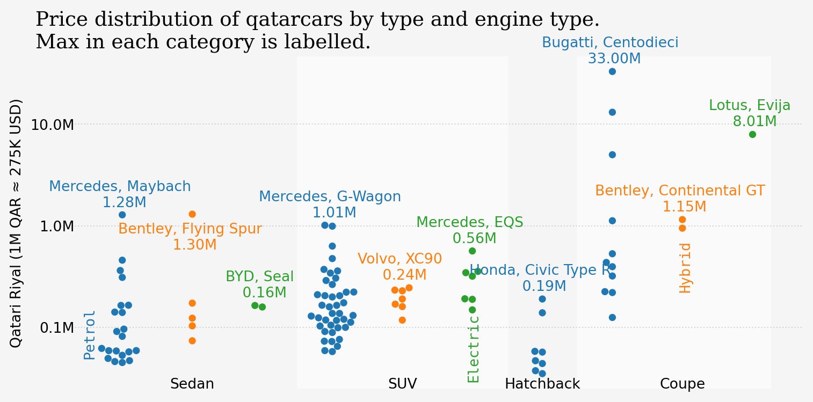

<script src="https://cdnjs.cloudflare.com/ajax/libs/require.js/2.3.6/require.min.js" integrity="sha512-c3Nl8+7g4LMSTdrm621y7kf9v3SDPnhxLNhcjFJbKECVnmZHTdo+IRO05sNLTH/D3vA6u1X32ehoLC7WFVdheg==" crossorigin="anonymous"></script>
<script src="https://cdnjs.cloudflare.com/ajax/libs/jquery/3.5.1/jquery.min.js" integrity="sha512-bLT0Qm9VnAYZDflyKcBaQ2gg0hSYNQrJ8RilYldYQ1FxQYoCLtUjuuRuZo+fjqhx/qtq/1itJ0C2ejDxltZVFg==" crossorigin="anonymous" data-relocate-top="true"></script>
<script type="application/javascript">define('jquery', [],function() {return window.jQuery;})</script>


## TidyTuesday dataset of [2025-12-09](https://github.com/rfordatascience/tidytuesday/blob/main/data/2025/2025-12-09)

``` python
import pandas as pd
import matplotlib.pyplot as plt
import numpy as np
import seaborn as sns
import matplotlib.ticker as ticker
import matplotlib.patches as patches
import matplotlib as mpl
```

``` python
qatarcars = pd.read_csv('https://raw.githubusercontent.com/rfordatascience/tidytuesday/main/data/2025/2025-12-09/qatarcars.csv')
qatarcars
```

<div>
<style scoped>
    .dataframe tbody tr th:only-of-type {
        vertical-align: middle;
    }

    .dataframe tbody tr th {
        vertical-align: top;
    }

    .dataframe thead th {
        text-align: right;
    }
</style>

|  | origin | make | model | length | width | height | seating | trunk | economy | horsepower | price | mass | performance | type | enginetype |
|----|----|----|----|----|----|----|----|----|----|----|----|----|----|----|----|
| 0 | Germany | BMW | 3 Series Sedan | 4.713 | 1.827 | 1.440 | 5 | 59 | 7.6 | 386 | 164257 | 1653 | 4.3 | Sedan | Petrol |
| 1 | Germany | BMW | X1 | 4.505 | 1.845 | 1.642 | 5 | 505 | 6.6 | 313 | 264000 | 1701 | 5.4 | SUV | Petrol |
| 2 | Germany | Audi | RS Q8 | 5.012 | 1.694 | 1.998 | 5 | 605 | 12.1 | 600 | 630000 | 2490 | 3.6 | SUV | Petrol |
| 3 | Germany | Audi | RS3 | 4.542 | 1.851 | 1.412 | 5 | 321 | 8.7 | 400 | 310000 | 1565 | 3.8 | Sedan | Petrol |
| 4 | Germany | Audi | A3 | 4.456 | 1.960 | 1.416 | 5 | 425 | 6.5 | 180 | 165000 | 1325 | 6.7 | Sedan | Petrol |
| \... | \... | \... | \... | \... | \... | \... | \... | \... | \... | \... | \... | \... | \... | \... | \... |
| 100 | South Korea | Kia | Picanto | 3.595 | 1.595 | 1.495 | 5 | 255 | 6.0 | 84 | 58000 | 976 | 13.7 | Hatchback | Petrol |
| 101 | PR China | Bestune | Oley | 4.555 | 1.660 | 1.465 | 4 | 300 | 6.7 | 101 | 35000 | 1150 | 12.1 | Hatchback | Petrol |
| 102 | Japan | Mitsubishi | Mirage | 3.780 | 1.665 | 1.500 | 5 | 235 | 4.8 | 77 | 44000 | 1050 | 13.9 | Hatchback | Petrol |
| 103 | South Korea | Hyundai | Grand i10 | 3.665 | 1.660 | 1.500 | 5 | 252 | 5.3 | 86 | 46900 | 1840 | 14.5 | Hatchback | Petrol |
| 104 | PR China | MG | MG3 Luxury | 4.055 | 1.729 | 1.504 | 5 | 293 | 6.7 | 109 | 57000 | 1308 | 10.8 | Hatchback | Petrol |

<p>105 rows × 15 columns</p>
</div>

``` python
def millions_formatter(x, pos):
    """The two args are the value and tick position"""
    return f'{x / 1000000:.1f}M'
```

``` python
df_melted = pd.melt(qatarcars, id_vars=['type', 'enginetype'], value_vars=['price'])
df_melted['type_engine'] = df_melted['type'] + '_' + df_melted['enginetype']
df_melted.sort_values(by=['type', 'enginetype'], ascending=False, inplace=True)
df_melted
```

<div>
<style scoped>
    .dataframe tbody tr th:only-of-type {
        vertical-align: middle;
    }

    .dataframe tbody tr th {
        vertical-align: top;
    }

    .dataframe thead th {
        text-align: right;
    }
</style>

|      | type  | enginetype | variable | value   | type_engine    |
|------|-------|------------|----------|---------|----------------|
| 0    | Sedan | Petrol     | price    | 164257  | Sedan_Petrol   |
| 3    | Sedan | Petrol     | price    | 310000  | Sedan_Petrol   |
| 4    | Sedan | Petrol     | price    | 165000  | Sedan_Petrol   |
| 5    | Sedan | Petrol     | price    | 1281000 | Sedan_Petrol   |
| 19   | Sedan | Petrol     | price    | 458000  | Sedan_Petrol   |
| \... | \...  | \...       | \...     | \...    | \...           |
| 98   | Coupe | Petrol     | price    | 224500  | Coupe_Petrol   |
| 99   | Coupe | Petrol     | price    | 125000  | Coupe_Petrol   |
| 69   | Coupe | Hybrid     | price    | 1150000 | Coupe_Hybrid   |
| 78   | Coupe | Hybrid     | price    | 945700  | Coupe_Hybrid   |
| 75   | Coupe | Electric   | price    | 8010200 | Coupe_Electric |

<p>105 rows × 5 columns</p>
</div>

``` python
df_max = qatarcars.loc[qatarcars.groupby(['type', 'enginetype'])['price'].idxmax()]
df_max.sort_values(by=['type', 'enginetype'], ascending=False, inplace=True)
df_max
```

<div>
<style scoped>
    .dataframe tbody tr th:only-of-type {
        vertical-align: middle;
    }

    .dataframe tbody tr th {
        vertical-align: top;
    }

    .dataframe thead th {
        text-align: right;
    }
</style>

|  | origin | make | model | length | width | height | seating | trunk | economy | horsepower | price | mass | performance | type | enginetype |
|----|----|----|----|----|----|----|----|----|----|----|----|----|----|----|----|
| 5 | Germany | Mercedes | Maybach | 5.469 | 1.921 | 1.510 | 4 | 500 | 13.3 | 612 | 1281000 | 2376 | 4.1 | Sedan | Petrol |
| 68 | UK | Bentley | Flying Spur | 5.316 | 2.013 | 1.483 | 5 | 351 | 10.9 | 521 | 1300000 | 2646 | 3.5 | Sedan | Hybrid |
| 88 | PR China | BYD | Seal | 4.800 | 1.875 | 1.460 | 5 | 400 | NaN | 204 | 164000 | 2185 | 3.8 | Sedan | Electric |
| 6 | Germany | Mercedes | G-Wagon | 4.613 | 1.984 | 1.969 | 5 | 480 | 13.1 | 585 | 1011500 | 2588 | 4.3 | SUV | Petrol |
| 65 | Sweden | Volvo | XC90 | 4.953 | 2.140 | 1.776 | 7 | 71 | 7.1 | 249 | 245000 | 2315 | 5.3 | SUV | Hybrid |
| 7 | Germany | Mercedes | EQS | 5.216 | 1.926 | 1.512 | 5 | 610 | NaN | 333 | 564500 | 2495 | 5.6 | SUV | Electric |
| 28 | Japan | Honda | Civic Type R | 4.594 | 1.890 | 1.407 | 5 | 609 | 9.8 | 315 | 189999 | 1446 | 5.4 | Hatchback | Petrol |
| 18 | Italy | Bugatti | Centodieci | 4.544 | 2.047 | 1.200 | 2 | 0 | 22.5 | 1600 | 33000000 | 1976 | 2.4 | Coupe | Petrol |
| 69 | UK | Bentley | Continental GT | 4.806 | 2.227 | 1.403 | 5 | 235 | 10.9 | 521 | 1150000 | 2459 | 3.3 | Coupe | Hybrid |
| 75 | UK | Lotus | Evija | 4.459 | 2.000 | 1.122 | 2 | 0 | NaN | 1973 | 8010200 | 1887 | 2.9 | Coupe | Electric |

</div>

``` python
bg_color = '#F5F5F5'
plot_colors = mpl.rcParams["axes.prop_cycle"].by_key()["color"]
fig, ax = plt.subplots(figsize=(8, 4))
sns.swarmplot(data=df_melted, x='type_engine', y='value', log_scale=True, hue='enginetype', legend=False)
ax.yaxis.set_major_formatter(ticker.FuncFormatter(millions_formatter))
plt.ylabel('Qatari Riyal (1M QAR ≈ 275K USD)')
plt.xlabel('')

ax.axvspan(2.5, 5.5, color='#FAFAFA', zorder=0)
ax.axvspan(6.5, 9.25, color='#FAFAFA', zorder=0)

ax.text(1, 25000, "Sedan", ha='center')
ax.text(4, 25000, "SUV", ha='center')
ax.text(6, 25000, "Hatchback", ha='center')
ax.text(8, 25000, "Coupe", ha='center')

# label the max values
for ind, (i, row) in enumerate(df_max.iterrows()):
    price_M = f"{row['price']/1000000:.2f}M"
    if (row['enginetype'] == 'Petrol'):
      ax.text(ind, row['price']*1.2, f"{row['make']}, {row['model']} \n {price_M}", ha='center', color=plot_colors[0])
    elif (row['enginetype'] == 'Hybrid'):
      if(row['model'] == 'Flying Spur'):
        ax.text(ind, row['price']*0.45, f"{row['make']}, {row['model']} \n {price_M}", ha='center', color=plot_colors[1])
      else:
        ax.text(ind, row['price']*1.2, f"{row['make']}, {row['model']} \n {price_M}", ha='center', color=plot_colors[1])
    else:
      ax.text(ind, row['price']*1.2, f"{row['make']}, {row['model']} \n {price_M}", ha='center', color=plot_colors[2])


sns.despine(bottom=True, left=True)
ax.tick_params(bottom=False, labelbottom=False)
ax.tick_params(axis='y', which='both', left=False, pad=-5)
ax.grid(True, axis='y', linestyle=':', alpha=0.5)
ax.figure.set_facecolor(bg_color)
ax.set_facecolor(bg_color)

plt.title("Price distribution of qatarcars by type and engine type.\nMax in each category is labelled.", \
          ha='left', x=-0.05, fontfamily='Serif', fontsize=14)
ax.annotate(
    'Petrol', 
    xy=(-0.09, 1), xycoords='axes fraction',
    xytext=(0.015, 0.10), textcoords='axes fraction', color=plot_colors[0],
    rotation=90, fontfamily='monospace'
)

ax.annotate(
    'Electric', 
    xy=(-0.09, 1), xycoords='axes fraction',
    xytext=(0.54, 0.03), textcoords='axes fraction', color=plot_colors[2],
    rotation=90, fontfamily='monospace'
)

ax.annotate(
    'Hybrid', 
    xy=(-0.09, 1), xycoords='axes fraction',
    xytext=(0.83, 0.3), textcoords='axes fraction', color=plot_colors[1],
    rotation=90, fontfamily='monospace'
)
plt.tight_layout()
plt.savefig('Qatarcars.png', dpi=300, bbox_inches='tight')
plt.show()
```


