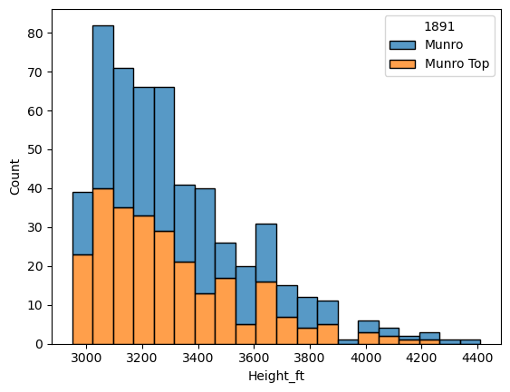
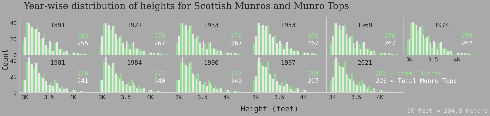

<script src="https://cdnjs.cloudflare.com/ajax/libs/require.js/2.3.6/require.min.js" integrity="sha512-c3Nl8+7g4LMSTdrm621y7kf9v3SDPnhxLNhcjFJbKECVnmZHTdo+IRO05sNLTH/D3vA6u1X32ehoLC7WFVdheg==" crossorigin="anonymous"></script>
<script src="https://cdnjs.cloudflare.com/ajax/libs/jquery/3.5.1/jquery.min.js" integrity="sha512-bLT0Qm9VnAYZDflyKcBaQ2gg0hSYNQrJ8RilYldYQ1FxQYoCLtUjuuRuZo+fjqhx/qtq/1itJ0C2ejDxltZVFg==" crossorigin="anonymous" data-relocate-top="true"></script>
<script type="application/javascript">define('jquery', [],function() {return window.jQuery;})</script>


## TidyTuesday dataset of [2025-08-19](https://github.com/rfordatascience/tidytuesday/blob/main/data/2025/2025-08-19)

``` python
import pandas as pd
import matplotlib.pyplot as plt
import seaborn as sns
```

``` python
scottish_munros = pd.read_csv('https://raw.githubusercontent.com/rfordatascience/tidytuesday/main/data/2025/2025-08-19/scottish_munros.csv', encoding='latin1')
```

``` python
scottish_munros
```

<div>
<style scoped>
    .dataframe tbody tr th:only-of-type {
        vertical-align: middle;
    }

    .dataframe tbody tr th {
        vertical-align: top;
    }

    .dataframe thead th {
        text-align: right;
    }
</style>

|  | DoBIH_number | Name | Height_m | Height_ft | xcoord | ycoord | 1891 | 1921 | 1933 | 1953 | 1969 | 1974 | 1981 | 1984 | 1990 | 1997 | 2021 | Comments |
|----|----|----|----|----|----|----|----|----|----|----|----|----|----|----|----|----|----|----|
| 0 | 1 | Ben Chonzie | 931.0 | 3054.0 | 277324.0 | 730857.0 | Munro | Munro | Munro | Munro | Munro | Munro | Munro | Munro | Munro | Munro | Munro | NaN |
| 1 | 17 | Ben Vorlich | 985.3 | 3233.0 | 262912.0 | 718916.0 | Munro | Munro | Munro | Munro | Munro | Munro | Munro | Munro | Munro | Munro | Munro | NaN |
| 2 | 18 | Stuc a\' Chroin | 973.0 | 3192.0 | 261746.0 | 717465.0 | Munro | Munro | Munro | Munro | Munro | Munro | Munro | Munro | Munro | Munro | Munro | NaN |
| 3 | 32 | Ben Lomond | 973.7 | 3195.0 | 236707.0 | 702863.0 | Munro | Munro | Munro | Munro | Munro | Munro | Munro | Munro | Munro | Munro | Munro | NaN |
| 4 | 26 | Ben More | 1174.0 | 3852.0 | 243276.0 | 724417.0 | Munro | Munro | Munro | Munro | Munro | Munro | Munro | Munro | Munro | Munro | Munro | NaN |
| \... | \... | \... | \... | \... | \... | \... | \... | \... | \... | \... | \... | \... | \... | \... | \... | \... | \... | \... |
| 599 | 1258 | Sgurr nan Eag | 926.3 | 3039.0 | 145705.0 | 819536.0 | Munro | Munro | Munro | Munro | Munro | Munro | Munro | Munro | Munro | Munro | Munro | NaN |
| 600 | 1255 | Blabheinn \[Bla Bheinn\] | 929.0 | 3048.0 | 152990.0 | 821743.0 | Munro | Munro | Munro | Munro | Munro | Munro | Munro | Munro | Munro | Munro | Munro | 1891: Blath Bheinn (Blaven), N Top; 1921-1969:\... |
| 601 | 1257 | Blabheinn South Top | 926.5 | 3040.0 | 152855.0 | 821529.0 | Munro Top | NaN | NaN | NaN | NaN | NaN | Munro Top | Munro Top | Munro Top | Munro Top | Munro Top | 1891: Blath Bheinn (Blaven), S Top; 1981-1990:\... |
| 602 | 1301 | Ben More | 966.0 | 3169.0 | 152576.0 | 733078.0 | Munro | Munro | Munro | Munro | Munro | Munro | Munro | Munro | Munro | Munro | Munro | NaN |
| 603 | Ten-figure grid references suitable for Garmin\... | NaN | NaN | NaN | NaN | NaN | NaN | NaN | NaN | NaN | NaN | NaN | NaN | NaN | NaN | NaN | NaN | NaN |

<p>604 rows × 18 columns</p>
</div>

``` python
scottish_munros.columns
```

    Index(['DoBIH_number', 'Name', 'Height_m', 'Height_ft', 'xcoord', 'ycoord',
           '1891', '1921', '1933', '1953', '1969', '1974', '1981', '1984', '1990',
           '1997', '2021', 'Comments'],
          dtype='object')

``` python
scottish_munros.groupby('1891').count()
```

<div>
<style scoped>
    .dataframe tbody tr th:only-of-type {
        vertical-align: middle;
    }

    .dataframe tbody tr th {
        vertical-align: top;
    }

    .dataframe thead th {
        text-align: right;
    }
</style>

|  | DoBIH_number | Name | Height_m | Height_ft | xcoord | ycoord | 1921 | 1933 | 1953 | 1969 | 1974 | 1981 | 1984 | 1990 | 1997 | 2021 | Comments |
|----|----|----|----|----|----|----|----|----|----|----|----|----|----|----|----|----|----|
| 1891 |  |  |  |  |  |  |  |  |  |  |  |  |  |  |  |  |  |
| Munro | 283 | 283 | 283 | 283 | 283 | 283 | 279 | 279 | 278 | 278 | 277 | 279 | 280 | 280 | 277 | 277 | 106 |
| Munro Top | 255 | 255 | 255 | 255 | 255 | 255 | 242 | 242 | 242 | 242 | 233 | 196 | 194 | 194 | 191 | 190 | 142 |

</div>

``` python
sns.histplot(scottish_munros, x='Height_ft', hue='1891', multiple='stack', bins=20)
plt.show()
```



``` python
scottish_munros_long = scottish_munros.melt(id_vars=['DoBIH_number', 'Name', 'Height_m', 'Height_ft', 'xcoord', 'ycoord', 'Comments'], var_name='year', value_name='munro_type')
munro_counts = scottish_munros_long.groupby(['year', 'munro_type']).size()
```

``` python
sns.set_style("dark", {
    'axes.facecolor': 'darkgrey',     # background of the plot
    'figure.facecolor': 'darkgrey',   # background around the plot
    'axes.edgecolor': 'gainsboro',
    'font.family': 'monospace',
})
sns.set_context("notebook", font_scale=2)

g = sns.displot(data=scottish_munros_long, x='Height_ft', hue='munro_type', col='year', \
col_wrap=6, kind='hist', multiple='dodge', palette=['lightgreen','white'], \
height=3, aspect=1.5, bins=20, edgecolor='none')
#sns.move_legend(g,"lower right", bbox_to_anchor=(0.875, 0.2), title=None, frameon=False)
g.legend.set_visible(False)
g.set_axis_labels("", "")
g.figure.suptitle("Year-wise distribution of heights for Scottish Munros and Munro Tops",\
x=0.05, y=1.025, ha='left', fontfamily='serif', fontsize=36)
g.figure.subplots_adjust(wspace=0, hspace=0)
text_obj = g.figure.supylabel('Count')
x, y = text_obj.get_position()   # get current position
text_obj.set_position((x - 0.01, y))  
g.figure.supxlabel('Height (feet)')

custom_ticks = [3000, 3500, 4000]
custom_labels = ['3K', '3.5', '4K']

# Set the ticks and labels on each axis in the grid
for ax in g.axes.flat:
    ax.set_xticks(custom_ticks)
    ax.set_xticklabels(custom_labels)
    title_text = ax.get_title()
    year = title_text.split('=')[-1].strip()
    year_counts = munro_counts.loc[year]
    for i, (mt, m_count) in enumerate(year_counts.items()):
        k=0
        if(i==0):
            if(ax == g.axes.flat[-1]):
                m_count = f'{m_count} ← Total Munros'
                k = 0.6
            ax.text(0.9 + k, 0.5 - i * 0.1, f'{m_count}', transform=ax.transAxes, ha='right', va='center', color='lightgreen')
        else:
            if(ax == g.axes.flat[-1]):
                m_count = f'{m_count} ← Total Munro Tops'
                k = 0.8
            ax.text(0.9 + k, 0.5 - i * 0.2, f'{m_count}', transform=ax.transAxes, ha='right', va='center', color='white')    

g.set_titles("{col_name}", y=0.7)
g.figure.text(0.90, 0.01, '1K feet = 304.8 meters', ha='right', color='gainsboro')

sns.despine()
#g.figure.savefig('Scottish_munros.png', dpi=300, bbox_inches='tight',pad_inches=0.25)
plt.show()
```


