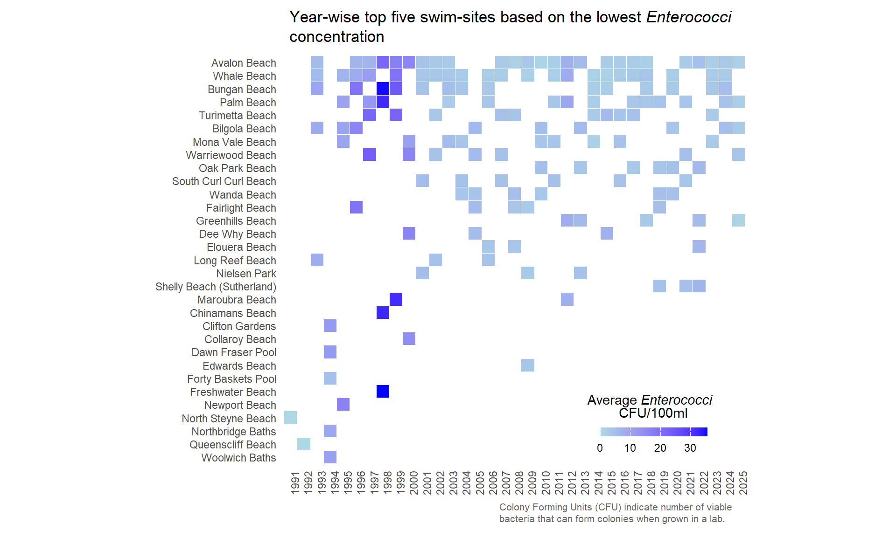

## TidyTuesday data for [2025-05-20](https://github.com/rfordatascience/tidytuesday/blob/main/data/2025/2025-05-20/readme.md)

``` r
library(tidyverse)
library(ggtext)
```

``` r
water_quality <- readr::read_csv('https://raw.githubusercontent.com/rfordatascience/tidytuesday/main/data/2025/2025-05-20/water_quality.csv')
water_quality
```

    # A tibble: 123,530 × 10
       region         council       swim_site date       time  enterococci_cfu_100ml
       <chr>          <chr>         <chr>     <date>     <tim>                 <dbl>
     1 Western Sydney Hawkesbury C… Windsor … 2025-04-28 11:00                   620
     2 Sydney Harbour North Sydney… Hayes St… 2025-04-28 11:40                    64
     3 Sydney Harbour Willoughby C… Northbri… 2025-04-28 10:54                   160
     4 Sydney Harbour Northern Bea… Fairligh… 2025-04-28 09:28                    54
     5 Western Sydney Hawkesbury C… Yarramun… 2025-04-28 10:35                   720
     6 Sydney Harbour Northern Bea… Little M… 2025-04-28 09:19                   230
     7 Sydney Harbour City of Cana… Chiswick… 2025-04-28 13:06                   120
     8 Sydney Harbour Inner West C… Dawn Fra… 2025-04-28 08:04                   280
     9 Sydney Harbour Woollahra Mu… Rose Bay… 2025-04-28 08:50                    60
    10 Sydney Harbour Woollahra Mu… Camp Cove 2025-04-28 09:09                   100
    # ℹ 123,520 more rows
    # ℹ 4 more variables: water_temperature_c <dbl>, conductivity_ms_cm <dbl>,
    #   latitude <dbl>, longitude <dbl>

``` r
glimpse(water_quality)
```

    Rows: 123,530
    Columns: 10
    $ region                <chr> "Western Sydney", "Sydney Harbour", "Sydney Harb…
    $ council               <chr> "Hawkesbury City Council", "North Sydney Council…
    $ swim_site             <chr> "Windsor Beach", "Hayes Street Beach", "Northbri…
    $ date                  <date> 2025-04-28, 2025-04-28, 2025-04-28, 2025-04-28,…
    $ time                  <time> 11:00:00, 11:40:00, 10:54:00, 09:28:00, 10:35:0…
    $ enterococci_cfu_100ml <dbl> 620, 64, 160, 54, 720, 230, 120, 280, 60, 100, 1…
    $ water_temperature_c   <dbl> 20, 21, 21, 21, 18, 21, 21, 21, 22, 22, 20, 20, …
    $ conductivity_ms_cm    <dbl> 248, 45250, 48930, 52700, 64, 39140, 4845, 50600…
    $ latitude              <dbl> -33.60448, -33.84172, -33.80604, -33.80073, -33.…
    $ longitude             <dbl> 150.8170, 151.2194, 151.2228, 151.2748, 150.6979…

## Data Wrangling

``` r
wq_grp <- water_quality %>%
  filter(!is.na(enterococci_cfu_100ml)) %>% 
  mutate(date_y = format(date, "%Y")) %>% 
  group_by(date_y, swim_site) %>% 
  summarise(mean_enterococci = mean(enterococci_cfu_100ml, na.rm = TRUE)) %>% 
  slice_min(order_by = mean_enterococci, n = 5)
```

    `summarise()` has grouped output by 'date_y'. You can override using the
    `.groups` argument.

``` r
site_freq <- wq_grp %>%
  ungroup() %>% 
  count(swim_site, sort = TRUE)
```

## Plotting

``` r
wq_grp%>% 
  mutate(swim_site = fct_rev(factor(swim_site, levels = site_freq$swim_site))) %>% 
  ggplot(aes(x = date_y, y=swim_site, fill=mean_enterococci)) +
  scale_fill_gradient(low = "lightblue", high = "blue") +
  geom_tile(color="white") +
  labs(
    title = "Year-wise top five swim-sites based on the lowest *Enterococci* concentration",
    x = element_blank(),
    y = element_blank(),
    fill = "Average *Enterococci* <br> CFU/100ml",
    caption = "Colony Forming Units (CFU) indicate number of viable bacteria that can form colonies when grown in a lab."
  ) +
  theme_minimal() +
  theme(
    panel.grid.major = element_blank(),
    panel.grid.minor = element_blank(),
    axis.text.x = element_text(angle = 90, hjust = 1),
    plot.title = element_textbox_simple(
      padding = margin(5.5, 5.5, 5.5, 5.5),
      margin = margin(5, 0, 10, 0)),
    legend.title = element_markdown(hjust = 0.5),
    legend.position = "inside",
    legend.position.inside = c(0.80, 0.1),
    legend.title.position = "top",
    plot.caption = element_textbox_simple(
      margin = margin(0, 0, 10, 175),
      padding = margin(5.5, 0, 0, 0),
      hjust = 0,
      size = 8,
      color = "gray40",
      lineheight = 1.2
    ),
    axis.title.x = element_text(family = "Consolas"),
    ) +
  guides(fill = guide_colorbar(direction = "horizontal", barheight=.5)) +
   coord_fixed(ratio = 1) 
```

    not found in Windows font database



``` r
#ggsave("swim_sites2.png", width = 8, height = 6, dpi = 300, bg = "white")
```
