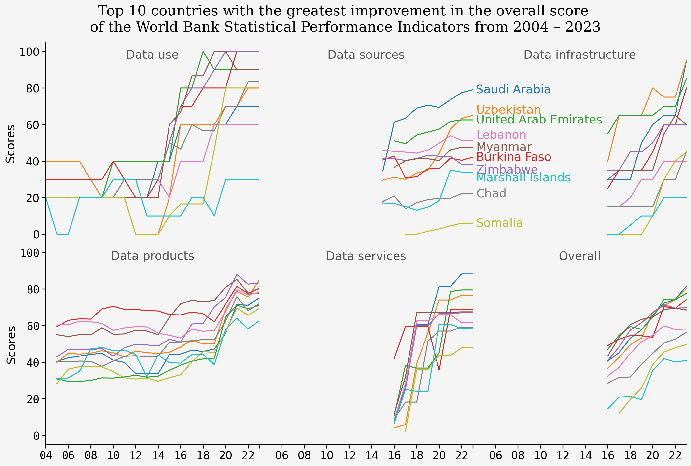

<script src="https://cdnjs.cloudflare.com/ajax/libs/require.js/2.3.6/require.min.js" integrity="sha512-c3Nl8+7g4LMSTdrm621y7kf9v3SDPnhxLNhcjFJbKECVnmZHTdo+IRO05sNLTH/D3vA6u1X32ehoLC7WFVdheg==" crossorigin="anonymous"></script>
<script src="https://cdnjs.cloudflare.com/ajax/libs/jquery/3.5.1/jquery.min.js" integrity="sha512-bLT0Qm9VnAYZDflyKcBaQ2gg0hSYNQrJ8RilYldYQ1FxQYoCLtUjuuRuZo+fjqhx/qtq/1itJ0C2ejDxltZVFg==" crossorigin="anonymous" data-relocate-top="true"></script>
<script type="application/javascript">define('jquery', [],function() {return window.jQuery;})</script>


## TidyTuesday dataset of [2025-11-25](https://github.com/rfordatascience/tidytuesday/blob/main/data/2025/2025-11-25)

``` python
import pandas as pd
import matplotlib.pyplot as plt
import seaborn as sns
import matplotlib.dates as mdates
import matplotlib.transforms as mtransforms
```

``` python
spi_indicators = pd.read_csv('https://raw.githubusercontent.com/rfordatascience/tidytuesday/main/data/2025/2025-11-25/spi_indicators.csv')
spi_indicators
```

<div>
<style scoped>
    .dataframe tbody tr th:only-of-type {
        vertical-align: middle;
    }

    .dataframe tbody tr th {
        vertical-align: top;
    }

    .dataframe thead th {
        text-align: right;
    }
</style>

|  | iso3c | country | region | income | year | population | overall_score | data_use_score | data_services_score | data_products_score | data_sources_score | data_infrastructure_score |
|----|----|----|----|----|----|----|----|----|----|----|----|----|
| 0 | DNK | Denmark | Europe & Central Asia | High income | 2023 | 5946952 | 95.255833 | 100.0 | 98.466667 | 90.71250 | 87.100 | 100.0 |
| 1 | FIN | Finland | Europe & Central Asia | High income | 2023 | 5584264 | 95.115417 | 100.0 | 96.433333 | 90.96875 | 88.175 | 100.0 |
| 2 | POL | Poland | Europe & Central Asia | High income | 2023 | 36685849 | 94.653750 | 100.0 | 97.300000 | 84.54375 | 91.425 | 100.0 |
| 3 | SWE | Sweden | Europe & Central Asia | High income | 2023 | 10536632 | 94.410000 | 100.0 | 96.000000 | 90.57500 | 85.475 | 100.0 |
| 4 | ESP | Spain | Europe & Central Asia | High income | 2023 | 48373336 | 94.325000 | 100.0 | 91.200000 | 92.62500 | 87.800 | 100.0 |
| \... | \... | \... | \... | \... | \... | \... | \... | \... | \... | \... | \... | \... |
| 4335 | VIR | Virgin Islands (U.S.) | Latin America & Caribbean | High income | 2004 | 108466 | NaN | 0.0 | NaN | NaN | NaN | NaN |
| 4336 | PSE | West Bank and Gaza | Middle East & North Africa | Lower middle income | 2004 | 3236626 | NaN | 20.0 | NaN | NaN | NaN | NaN |
| 4337 | YEM | Yemen, Rep. | Middle East & North Africa | Low income | 2004 | 20733406 | NaN | 20.0 | NaN | NaN | NaN | NaN |
| 4338 | ZMB | Zambia | Sub-Saharan Africa | Lower middle income | 2004 | 11188040 | NaN | 40.0 | NaN | NaN | NaN | NaN |
| 4339 | ZWE | Zimbabwe | Sub-Saharan Africa | Lower middle income | 2004 | 12160881 | NaN | 20.0 | NaN | NaN | NaN | NaN |

<p>4340 rows × 12 columns</p>
</div>

``` python
spi_indicators['year'] = pd.to_datetime(spi_indicators['year'], format='%Y')
```

``` python
spi_indicators.columns
```

    Index(['iso3c', 'country', 'region', 'income', 'year', 'population',
           'overall_score', 'data_use_score', 'data_services_score',
           'data_products_score', 'data_sources_score',
           'data_infrastructure_score'],
          dtype='object')

``` python
country_desc = spi_indicators.groupby(['country'])['overall_score'].describe()
country_desc['diff'] = country_desc['max']-country_desc['min']
top10_diff = country_desc.nlargest(10, 'diff')
spi_top10 = spi_indicators[spi_indicators['country'].isin(top10_diff.index)]
spi_top10
```

<div>
<style scoped>
    .dataframe tbody tr th:only-of-type {
        vertical-align: middle;
    }

    .dataframe tbody tr th {
        vertical-align: top;
    }

    .dataframe thead th {
        text-align: right;
    }
</style>

|  | iso3c | country | region | income | year | population | overall_score | data_use_score | data_services_score | data_products_score | data_sources_score | data_infrastructure_score |
|----|----|----|----|----|----|----|----|----|----|----|----|----|
| 54 | SAU | Saudi Arabia | Middle East & North Africa | High income | 2023-01-01 | 36947025 | 81.533333 | 70.0 | 88.366667 | 75.22500 | 79.075000 | 95.0 |
| 61 | UZB | Uzbekistan | Europe & Central Asia | Lower middle income | 2023-01-01 | 36412350 | 80.332083 | 80.0 | 76.633333 | 85.04375 | 64.983333 | 95.0 |
| 71 | ARE | United Arab Emirates | Middle East & North Africa | High income | 2023-01-01 | 9516871 | 77.635000 | 90.0 | 79.500000 | 71.15000 | 62.525000 | 85.0 |
| 80 | BFA | Burkina Faso | Sub-Saharan Africa | Low income | 2023-01-01 | 23251485 | 74.309167 | 100.0 | 69.000000 | 80.38750 | 42.158333 | 80.0 |
| 92 | ZWE | Zimbabwe | Sub-Saharan Africa | Lower middle income | 2023-01-01 | 16665409 | 69.732500 | 100.0 | 67.033333 | 83.38750 | 38.241667 | 60.0 |
| \... | \... | \... | \... | \... | \... | \... | \... | \... | \... | \... | \... | \... |
| 4289 | SAU | Saudi Arabia | Middle East & North Africa | High income | 2004-01-01 | 23661808 | NaN | 20.0 | NaN | NaN | NaN | NaN |
| 4299 | SOM | Somalia | Sub-Saharan Africa | Low income | 2004-01-01 | 10117354 | NaN | 20.0 | NaN | NaN | NaN | NaN |
| 4327 | ARE | United Arab Emirates | Middle East & North Africa | High income | 2004-01-01 | 3993339 | NaN | 20.0 | NaN | NaN | NaN | NaN |
| 4331 | UZB | Uzbekistan | Europe & Central Asia | Lower middle income | 2004-01-01 | 25864350 | NaN | 40.0 | NaN | NaN | NaN | NaN |
| 4339 | ZWE | Zimbabwe | Sub-Saharan Africa | Lower middle income | 2004-01-01 | 12160881 | NaN | 20.0 | NaN | NaN | NaN | NaN |

<p>200 rows × 12 columns</p>
</div>

``` python
df_melt_top10 = pd.melt(spi_top10, id_vars=['country','year'], \
            value_vars=['overall_score', 'data_use_score', 'data_services_score', 'data_products_score', 'data_sources_score', 'data_infrastructure_score'],\
            var_name='Score_type', value_name='Scores')
df_melt_top10
```

<div>
<style scoped>
    .dataframe tbody tr th:only-of-type {
        vertical-align: middle;
    }

    .dataframe tbody tr th {
        vertical-align: top;
    }

    .dataframe thead th {
        text-align: right;
    }
</style>

|      | country              | year       | Score_type                | Scores    |
|------|----------------------|------------|---------------------------|-----------|
| 0    | Saudi Arabia         | 2023-01-01 | overall_score             | 81.533333 |
| 1    | Uzbekistan           | 2023-01-01 | overall_score             | 80.332083 |
| 2    | United Arab Emirates | 2023-01-01 | overall_score             | 77.635000 |
| 3    | Burkina Faso         | 2023-01-01 | overall_score             | 74.309167 |
| 4    | Zimbabwe             | 2023-01-01 | overall_score             | 69.732500 |
| \... | \...                 | \...       | \...                      | \...      |
| 1195 | Saudi Arabia         | 2004-01-01 | data_infrastructure_score | NaN       |
| 1196 | Somalia              | 2004-01-01 | data_infrastructure_score | NaN       |
| 1197 | United Arab Emirates | 2004-01-01 | data_infrastructure_score | NaN       |
| 1198 | Uzbekistan           | 2004-01-01 | data_infrastructure_score | NaN       |
| 1199 | Zimbabwe             | 2004-01-01 | data_infrastructure_score | NaN       |

<p>1200 rows × 4 columns</p>
</div>

``` python
sns.set_context("notebook", font_scale=1.5)

g = sns.relplot(data=df_melt_top10, x='year', y='Scores', hue='country', kind='line', col='Score_type', \
            col_wrap=3, legend=False, col_order=['data_use_score', 'data_sources_score', 'data_infrastructure_score', 'data_products_score', 'data_services_score', 'overall_score'])

original_ticks = g.axes.flatten()[0].get_xticks()   # or use one representative axis

keep = original_ticks#[::2]
#if original_ticks[-1] not in keep:
#    keep = list(keep) + [original_ticks[-1]]

for ind, ax in enumerate(g.axes.flatten()):
    new_title = ' '.join(ax.get_title().removesuffix('_score').split()[-1].split('_')).capitalize()
    
    ax.set_title(new_title, y=0.9, color='#555555')
#    ax.tick_params(axis='x', rotation=45)
    ax.set_xlabel("")
    ax.set_xticks(keep)
    ax.xaxis.set_major_formatter(mdates.DateFormatter("%y"))
    ax.margins(x=0)
    ax.set_facecolor('#F5F5F5')
    for labelx, labely in zip(ax.get_xticklabels(), ax.get_yticklabels()):
        labelx.set_fontfamily('monospace')
        labely.set_fontfamily('monospace')
    if (ind not in [0,3]):
        ax.spines['left'].set_visible(False)
        ax.tick_params(axis='y', left=False, labelleft=False)
        labels = ax.get_xticklabels()
        if labels:
            labels[1].set_visible(False)   

fig = g.fig
ax = g.axes.flatten()[1]   # facet to annotate

# create an offset transform: 5 points right, 0 points up
text_trans = mtransforms.offset_copy(ax.transData, fig=fig,
                                     x=5, y=0, units='points')

y_offset = 3
for line, country in zip(ax.lines, df_melt_top10['country'].unique()):
    x_end = line.get_xdata()[-1]
    y_end = line.get_ydata()[-1]

    if (country in ['Uzbekistan', 'Lebanon']):
        y_end += y_offset
    if (country in ['Marshall Islands', 'Zimbabwe']):
        y_end -= y_offset
    

    fig.text(
        x_end,
        y_end,
        country,
        transform=text_trans,   
        ha='left',
        va='center',
        color=line.get_color(),
        clip_on=False           
    )


g.fig.subplots_adjust(wspace=0, hspace=0)
g.fig.suptitle("Top 10 countries with the greatest improvement in the overall score \nof the World Bank Statistical Performance Indicators from 2004 \u2013 2023", fontfamily='Serif', y=1.025)
g.fig.patch.set_facecolor('#F5F5F5')
plt.savefig('WHO_SPI.png', dpi=300, bbox_inches='tight')
plt.show()
```


