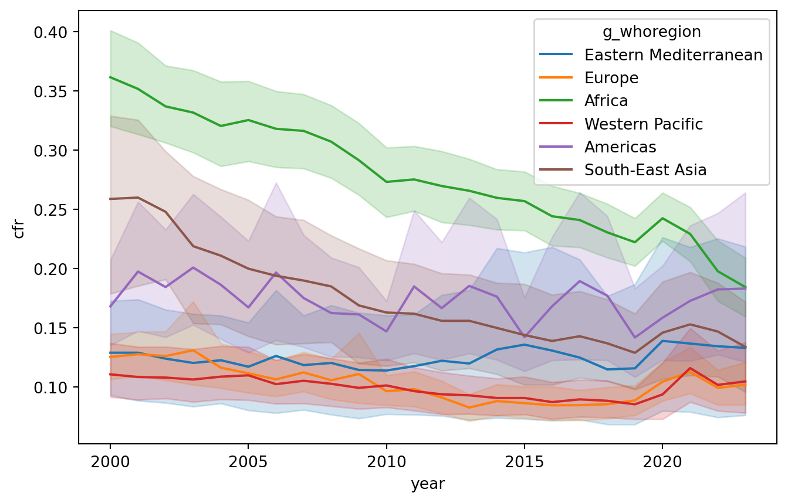
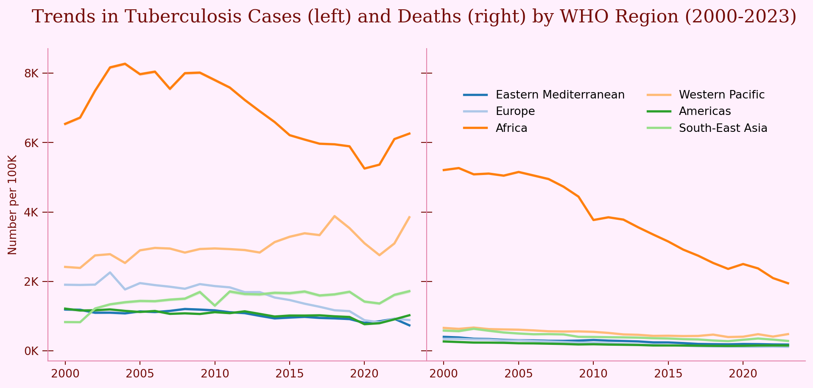

<script src="https://cdnjs.cloudflare.com/ajax/libs/require.js/2.3.6/require.min.js" integrity="sha512-c3Nl8+7g4LMSTdrm621y7kf9v3SDPnhxLNhcjFJbKECVnmZHTdo+IRO05sNLTH/D3vA6u1X32ehoLC7WFVdheg==" crossorigin="anonymous"></script>
<script src="https://cdnjs.cloudflare.com/ajax/libs/jquery/3.5.1/jquery.min.js" integrity="sha512-bLT0Qm9VnAYZDflyKcBaQ2gg0hSYNQrJ8RilYldYQ1FxQYoCLtUjuuRuZo+fjqhx/qtq/1itJ0C2ejDxltZVFg==" crossorigin="anonymous" data-relocate-top="true"></script>
<script type="application/javascript">define('jquery', [],function() {return window.jQuery;})</script>


## TidyTuesday dataset of [2025-11-11](https://github.com/rfordatascience/tidytuesday/blob/main/data/2025/2025-11-11)

``` python
import pandas as pd
import matplotlib.pyplot as plt
import seaborn as sns
import numpy as np
from matplotlib.ticker import FuncFormatter
```

``` python
who_tb_data = pd.read_csv('https://raw.githubusercontent.com/rfordatascience/tidytuesday/main/data/2025/2025-11-11/who_tb_data.csv')
who_tb_data
```

<div>
<style scoped>
    .dataframe tbody tr th:only-of-type {
        vertical-align: middle;
    }

    .dataframe tbody tr th {
        vertical-align: top;
    }

    .dataframe thead th {
        text-align: right;
    }
</style>

|  | country | g_whoregion | iso_numeric | iso2 | iso3 | year | c_cdr | c_newinc_100k | cfr | e_inc_100k | e_inc_num | e_mort_100k | e_mort_exc_tbhiv_100k | e_mort_exc_tbhiv_num | e_mort_num | e_mort_tbhiv_100k | e_mort_tbhiv_num | e_pop_num |
|----|----|----|----|----|----|----|----|----|----|----|----|----|----|----|----|----|----|----|
| 0 | Afghanistan | Eastern Mediterranean | 4 | AF | AFG | 2000 | 19.0 | 35.0 | 0.37 | 190.0 | 38000 | 68.0 | 68.0 | 14000.0 | 14000.0 | 0.17 | 34.0 | 20130323 |
| 1 | Afghanistan | Eastern Mediterranean | 4 | AF | AFG | 2001 | 26.0 | 50.0 | 0.35 | 189.0 | 38000 | 63.0 | 63.0 | 13000.0 | 13000.0 | 0.30 | 61.0 | 20284311 |
| 2 | Afghanistan | Eastern Mediterranean | 4 | AF | AFG | 2002 | 34.0 | 65.0 | 0.31 | 189.0 | 40000 | 57.0 | 57.0 | 12000.0 | 12000.0 | 0.27 | 58.0 | 21378110 |
| 3 | Afghanistan | Eastern Mediterranean | 4 | AF | AFG | 2003 | 32.0 | 61.0 | 0.32 | 189.0 | 43000 | 58.0 | 58.0 | 13000.0 | 13000.0 | 0.29 | 66.0 | 22733047 |
| 4 | Afghanistan | Eastern Mediterranean | 4 | AF | AFG | 2004 | 41.0 | 78.0 | 0.28 | 189.0 | 44000 | 52.0 | 51.0 | 12000.0 | 12000.0 | 0.29 | 67.0 | 23560660 |
| \... | \... | \... | \... | \... | \... | \... | \... | \... | \... | \... | \... | \... | \... | \... | \... | \... | \... | \... |
| 5112 | Zimbabwe | Africa | 716 | ZW | ZWE | 2019 | 69.0 | 138.0 | 0.22 | 199.0 | 30000 | 43.0 | 11.0 | 1700.0 | 6500.0 | 31.00 | 4800.0 | 15271376 |
| 5113 | Zimbabwe | Africa | 716 | ZW | ZWE | 2020 | 54.0 | 101.0 | 0.24 | 188.0 | 29000 | 44.0 | 13.0 | 2000.0 | 6800.0 | 31.00 | 4800.0 | 15526885 |
| 5114 | Zimbabwe | Africa | 716 | ZW | ZWE | 2021 | 52.0 | 103.0 | 0.25 | 199.0 | 31000 | 49.0 | 15.0 | 2300.0 | 7800.0 | 34.00 | 5400.0 | 15797209 |
| 5115 | Zimbabwe | Africa | 716 | ZW | ZWE | 2022 | 54.0 | 113.0 | 0.26 | 209.0 | 34000 | 52.0 | 16.0 | 2500.0 | 8400.0 | 37.00 | 5900.0 | 16069054 |
| 5116 | Zimbabwe | Africa | 716 | ZW | ZWE | 2023 | 56.0 | 118.0 | 0.24 | 211.0 | 35000 | 48.0 | 14.0 | 2400.0 | 7900.0 | 34.00 | 5500.0 | 16340822 |

<p>5117 rows × 18 columns</p>
</div>

``` python
who_tb_data['g_whoregion'].unique()
```

    array(['Eastern Mediterranean', 'Europe', 'Africa', 'Western Pacific',
           'Americas', 'South-East Asia'], dtype=object)

``` python
who_tb_data.groupby('country')['c_newinc_100k'].sum().sort_values(ascending=False)
```

    country
    Eswatini                                                    12982.00
    Namibia                                                     12055.00
    South Africa                                                11692.00
    Lesotho                                                     10858.00
    Botswana                                                     8117.00
                                                                  ...   
    Curaçao                                                        23.85
    Anguilla                                                       21.90
    occupied Palestinian territory, including east Jerusalem       19.51
    Monaco                                                         11.00
    San Marino                                                     10.90
    Name: c_newinc_100k, Length: 215, dtype: float64

``` python
sns.lineplot(data=who_tb_data,x='year',y='cfr',hue='g_whoregion')
plt.show()
```



``` python
bg_color="#FFF0FD"
fg_color="#740C08"#"#333333"
fg_color2="#E484AC"
palette='tab20'
fig, ax  = plt.subplots(1,2, figsize=(12,5), sharey=True)
#sns.lineplot(data=who_tb_data,x='year',y='c_newinc_100k',hue='g_whoregion',ax=ax[0], legend=False, errorbar='se', estimator=np.sum, palette=['black'] * who_tb_data['g_whoregion'].nunique(), lw=2.5)
sns.lineplot(data=who_tb_data,x='year',y='c_newinc_100k',hue='g_whoregion',ax=ax[0], legend=False, errorbar='se', estimator=np.sum, palette=palette, lw=2)
#sns.lineplot(data=who_tb_data,x='year',y='e_mort_100k',hue='g_whoregion',ax=ax[1], errorbar='se', estimator=np.sum, palette=['black'] * who_tb_data['g_whoregion'].nunique(), lw=2.5, legend=False)
sns.lineplot(data=who_tb_data,x='year',y='e_mort_100k',hue='g_whoregion',ax=ax[1], errorbar='se', estimator=np.sum, palette=palette, lw=2)

sns.despine()


def thousands(x, pos):
    return f'{int(x/1000)}K'

# Apply to y-axis
ax[1].yaxis.set_major_formatter(FuncFormatter(thousands))
for a in ax:
    a.tick_params(axis='both', colors=fg_color)
    for spine in a.spines.values():
        spine.set_color(fg_color2) 

ax[0].tick_params(axis='y', length=10, direction='inout')
ax[1].tick_params(axis='y', length=10, direction='inout')
ax[1].legend(frameon=False, ncol=2, loc='upper center', bbox_to_anchor=(0.5, 0.9))
#ax[0].set_title("Number of cases", color=fg_color)
#ax[1].set_title("Number of deaths", color=fg_color)
ax[0].set_ylabel("Number per 100K", color=fg_color)
ax[0].set_xlabel("")
ax[1].set_xlabel("")
plt.subplots_adjust(wspace=0)  
fig.patch.set_facecolor(bg_color)
ax[0].set_facecolor(bg_color)
ax[1].set_facecolor(bg_color)
fig.suptitle("Trends in Tuberculosis Cases (left) and Deaths (right) by WHO Region (2000-2023)", color=fg_color, fontsize=16, family='serif')
plt.savefig('WHO_TB.png', dpi=300, bbox_inches='tight')
plt.show()
```


