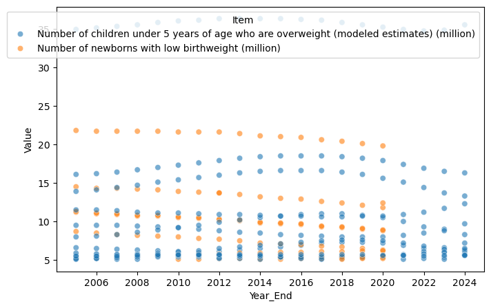
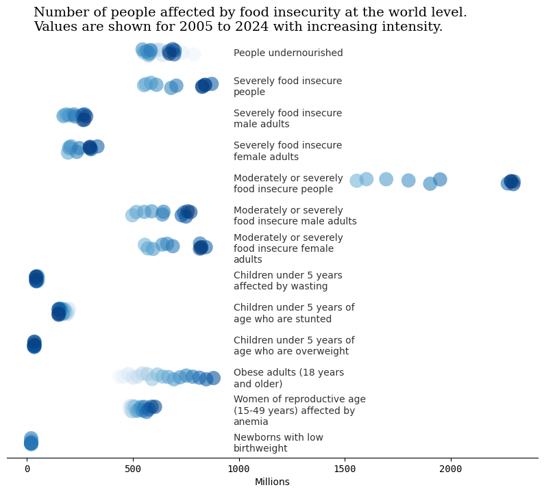

<script src="https://cdnjs.cloudflare.com/ajax/libs/require.js/2.3.6/require.min.js" integrity="sha512-c3Nl8+7g4LMSTdrm621y7kf9v3SDPnhxLNhcjFJbKECVnmZHTdo+IRO05sNLTH/D3vA6u1X32ehoLC7WFVdheg==" crossorigin="anonymous"></script>
<script src="https://cdnjs.cloudflare.com/ajax/libs/jquery/3.5.1/jquery.min.js" integrity="sha512-bLT0Qm9VnAYZDflyKcBaQ2gg0hSYNQrJ8RilYldYQ1FxQYoCLtUjuuRuZo+fjqhx/qtq/1itJ0C2ejDxltZVFg==" crossorigin="anonymous" data-relocate-top="true"></script>
<script type="application/javascript">define('jquery', [],function() {return window.jQuery;})</script>


## TidyTuesday dataset of [2025-10-14](https://github.com/rfordatascience/tidytuesday/blob/main/data/2025/2025-10-14)

``` python
import pandas as pd
import matplotlib.pyplot as plt
import seaborn as sns
import textwrap
```

``` python
food_security = pd.read_csv('https://raw.githubusercontent.com/rfordatascience/tidytuesday/main/data/2025/2025-10-14/food_security.csv')
```

``` python
food_security
```

<div>
<style scoped>
    .dataframe tbody tr th:only-of-type {
        vertical-align: middle;
    }

    .dataframe tbody tr th {
        vertical-align: top;
    }

    .dataframe thead th {
        text-align: right;
    }
</style>

|  | Year_Start | Year_End | Area | Item | Unit | Value | CI_Lower | CI_Upper | Flag | Note |
|----|----|----|----|----|----|----|----|----|----|----|
| 0 | 2005 | 2007 | Afghanistan | Average dietary energy supply adequacy (percen\... | % | 97.0 | NaN | NaN | Estimated value | NaN |
| 1 | 2006 | 2008 | Afghanistan | Average dietary energy supply adequacy (percen\... | % | 99.0 | NaN | NaN | Estimated value | NaN |
| 2 | 2007 | 2009 | Afghanistan | Average dietary energy supply adequacy (percen\... | % | 102.0 | NaN | NaN | Estimated value | NaN |
| 3 | 2008 | 2010 | Afghanistan | Average dietary energy supply adequacy (percen\... | % | 104.0 | NaN | NaN | Estimated value | NaN |
| 4 | 2009 | 2011 | Afghanistan | Average dietary energy supply adequacy (percen\... | % | 105.0 | NaN | NaN | Estimated value | NaN |
| \... | \... | \... | \... | \... | \... | \... | \... | \... | \... | \... |
| 171227 | 2016 | 2018 | Upper-middle-income economies | Average fat supply (g/cap/day) (3-year average) | g/cap/d | 89.1 | NaN | NaN | Estimated value | NaN |
| 171228 | 2017 | 2019 | Upper-middle-income economies | Average fat supply (g/cap/day) (3-year average) | g/cap/d | 90.8 | NaN | NaN | Estimated value | NaN |
| 171229 | 2018 | 2020 | Upper-middle-income economies | Average fat supply (g/cap/day) (3-year average) | g/cap/d | 92.5 | NaN | NaN | Estimated value | NaN |
| 171230 | 2019 | 2021 | Upper-middle-income economies | Average fat supply (g/cap/day) (3-year average) | g/cap/d | 95.0 | NaN | NaN | Estimated value | NaN |
| 171231 | 2020 | 2022 | Upper-middle-income economies | Average fat supply (g/cap/day) (3-year average) | g/cap/d | 96.5 | NaN | NaN | Estimated value | NaN |

<p>171232 rows × 10 columns</p>
</div>

``` python
food_security = food_security.assign(Year_Start = pd.to_datetime(food_security['Year_Start'], format='%Y'),
                                     Year_End = pd.to_datetime(food_security['Year_End'], format='%Y'))
```

``` python
food_security_nona = food_security[food_security['Value'].notna()]
food_security_nona_mod = food_security_nona[(food_security_nona['Item'] == 'Number of children under 5 years of age who are overweight (modeled estimates) (million)') \
| (food_security_nona['Item']=='Number of newborns with low birthweight (million)')]
```

``` python
food_security_nona_mod2 = food_security_nona_mod[food_security_nona_mod['Value']>5]
food_security_nona_mod2
```

<div>
<style scoped>
    .dataframe tbody tr th:only-of-type {
        vertical-align: middle;
    }

    .dataframe tbody tr th {
        vertical-align: top;
    }

    .dataframe thead th {
        text-align: right;
    }
</style>

|  | Year_Start | Year_End | Area | Item | Unit | Value | CI_Lower | CI_Upper | Flag | Note |
|----|----|----|----|----|----|----|----|----|----|----|
| 24188 | 2005-01-01 | 2005-01-01 | China | Number of children under 5 years of age who ar\... | million No | 5.2 | NaN | NaN | Figure from external organization | NaN |
| 24189 | 2006-01-01 | 2006-01-01 | China | Number of children under 5 years of age who ar\... | million No | 5.2 | NaN | NaN | Figure from external organization | NaN |
| 24190 | 2007-01-01 | 2007-01-01 | China | Number of children under 5 years of age who ar\... | million No | 5.3 | NaN | NaN | Figure from external organization | NaN |
| 24191 | 2008-01-01 | 2008-01-01 | China | Number of children under 5 years of age who ar\... | million No | 5.4 | NaN | NaN | Figure from external organization | NaN |
| 24192 | 2009-01-01 | 2009-01-01 | China | Number of children under 5 years of age who ar\... | million No | 5.5 | NaN | NaN | Figure from external organization | NaN |
| \... | \... | \... | \... | \... | \... | \... | \... | \... | \... | \... |
| 171123 | 2020-01-01 | 2020-01-01 | Upper-middle-income economies | Number of children under 5 years of age who ar\... | million No | 15.6 | NaN | NaN | Figure from external organization | Based on FY 2025 classification |
| 171124 | 2021-01-01 | 2021-01-01 | Upper-middle-income economies | Number of children under 5 years of age who ar\... | million No | 15.1 | NaN | NaN | Figure from external organization | Based on FY 2025 classification |
| 171125 | 2022-01-01 | 2022-01-01 | Upper-middle-income economies | Number of children under 5 years of age who ar\... | million No | 14.4 | NaN | NaN | Figure from external organization | Based on FY 2025 classification |
| 171126 | 2023-01-01 | 2023-01-01 | Upper-middle-income economies | Number of children under 5 years of age who ar\... | million No | 13.7 | NaN | NaN | Figure from external organization | Based on FY 2025 classification |
| 171127 | 2024-01-01 | 2024-01-01 | Upper-middle-income economies | Number of children under 5 years of age who ar\... | million No | 13.3 | NaN | NaN | Figure from external organization | Based on FY 2025 classification |

<p>374 rows × 10 columns</p>
</div>

``` python
fig,ax = plt.subplots(figsize=(8,5))
sns.scatterplot(data=food_security_nona_mod2, x='Year_End', y='Value', hue='Item', alpha=0.6)
```



``` python
items_mi = [x for x in food_security['Item'].unique() if 'million' in x]
items_mi = [x for x in items_mi if 'average' not in x]
items_mi = [x for x in items_mi if x is not None]
print(len(items_mi))
items_mi
```

    13

    ['Number of children under 5 years affected by wasting (million)',
     'Number of children under 5 years of age who are stunted (modeled estimates) (million)',
     'Number of children under 5 years of age who are overweight (modeled estimates) (million)',
     'Number of obese adults (18 years and older) (million)',
     'Number of women of reproductive age (15-49 years) affected by anemia (million)',
     'Number of newborns with low birthweight (million)',
     'Number of people undernourished (million) (annual value)',
     'Number of severely food insecure people (million) (annual value)',
     'Number of severely food insecure male adults (million) (annual value)',
     'Number of severely food insecure female adults (million) (annual value)',
     'Number of moderately or severely food insecure people (million) (annual value)',
     'Number of moderately or severely food insecure male adults (million) (annual value)',
     'Number of moderately or severely food insecure female adults (million) (annual value)']

``` python
df_world = food_security_nona[food_security_nona['Area']=='World'][food_security_nona['Item'].isin(items_mi)]
df_world
```

      df_world = food_security_nona[food_security_nona['Area']=='World'][food_security_nona['Item'].isin(items_mi)]

<div>
<style scoped>
    .dataframe tbody tr th:only-of-type {
        vertical-align: middle;
    }

    .dataframe tbody tr th {
        vertical-align: top;
    }

    .dataframe thead th {
        text-align: right;
    }
</style>

|  | Year_Start | Year_End | Area | Item | Unit | Value | CI_Lower | CI_Upper | Flag | Note |
|----|----|----|----|----|----|----|----|----|----|----|
| 132089 | 2005-01-01 | 2005-01-01 | World | Number of people undernourished (million) (ann\... | million No | 788.8 | NaN | NaN | Estimated value | NaN |
| 132090 | 2006-01-01 | 2006-01-01 | World | Number of people undernourished (million) (ann\... | million No | 733.8 | NaN | NaN | Estimated value | NaN |
| 132091 | 2007-01-01 | 2007-01-01 | World | Number of people undernourished (million) (ann\... | million No | 672.9 | NaN | NaN | Estimated value | NaN |
| 132092 | 2008-01-01 | 2008-01-01 | World | Number of people undernourished (million) (ann\... | million No | 639.7 | NaN | NaN | Estimated value | NaN |
| 132093 | 2009-01-01 | 2009-01-01 | World | Number of people undernourished (million) (ann\... | million No | 630.1 | NaN | NaN | Estimated value | NaN |
| \... | \... | \... | \... | \... | \... | \... | \... | \... | \... | \... |
| 132781 | 2016-01-01 | 2016-01-01 | World | Number of newborns with low birthweight (million) | million No | 20.9 | NaN | NaN | Figure from external organization | NaN |
| 132782 | 2017-01-01 | 2017-01-01 | World | Number of newborns with low birthweight (million) | million No | 20.6 | NaN | NaN | Figure from external organization | NaN |
| 132783 | 2018-01-01 | 2018-01-01 | World | Number of newborns with low birthweight (million) | million No | 20.4 | NaN | NaN | Figure from external organization | NaN |
| 132784 | 2019-01-01 | 2019-01-01 | World | Number of newborns with low birthweight (million) | million No | 20.1 | NaN | NaN | Figure from external organization | NaN |
| 132785 | 2020-01-01 | 2020-01-01 | World | Number of newborns with low birthweight (million) | million No | 19.8 | NaN | NaN | Figure from external organization | NaN |

<p>199 rows × 10 columns</p>
</div>

``` python
df_world['Item_mod'] = df_world['Item'].str.split('\(m').str[0].str.split('Number of ').str[1].str.capitalize()
df_world
```

      df_world['Item_mod'] = df_world['Item'].str.split('\(m').str[0].str.split('Number of ').str[1].str.capitalize()

<div>
<style scoped>
    .dataframe tbody tr th:only-of-type {
        vertical-align: middle;
    }

    .dataframe tbody tr th {
        vertical-align: top;
    }

    .dataframe thead th {
        text-align: right;
    }
</style>

|  | Year_Start | Year_End | Area | Item | Unit | Value | CI_Lower | CI_Upper | Flag | Note | Item_mod |
|----|----|----|----|----|----|----|----|----|----|----|----|
| 132089 | 2005-01-01 | 2005-01-01 | World | Number of people undernourished (million) (ann\... | million No | 788.8 | NaN | NaN | Estimated value | NaN | People undernourished |
| 132090 | 2006-01-01 | 2006-01-01 | World | Number of people undernourished (million) (ann\... | million No | 733.8 | NaN | NaN | Estimated value | NaN | People undernourished |
| 132091 | 2007-01-01 | 2007-01-01 | World | Number of people undernourished (million) (ann\... | million No | 672.9 | NaN | NaN | Estimated value | NaN | People undernourished |
| 132092 | 2008-01-01 | 2008-01-01 | World | Number of people undernourished (million) (ann\... | million No | 639.7 | NaN | NaN | Estimated value | NaN | People undernourished |
| 132093 | 2009-01-01 | 2009-01-01 | World | Number of people undernourished (million) (ann\... | million No | 630.1 | NaN | NaN | Estimated value | NaN | People undernourished |
| \... | \... | \... | \... | \... | \... | \... | \... | \... | \... | \... | \... |
| 132781 | 2016-01-01 | 2016-01-01 | World | Number of newborns with low birthweight (million) | million No | 20.9 | NaN | NaN | Figure from external organization | NaN | Newborns with low birthweight |
| 132782 | 2017-01-01 | 2017-01-01 | World | Number of newborns with low birthweight (million) | million No | 20.6 | NaN | NaN | Figure from external organization | NaN | Newborns with low birthweight |
| 132783 | 2018-01-01 | 2018-01-01 | World | Number of newborns with low birthweight (million) | million No | 20.4 | NaN | NaN | Figure from external organization | NaN | Newborns with low birthweight |
| 132784 | 2019-01-01 | 2019-01-01 | World | Number of newborns with low birthweight (million) | million No | 20.1 | NaN | NaN | Figure from external organization | NaN | Newborns with low birthweight |
| 132785 | 2020-01-01 | 2020-01-01 | World | Number of newborns with low birthweight (million) | million No | 19.8 | NaN | NaN | Figure from external organization | NaN | Newborns with low birthweight |

<p>199 rows × 11 columns</p>
</div>

``` python
fig,ax = plt.subplots(figsize=(10,8))
sns.stripplot(data=df_world, x='Value', y='Item_mod',hue='Year_End', size=15,\
 alpha=0.6, legend=False, palette='Blues')
ax.yaxis.tick_right()
ax.tick_params(axis='y', which='major', pad=-320) 
ax.tick_params(axis='y', length=0)
plt.xlabel("Millions")
plt.ylabel("")
title="Number of people affected by food insecurity at the world level.\nValues are shown for 2005 to 2024 with increasing intensity."
#title_wrapped = textwrap.fill(title, width=65)
plt.title(title, family='Serif', fontsize=14, ha='left', x=0.05)
sns.despine(left=True)
labels = ax.get_yticklabels()
wrapped_labels = []
for label in labels:
    original_text = label.get_text()
    wrapped_text = textwrap.fill(original_text, width=25) # Adjust width as needed
    wrapped_labels.append(wrapped_text)
ax.set_yticklabels(wrapped_labels, color='#333333')
ax.set_xticklabels([int(x) for x in ax.get_xticks()], family='monospace')
plt.savefig('world_food.png', dpi=300, bbox_inches='tight')
plt.show()
```

      ax.set_yticklabels(wrapped_labels, color='#333333')
      ax.set_xticklabels([int(x) for x in ax.get_xticks()], family='monospace')



``` python
df_world.describe()
```

<div>
<style scoped>
    .dataframe tbody tr th:only-of-type {
        vertical-align: middle;
    }

    .dataframe tbody tr th {
        vertical-align: top;
    }

    .dataframe thead th {
        text-align: right;
    }
</style>

|  | Year_Start | Year_End | Value | CI_Lower | CI_Upper |
|----|----|----|----|----|----|
| count | 199 | 199 | 199.000000 | 66.000000 | 66.000000 |
| mean | 2015-09-11 09:46:07.839195904 | 2015-09-11 09:46:07.839195904 | 451.684925 | 738.501515 | 783.675758 |
| min | 2005-01-01 00:00:00 | 2005-01-01 00:00:00 | 19.800000 | 160.100000 | 185.700000 |
| 25% | 2012-01-01 00:00:00 | 2012-01-01 00:00:00 | 51.350000 | 273.875000 | 295.175000 |
| 50% | 2016-01-01 00:00:00 | 2016-01-01 00:00:00 | 457.700000 | 599.650000 | 650.300000 |
| 75% | 2020-01-01 00:00:00 | 2020-01-01 00:00:00 | 639.750000 | 806.125000 | 847.150000 |
| max | 2024-01-01 00:00:00 | 2024-01-01 00:00:00 | 2296.600000 | 2260.900000 | 2332.400000 |
| std | NaN | NaN | 468.873860 | 598.928099 | 620.089332 |

</div>
