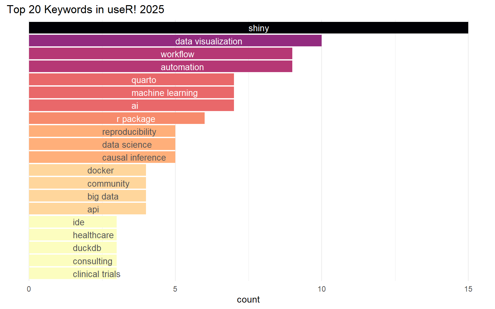

``` r
library(tidyverse)
library(uk2us)
```

``` r
user2025 <- readr::read_csv('https://raw.githubusercontent.com/rfordatascience/tidytuesday/main/data/2025/2025-04-29/user2025.csv')
user2025
```

    # A tibble: 128 × 11
          id session date       time  room   title  content video_recording keywords
       <dbl> <chr>   <date>     <chr> <chr>  <chr>  <chr>   <chr>           <chr>   
     1   170 Virtual 2025-08-01 TBD   Online A Rob… In R p… ✅              statist…
     2    79 Virtual 2025-08-01 TBD   Online A fir… Positr… ✅              ide, wo…
     3    30 Virtual 2025-08-01 TBD   Online Analy… This t… ✅              demogra…
     4    31 Virtual 2025-08-01 TBD   Online Autom… Webhoo… ✅              automat…
     5    39 Virtual 2025-08-01 TBD   Online Beyon… In a w… ✅              marketi…
     6   169 Virtual 2025-08-01 TBD   Online CSV t… CSV is… ✅              data pr…
     7    94 Virtual 2025-08-01 TBD   Online Data … Explor… ✅              factor …
     8   163 Virtual 2025-08-01 TBD   Online Don’t… The fa… ✅              testing…
     9    13 Virtual 2025-08-01 TBD   Online Exper… Large … ✅              automat…
    10    51 Virtual 2025-08-01 TBD   Online From … Data S… ✅              quarto,…
    # ℹ 118 more rows
    # ℹ 2 more variables: speakers <chr>, co_authors <chr>

``` r
normalize_keywords_uk2us <- function(phrases) {
  phrases %>%
    str_split("\\s+") %>%                                
    map(~ uk2us::convert_uk2us(.x)) %>%                  
    map_chr(str_c, collapse = " ")                       
}
```

## Plotting

``` r
user2025 %>%
  separate_rows(keywords, sep = ",") %>%
  mutate(keywords = str_trim(keywords)) %>%
  mutate(keywords = normalize_keywords_uk2us(keywords)) %>% 
  group_by(keywords) %>% 
  summarise(count = n()) %>% 
  arrange(desc(count)) %>% 
  slice(1:20) %>% 
  ggplot(aes(x = reorder(keywords, count), y = count, fill=count)) +
  geom_bar(stat = "identity") +
  geom_text(aes(label = reorder(keywords, count), y=count/2), hjust = 0, 
            size = 3.5, color=rep(c("white", "#555"), times=c(8,12))) + 
  coord_flip() +
  scale_fill_viridis_c(option="magma", direction = -1)+
  labs(title = "Top 20 Keywords in useR! 2025") +
  theme_minimal() +
  theme(
    axis.text.y = element_blank(),
    axis.ticks.y = element_blank(),
    axis.title.y = element_blank(),
    legend.position = "none",
    panel.grid.major.y = element_blank()
  )
```



``` r
ggsave("user2025_keywords.png", width = 8, height = 6, dpi = 300)
```
