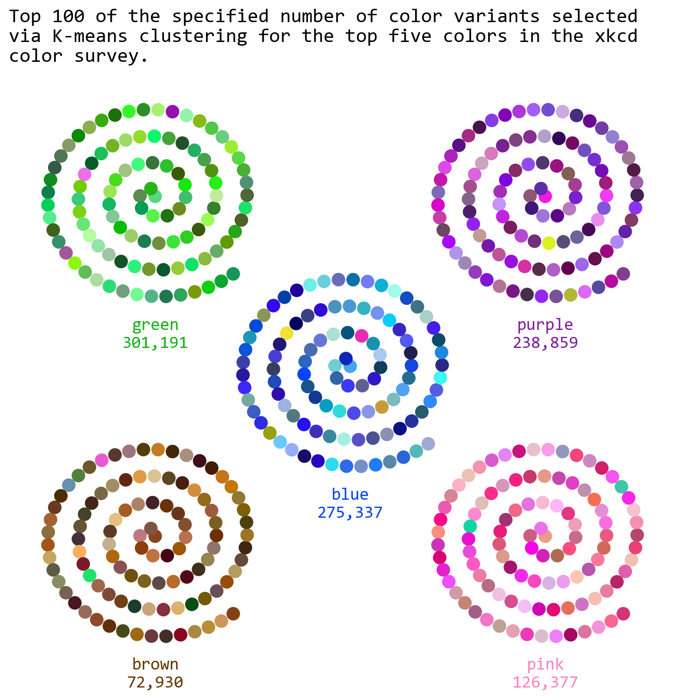

<script src="https://cdnjs.cloudflare.com/ajax/libs/require.js/2.3.6/require.min.js" integrity="sha512-c3Nl8+7g4LMSTdrm621y7kf9v3SDPnhxLNhcjFJbKECVnmZHTdo+IRO05sNLTH/D3vA6u1X32ehoLC7WFVdheg==" crossorigin="anonymous"></script>
<script src="https://cdnjs.cloudflare.com/ajax/libs/jquery/3.5.1/jquery.min.js" integrity="sha512-bLT0Qm9VnAYZDflyKcBaQ2gg0hSYNQrJ8RilYldYQ1FxQYoCLtUjuuRuZo+fjqhx/qtq/1itJ0C2ejDxltZVFg==" crossorigin="anonymous" data-relocate-top="true"></script>
<script type="application/javascript">define('jquery', [],function() {return window.jQuery;})</script>


## TidyTuesday data for [2025-07-08](https://github.com/rfordatascience/tidytuesday/blob/main/data/2025/2025-07-08/readme.md)

``` python
import pandas as pd
import numpy as np
import matplotlib.pyplot as plt
from matplotlib import colors
import colorsys
from sklearn.cluster import KMeans
from sklearn.metrics import pairwise_distances_argmin_min
import textwrap
```

``` python
answers = pd.read_csv('https://raw.githubusercontent.com/rfordatascience/tidytuesday/main/data/2025/2025-07-08/answers.csv')
color_ranks = pd.read_csv('https://raw.githubusercontent.com/rfordatascience/tidytuesday/main/data/2025/2025-07-08/color_ranks.csv')
users = pd.read_csv('https://raw.githubusercontent.com/rfordatascience/tidytuesday/main/data/2025/2025-07-08/users.csv')
```

``` python
answers
```

<div>
<style scoped>
    .dataframe tbody tr th:only-of-type {
        vertical-align: middle;
    }

    .dataframe tbody tr th {
        vertical-align: top;
    }

    .dataframe thead th {
        text-align: right;
    }
</style>

|         | user_id | hex     | rank |
|---------|---------|---------|------|
| 0       | 1       | #8240EA | 1    |
| 1       | 2       | #4B31EA | 3    |
| 2       | 2       | #584601 | 5    |
| 3       | 2       | #DA239C | 4    |
| 4       | 2       | #B343E5 | 1    |
| \...    | \...    | \...    | \... |
| 1058206 | 152397  | #7238F0 | 1    |
| 1058207 | 152398  | #8E14CD | 1    |
| 1058208 | 152398  | #0A49E7 | 3    |
| 1058209 | 152400  | #38A30E | 2    |
| 1058210 | 152401  | #4D004B | 1    |

<p>1058211 rows × 3 columns</p>
</div>

``` python
answers['rank'].unique()
```

    array([1, 3, 5, 4, 2], dtype=int64)

``` python
color_ranks
```

<div>
<style scoped>
    .dataframe tbody tr th:only-of-type {
        vertical-align: middle;
    }

    .dataframe tbody tr th {
        vertical-align: top;
    }

    .dataframe thead th {
        text-align: right;
    }
</style>

|      | color             | rank | hex     |
|------|-------------------|------|---------|
| 0    | purple            | 1    | #7e1e9c |
| 1    | green             | 2    | #15b01a |
| 2    | blue              | 3    | #0343df |
| 3    | pink              | 4    | #ff81c0 |
| 4    | brown             | 5    | #653700 |
| \... | \...              | \... | \...    |
| 944  | fresh green       | 945  | #69d84f |
| 945  | electric lime     | 946  | #a8ff04 |
| 946  | dust              | 947  | #b2996e |
| 947  | dark pastel green | 948  | #56ae57 |
| 948  | cloudy blue       | 949  | #acc2d9 |

<p>949 rows × 3 columns</p>
</div>

``` python
def hex_to_hsl(hex_color):
    rgb = colors.to_rgb(hex_color)  # Returns RGB as floats (0-1)
    h, l, s = colorsys.rgb_to_hls(*rgb)  # Note: HLS order
#    return round(h * 360, 1), round(s * 100, 1), round(l * 100, 1)
    return h, s, l

print(hex_to_hsl("#ff5733"))
```

    (0.02941176470588236, 1.0, 0.6)

``` python
# merge answers and color_rank based on rank column
merged_data = pd.merge(answers, color_ranks, on='rank', how='left')
merged_data[['h', 's', 'l']] = merged_data['hex_x'].apply(hex_to_hsl).apply(pd.Series)
```

``` python
merged_data
```

<div>
<style scoped>
    .dataframe tbody tr th:only-of-type {
        vertical-align: middle;
    }

    .dataframe tbody tr th {
        vertical-align: top;
    }

    .dataframe thead th {
        text-align: right;
    }
</style>

|         | user_id | hex_x   | rank | color  | hex_y   | h        | s        | l        |
|---------|---------|---------|------|--------|---------|----------|----------|----------|
| 0       | 1       | #8240EA | 1    | purple | #7e1e9c | 0.731373 | 0.801887 | 0.584314 |
| 1       | 2       | #4B31EA | 3    | blue   | #0343df | 0.690090 | 0.814978 | 0.554902 |
| 2       | 2       | #584601 | 5    | brown  | #653700 | 0.132184 | 0.977528 | 0.174510 |
| 3       | 2       | #DA239C | 4    | pink   | #ff81c0 | 0.889800 | 0.723320 | 0.496078 |
| 4       | 2       | #B343E5 | 1    | purple | #7e1e9c | 0.781893 | 0.757009 | 0.580392 |
| \...    | \...    | \...    | \... | \...   | \...    | \...     | \...     | \...     |
| 1058206 | 152397  | #7238F0 | 1    | purple | #7e1e9c | 0.719203 | 0.859813 | 0.580392 |
| 1058207 | 152398  | #8E14CD | 1    | purple | #7e1e9c | 0.776577 | 0.822222 | 0.441176 |
| 1058208 | 152398  | #0A49E7 | 3    | blue   | #0343df | 0.619155 | 0.917012 | 0.472549 |
| 1058209 | 152400  | #38A30E | 2    | green  | #15b01a | 0.286353 | 0.841808 | 0.347059 |
| 1058210 | 152401  | #4D004B | 1    | purple | #7e1e9c | 0.837662 | 1.000000 | 0.150980 |

<p>1058211 rows × 8 columns</p>
</div>

``` python
merged_data.groupby('color').count()
```

<div>
<style scoped>
    .dataframe tbody tr th:only-of-type {
        vertical-align: middle;
    }

    .dataframe tbody tr th {
        vertical-align: top;
    }

    .dataframe thead th {
        text-align: right;
    }
</style>

|        | user_id | hex_x  | rank   | hex_y  | h      | s      | l      |
|--------|---------|--------|--------|--------|--------|--------|--------|
| color  |         |        |        |        |        |        |        |
| blue   | 288015  | 288015 | 288015 | 288015 | 288015 | 288015 | 288015 |
| brown  | 75812   | 75812  | 75812  | 75812  | 75812  | 75812  | 75812  |
| green  | 314172  | 314172 | 314172 | 314172 | 314172 | 314172 | 314172 |
| pink   | 131013  | 131013 | 131013 | 131013 | 131013 | 131013 | 131013 |
| purple | 249199  | 249199 | 249199 | 249199 | 249199 | 249199 | 249199 |

</div>

``` python
f"{merged_data.groupby('color')['hex_x'].nunique().loc['blue']:,}"
```

    '275,337'

``` python
cluster_results = {}
for color, group_df in merged_data.groupby('color'):
    kmeans = KMeans(n_clusters=100, random_state=2025)
    kmeans.fit(group_df[['h', 's', 'l']])

    # Store the result: labels and cluster centers
    cluster_results[color] = {
        'labels': kmeans.labels_,
        'centers': kmeans.cluster_centers_,
        'data': group_df.copy()
    }
#    cluster_results[color]['data']['cluster'] = kmeans.labels_

#print(cluster_results["blue"]["data"])

for color in cluster_results:
    group_data = cluster_results[color]['data']
    centers = cluster_results[color]['centers']
    closest_idxs, _ = pairwise_distances_argmin_min(centers, group_data[['h', 's', 'l']].values)
    closest_points = group_data.iloc[closest_idxs]
    cluster_results[color]['closest_points'] = closest_points
```

``` python
print(cluster_results['blue']['closest_points'][['h', 's', 'l']].head(10).values)
```

    [[0.56581741 0.74407583 0.58627451]
     [0.6374269  0.89528796 0.3745098 ]
     [0.50673401 0.52380952 0.62941176]
     [0.59259259 0.54418605 0.42156863]
     [0.66666667 0.88516746 0.59019608]
     [0.66333333 0.20661157 0.4745098 ]
     [0.68726592 0.78070175 0.44705882]
     [0.57042254 0.63963964 0.21764706]
     [0.59777778 0.78947368 0.81372549]
     [0.53159041 0.76884422 0.39019608]]

``` python
from scipy.optimize import root_scalar
def hsl_to_rgb(h, s, l):
    # colorsys expects H, L, S in [0,1]
    r, g, b = colorsys.hls_to_rgb(h, l, s)
    return r, g, b
    
# Arc length function of theta
def arc_length(theta, b):
    return (b/2) * (theta * np.sqrt(1 + theta**2) + np.arcsinh(theta))

# Inverse function: find theta given s (arc length)
def theta_for_s(s, b):
    # Use root finding to solve arc_length(theta) - s = 0
    sol = root_scalar(lambda t: arc_length(t, b) - s, bracket=[0, 100], method='bisect')
    return sol.root

d = 4  # distance from center to corner
# Define corner offsets using Cartesian product of [-d, d]
corners = np.array(np.meshgrid([-d, d], [-d, d])).T.reshape(-1, 2)
offsets = np.vstack([[0, 0],corners])

fig, ax = plt.subplots(figsize=(8, 8))

for ind, color_name in enumerate(cluster_results):
    cp = cluster_results[color_name]['closest_points'][['h', 's', 'l']].values
    
    rgb_colors = [hsl_to_rgb(*hsl) for hsl in cp]
    
    b = 0.1  # spiral parameter
    num_points = len(cp)
    desired_sep = 0.3  # desired arc length between points
        
    # Compute theta values for uniform arc length steps
    arc_lengths = np.arange(num_points) * desired_sep
    theta_vals = np.array([theta_for_s(s, b) for s in arc_lengths])
    
    # Compute spiral coords
    r = b * theta_vals
    x = r * np.cos(theta_vals)
    y = r * np.sin(theta_vals)
    
    #plt.scatter(x, y, color=rgb_colors, s=200, marker="|", linewidths=4)
    plt.scatter(x+offsets[ind][0], y+offsets[ind][1], color=rgb_colors, s=100) 
    ax.text(offsets[ind][0], offsets[ind][1]-3.25, f"{color_name}\n{ merged_data.groupby('color')['hex_x'].nunique().loc[color_name]:,}", fontsize=14, ha='center', va='center', color=color_ranks[color_ranks['color'] == color_name]['hex'].values[0], fontfamily="Consolas")

ax.axis("off")
plt.ylim(-7, 7)
plt.xlim(-7, 7)
long_title = "Top 100 of the specified number of color variants selected via K-means clustering for the top five colors in the xkcd color survey."
wrapped_title = "\n".join(textwrap.wrap(long_title, width=60))

plt.title(wrapped_title, fontsize=16, fontfamily="Consolas", loc='left')
plt.tight_layout()
#plt.ylabel("Random value")
plt.savefig("xkcd_colors.png", dpi=300, bbox_inches='tight')
plt.show()
```


